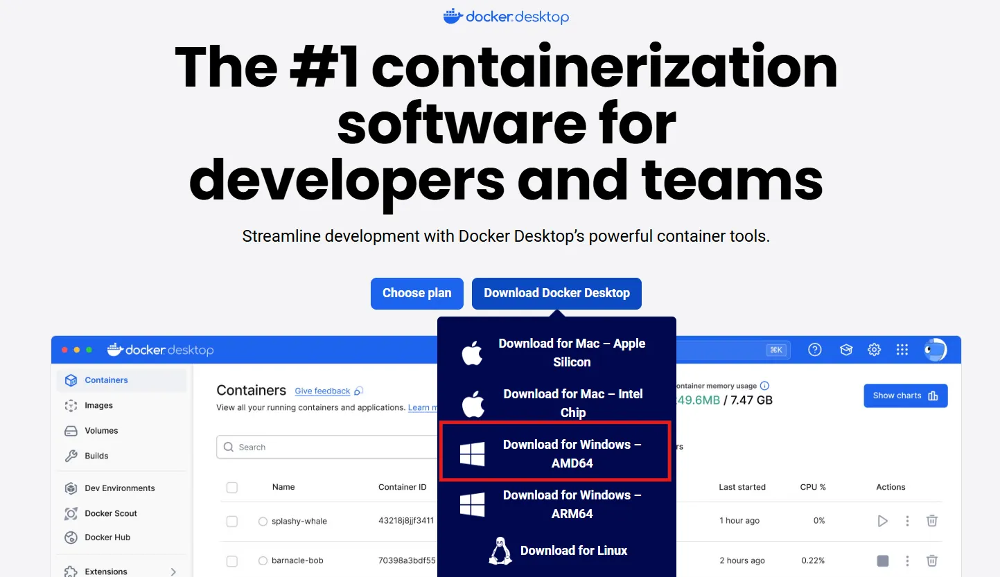

Docker Desktop 是一款專為開發者設計的圖形化應用程式，能在 Windows、Linux 和 macOS 上提供完整的 Docker 容器開發環境。它整合了 Docker Engine、Docker CLI、Docker Compose 和 Kubernetes 等核心工具，讓容器化應用程式的建立、管理與部署變得更加簡單直觀。透過與本機檔案系統的無縫整合，開發者可以在不同平台上保持一致的開發與測試體驗。

## Docker Desktop 安裝流程

### 下載與安裝

1. **下載安裝程式**
   - 前往 [Docker Desktop 官方網站](https://www.docker.com/products/docker-desktop/)
   - Intel 或 AMD 處理器請選擇 AMD64 版本
     

2. **執行安裝程式**
   - 執行下載的安裝檔
   - 安裝完成後，系統會要求重新啟動電腦
     

3. **啟動 Docker Desktop**
   - 重啟後開啟 Docker Desktop 應用程式
     

4. **接受使用者協議**
   - 閱讀並同意 Docker 使用者協議
     

5. **安裝 WSL 2 元件**
   - 命令提示字元會自動彈出 WSL 安裝視窗
   - 按下 Enter 鍵（或任意鍵）開始安裝 WSL 2
     

6. **完成 WSL 安裝**
   - WSL 安裝完成後，按任意鍵關閉視窗
     

7. **登入或跳過**
   - 可選擇登入 Docker Hub 帳號，或直接跳過此步驟
     

8. **完成設定**
   - 進入 Docker Desktop 主畫面即表示安裝完成，可以關閉視窗。
   - 若畫面卡住未進入，請重新啟動電腦
     
