# n8n 軟體安裝指引

## 什麼是 n8n？

n8n 是一套開源的工作流程自動化工具，可以透過視覺化介面串接各種應用程式與服務（如 LINE、Google Sheets、資料庫等），無需撰寫程式碼即可建立自動化流程。

n8n 需要 Node.js 作為執行環境，因此安裝前必須先完成 Node.js 的安裝。

---

## 第一部分：安裝 Node.js

Node.js 是 n8n 的執行環境，請依照以下步驟安裝。

### 步驟 1：前往 Node.js 官網

開啟瀏覽器，進入 [Node.js 官方網站](https://nodejs.org/en/)，點擊 **Get Node.js** 按鈕。

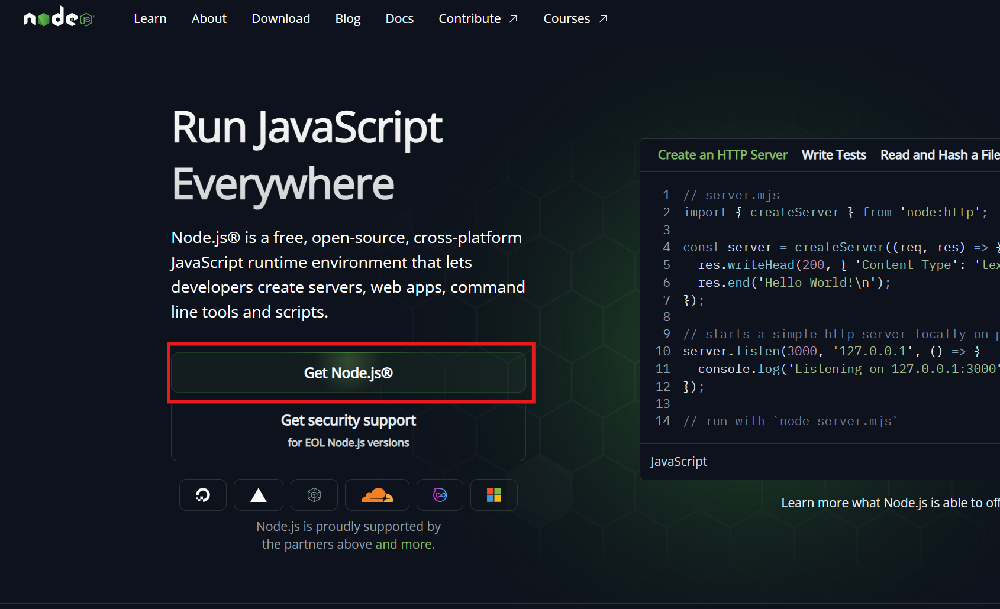

### 步驟 2：下載安裝檔

在下載頁面中，點擊 **Windows Installer (.msi)** 下載適用於 Windows 的安裝檔。

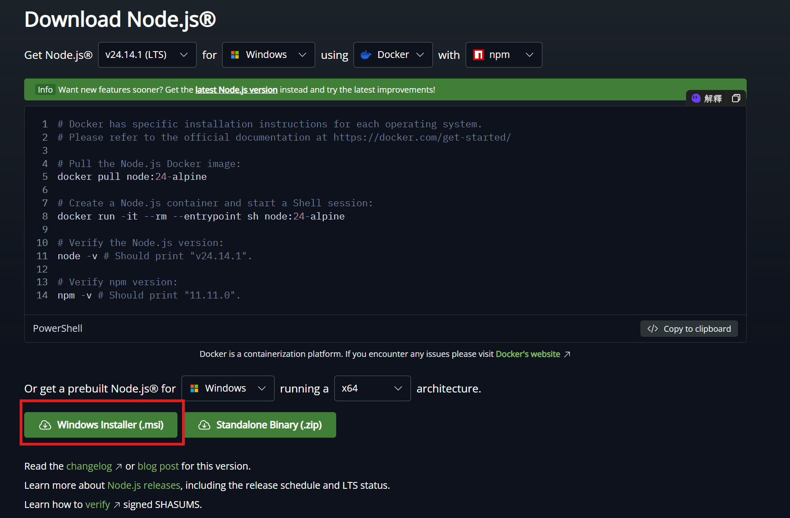

### 步驟 3：啟動安裝程式

開啟下載的 `.msi` 檔案，出現歡迎畫面後點擊 **Next**。

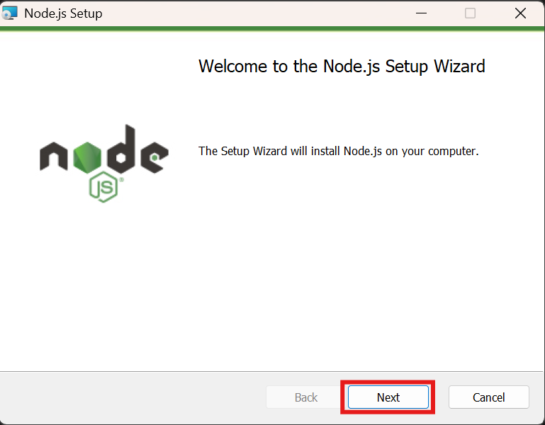

### 步驟 4：同意授權條款

勾選 **I accept the terms in the License Agreement**，然後點擊 **Next**。

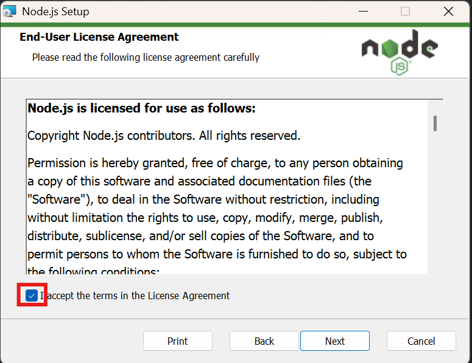

### 步驟 5：選擇安裝路徑

維持預設安裝路徑 `C:\Program Files\nodejs\` 即可，點擊 **Next**。

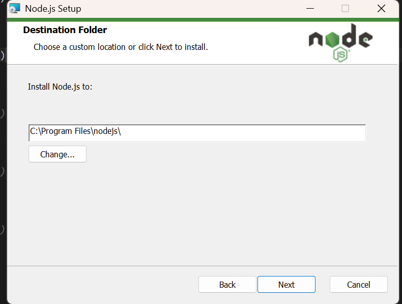

### 步驟 6：選擇安裝元件

維持預設勾選（Node.js runtime、npm 等），點擊 **Next**。

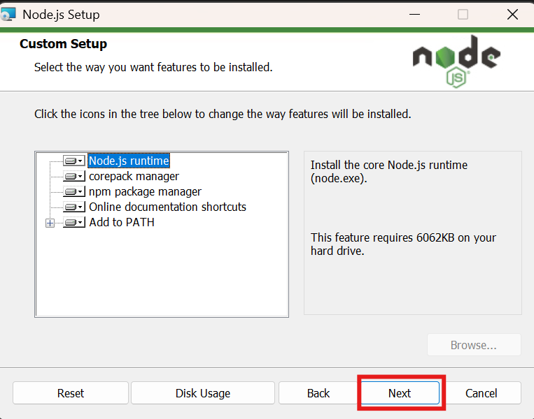

### 步驟 7：原生模組工具（可跳過）

此頁面詢問是否安裝編譯原生模組所需的工具，**不需勾選**，直接點擊 **Next**。

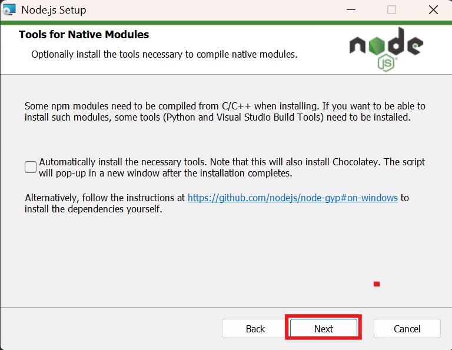

### 步驟 8：開始安裝

確認設定無誤後，點擊 **Install** 開始安裝。安裝過程中可能會彈出權限確認視窗，請點擊「是」允許安裝。

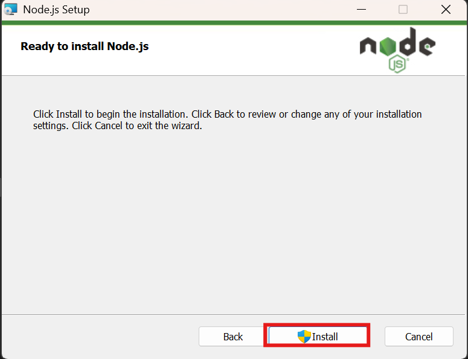

---

## 第二部分：安裝 n8n

Node.js 安裝完成後，即可透過 npm 安裝 n8n。

### 步驟 1：開啟終端機

在 Windows 工作列搜尋「終端機」或「PowerShell」，右鍵選擇 **以系統管理員身分執行**。

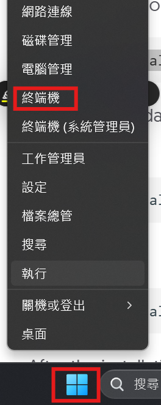

### 步驟 2：執行安裝指令

在終端機中輸入以下指令，透過 npm 全域安裝 n8n：

```
npm install n8n -g
```

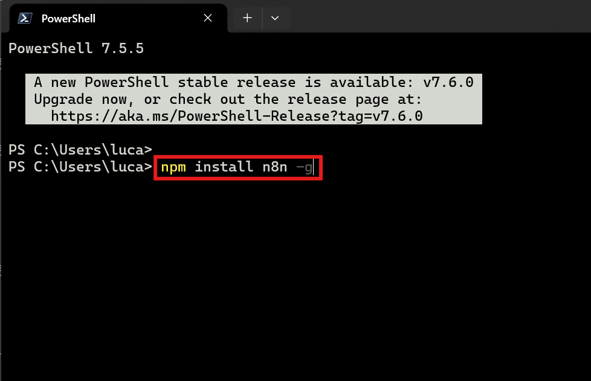

### 步驟 3：確認安裝完成

安裝過程需要數分鐘，當畫面顯示 **added xxxx packages** 字樣時，代表安裝成功。

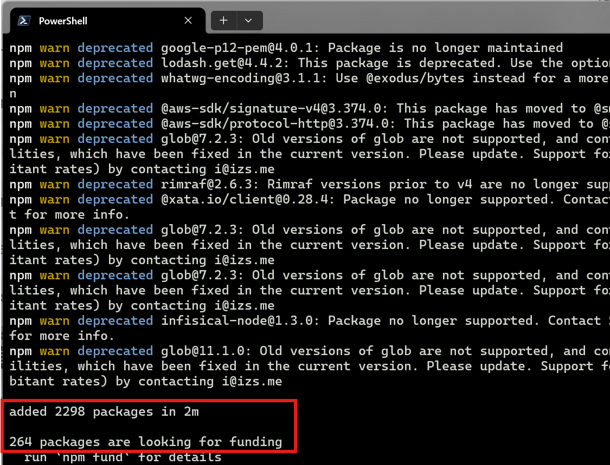

### 步驟 4：啟動 n8n

在終端機中輸入以下指令啟動 n8n：

```
n8n start
```

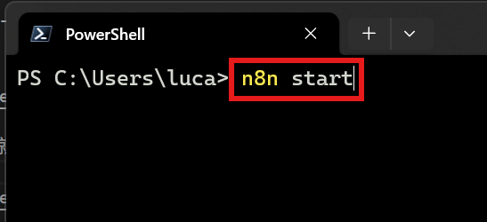

### 步驟 5：開啟 n8n 操作介面

啟動完成後，終端機會顯示 `Editor is now accessible via: http://localhost:5678`。開啟瀏覽器，輸入以下網址即可進入 n8n：

```
http://localhost:5678
```

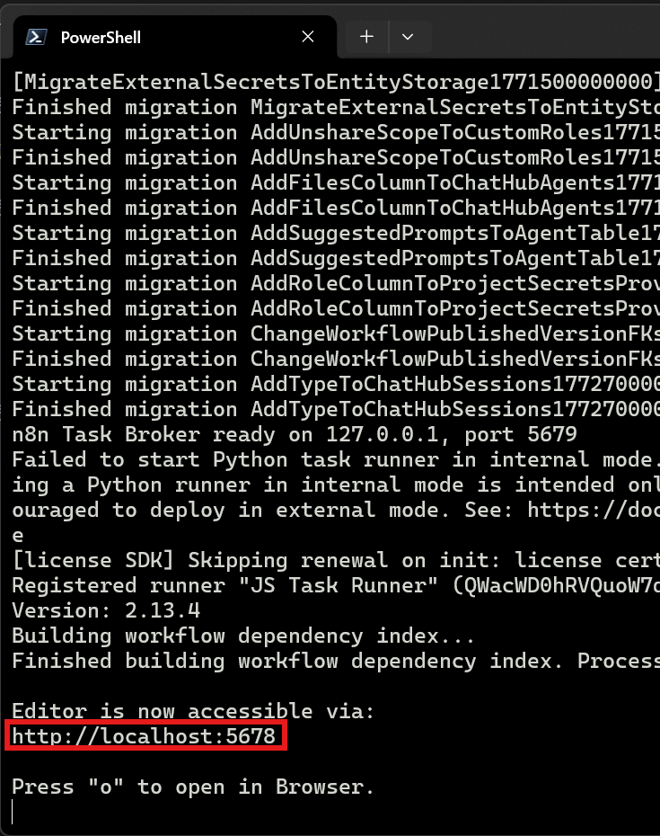
