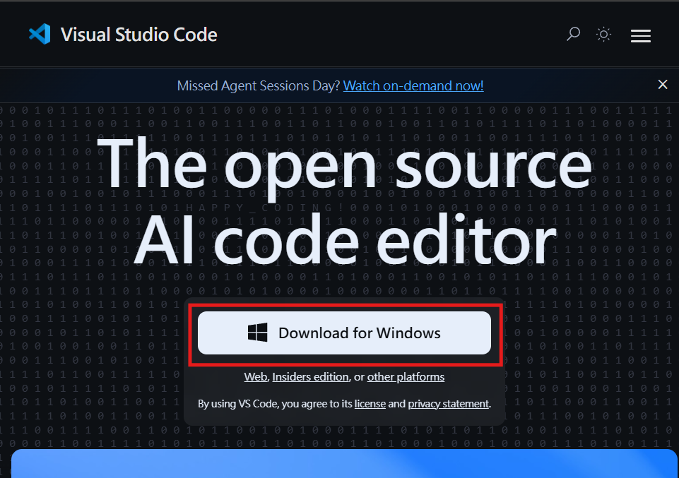
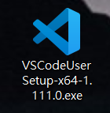
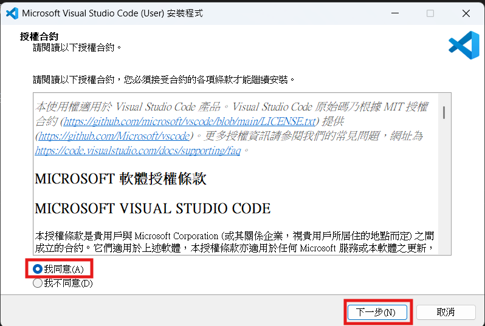
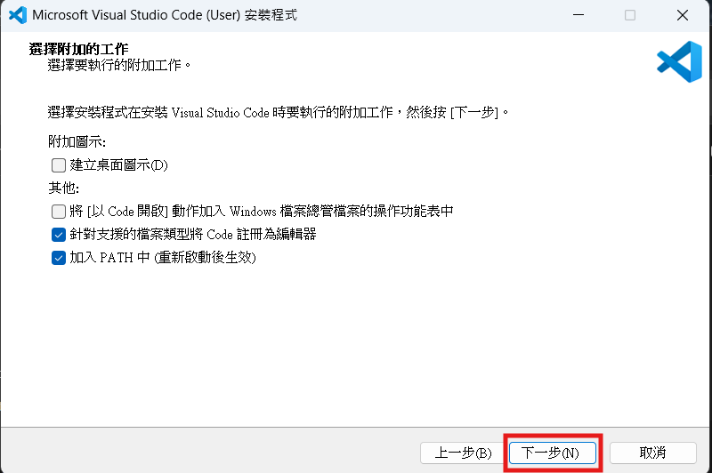
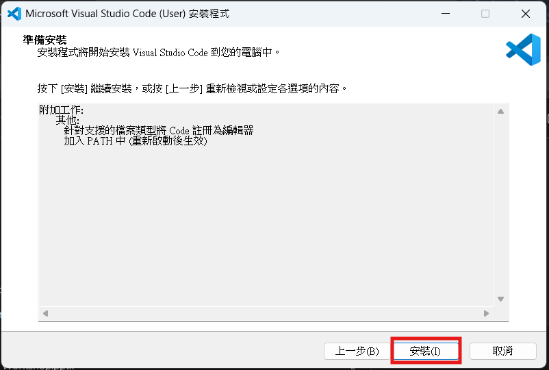
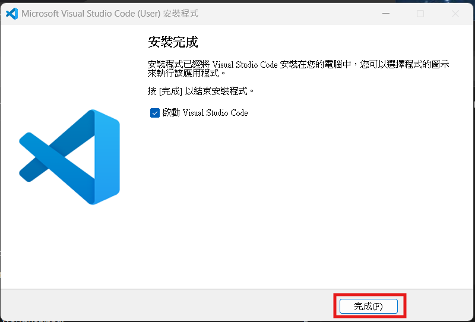
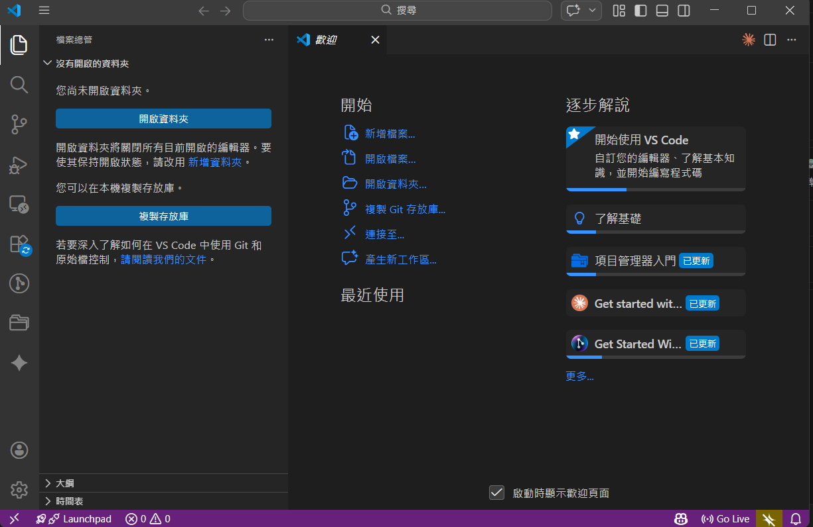

# VS Code 簡介

Visual Studio Code (簡稱 VS Code) 是一款由微軟開發，且開源、免費、跨平台的現代化程式碼編輯器。它不僅輕量高效，還擁有極為強大的生態系統，是目前全球最受歡迎的開發工具之一。

### 核心特色：

1.  **輕量且快速**：相比於完整的 IDE（整合開發環境），VS Code 啟動速度快，佔用資源相對較少。
2.  **強大的擴充功能 (Extensions)**：透過安裝擴充插件，可以支援幾乎所有的程式語言（如 Python, JavaScript, C++, Java 等）以及各種開發工具（如 Git, Docker, AI 輔助插件）。
3.  **內建 Git 支援**：直接在編輯器內即可進行版本控制，查看檔案差異與提交程式碼。
4.  **智慧回饋 (IntelliSense)**：提供自動補全、語法提示及語法亮點，大幅提升開發效率。
5.  **跨平台**：支援 Windows、macOS 及 Linux 系統。
6.  **內建終端機 (Terminal)**：無需切換視窗，即可直接執行指令與腳本。

對於初學者與專業開發者而言，VS Code 都是一個極佳的選擇。

---

## VS Code 安裝流程

1. 前往 [VS Code 官方網站](https://code.visualstudio.com/)，點擊下載按鈕。

   

2. 下載完成後，執行安裝檔。

   

3. 勾選同意授權條款，點擊「下一步」。

   

4. 維持預設設定，點擊「下一步」。

   

5. 確認安裝內容無誤後，點擊「安裝」開始安裝程序。

   

6. 安裝完成後，點擊「完成」結束安裝精靈。

   

7. 出現以下畫面，表示 VS Code 已安裝完成，可以關閉視窗。

   
