# ngrok 簡介

`ngrok` 是一個強大的反向代理（Reverse Proxy）工具，它可以將運行在本地開發環境的服務（例如：localhost:3000）安全地暴露到公網，並提供一個公共的 URL（HTTPS）。

這在開發 Webhooks、測試行動裝置存取本地伺服器、或是展示專案原型時非常有用。

## 為什麼要使用 ngrok？

- **穿透防火牆與 NAT**：不需要更改路由器設定或開啟連接埠，即可讓外部存取本地服務。
- **HTTPS 支援**：自動提供 SSL/TLS 憑證，確保資料傳輸安全。
- **即時監控**：提供一個 Web 界面（通常在 `127.0.0.1:4040`），讓你可以檢查所有的 HTTP 請求與回應。

## 註冊與安裝流程

### 註冊帳號

1. 前往 [ngrok 官方網站](https://ngrok.com/)，點擊註冊按鈕。

   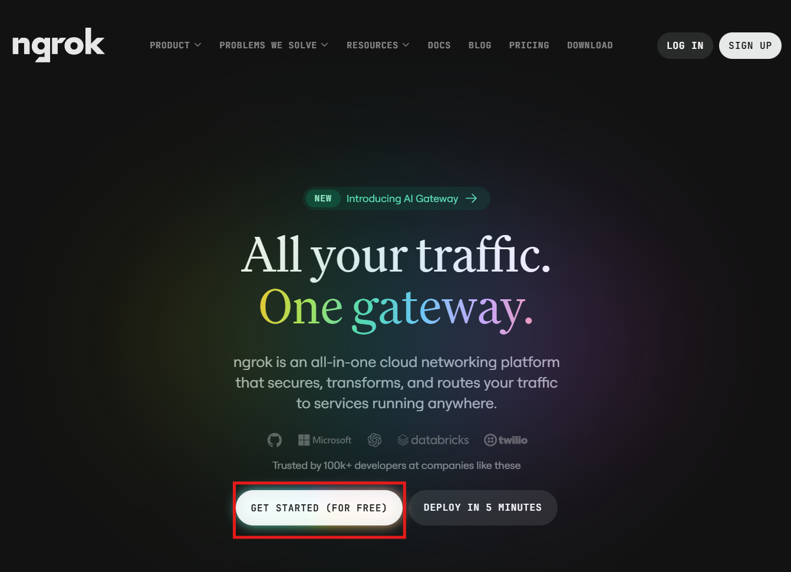

2. 建議使用 Google 帳號進行註冊，操作較為便捷。

   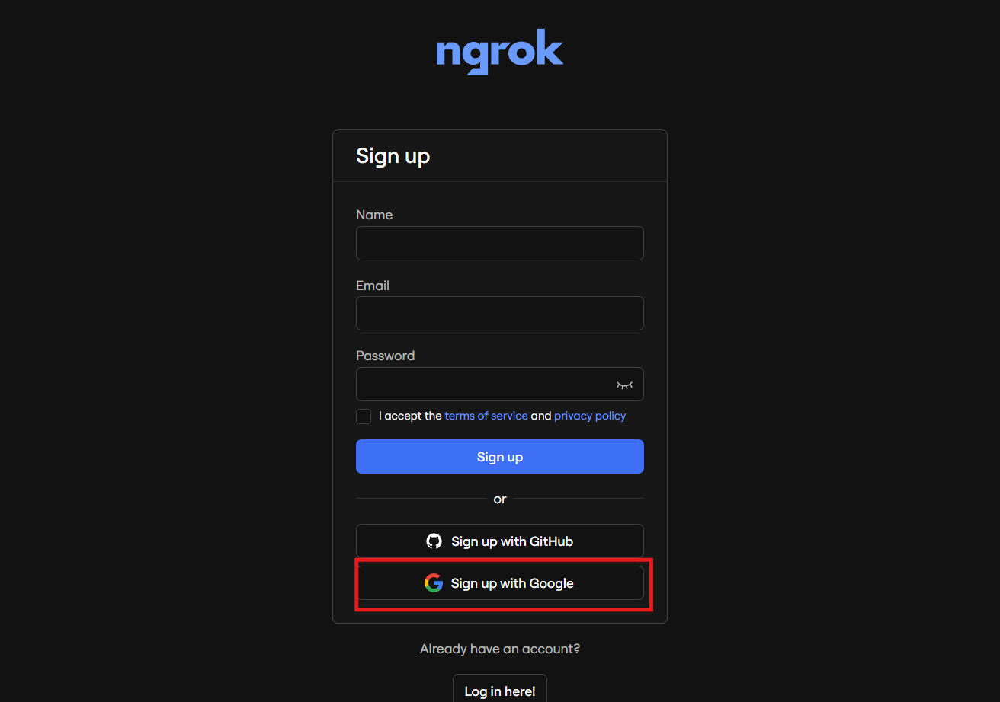

3. 選擇您的 Google 帳號，並允許授權存取。

   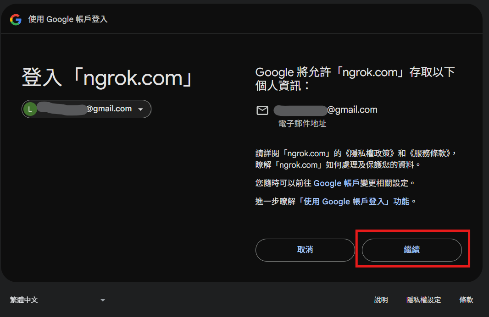

4. 閱讀並接受使用條款後，點擊建立帳號。

   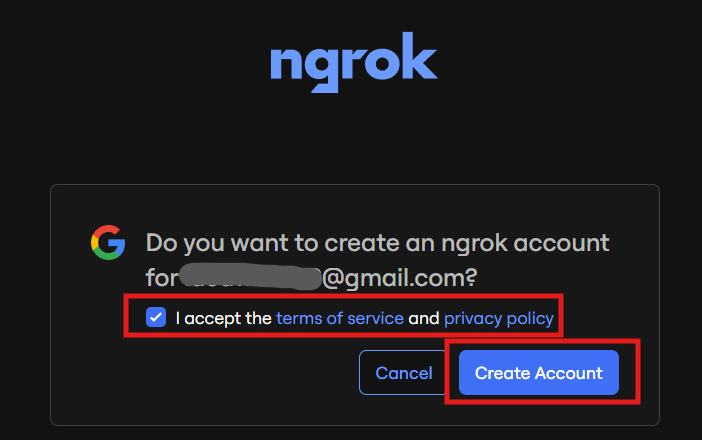

5. 多因子驗證（MFA）設定可先跳過，後續可依需求再行開啟。

   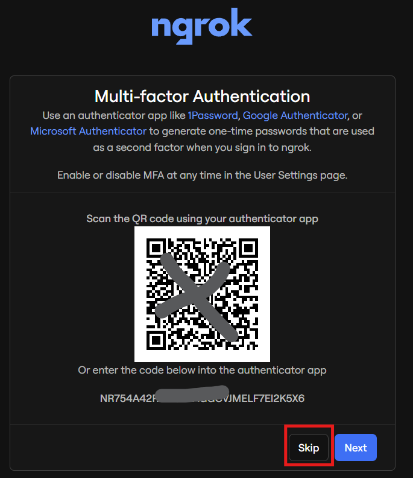

6. 點擊「Got it」確認，此功能可於日後隨時啟用。

   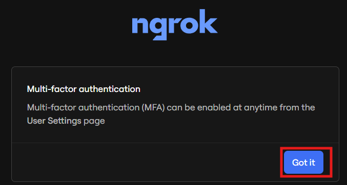

7. 使用者問卷調查可依個人狀況填寫，不影響後續使用。

   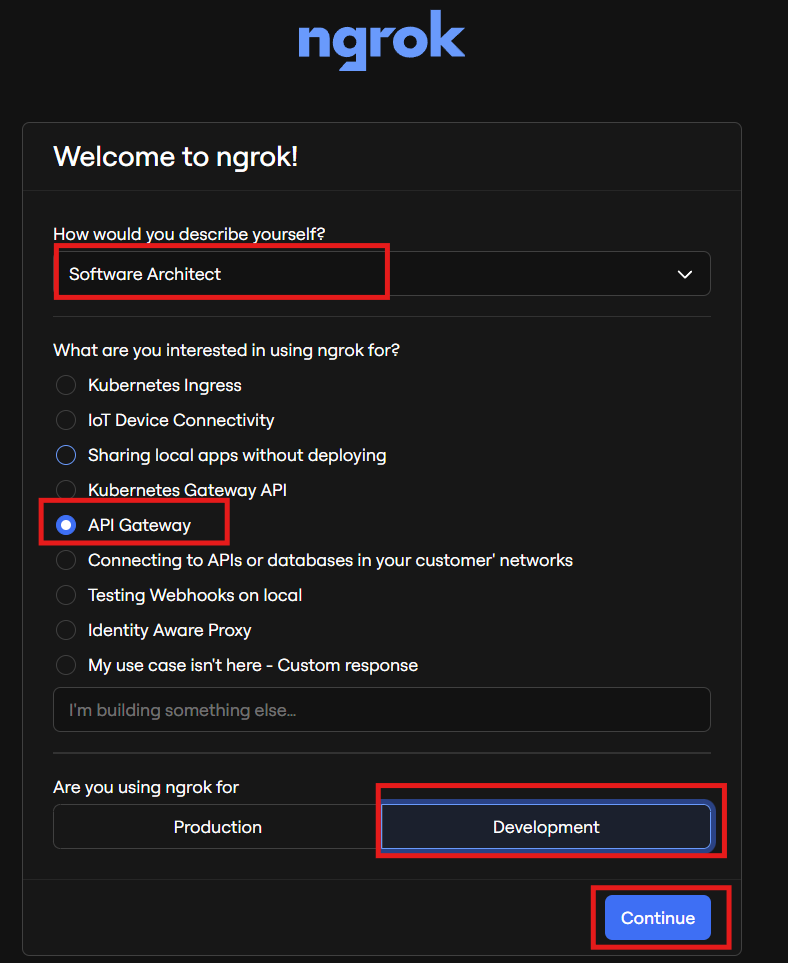

### 下載與安裝

8. 選擇適合您系統的下載方式。

   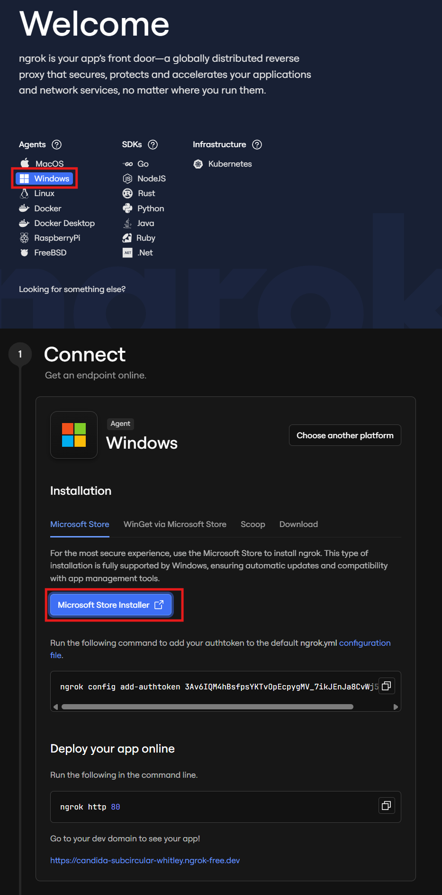

9. 點擊開啟 Microsoft Store。

   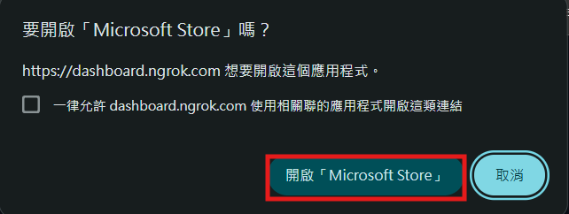

10. 點擊「安裝」按鈕，等待安裝完成。

    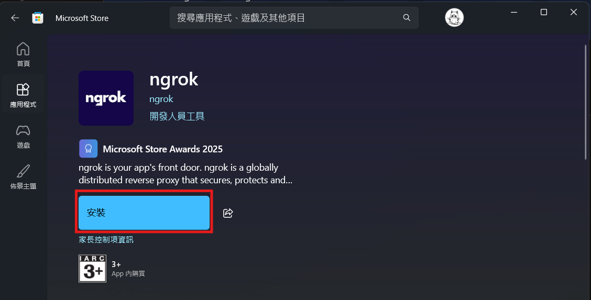

11. 在 Windows 搜尋列中輸入「ngrok」，開啟應用程式。

    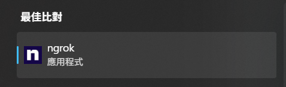

12. 出現以下畫面即表示安裝成功。

    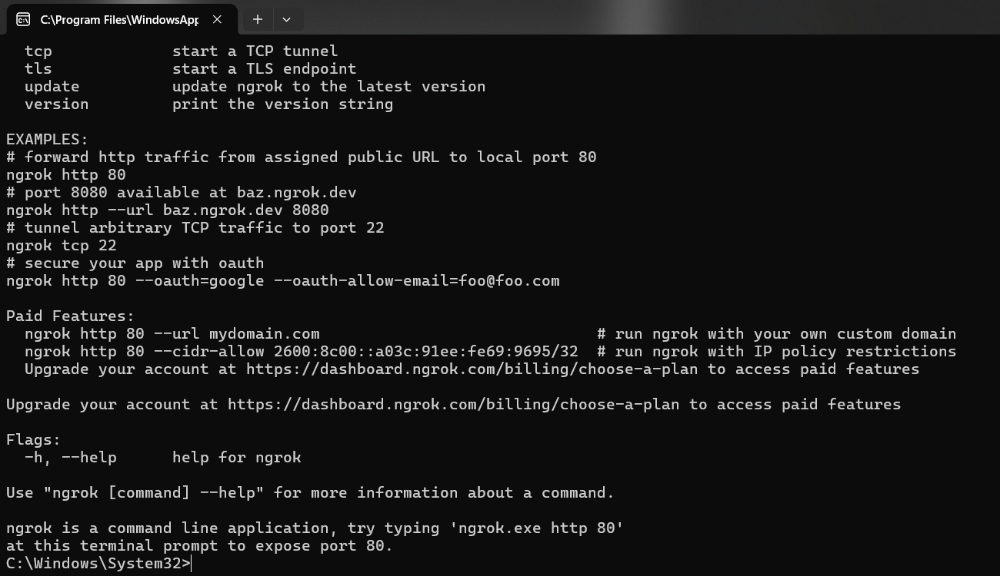

### 設定認證金鑰

13. 返回步驟 8 的頁面，點擊複製按鈕以複製 Authtoken。
    [ngrok 設定頁面](https://dashboard.ngrok.com/get-started/setup/windows)

    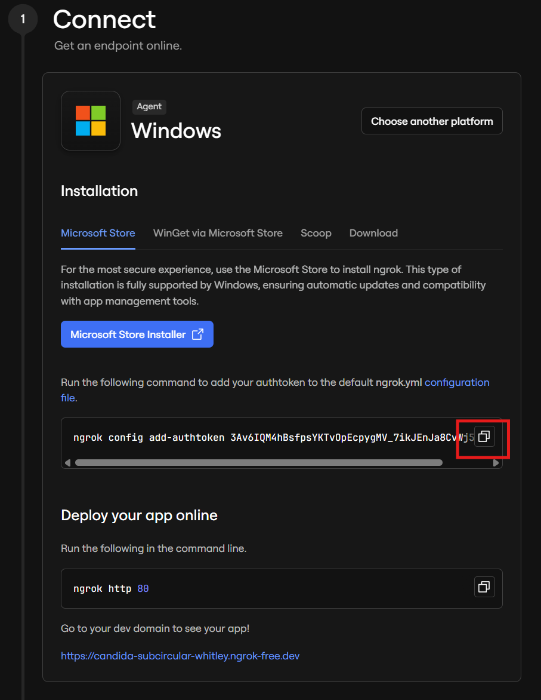

14. 在步驟 12 的終端機畫面中，按右鍵貼上指令並按下 Enter。出現以下文字即表示設定完成，可以關閉視窗。

    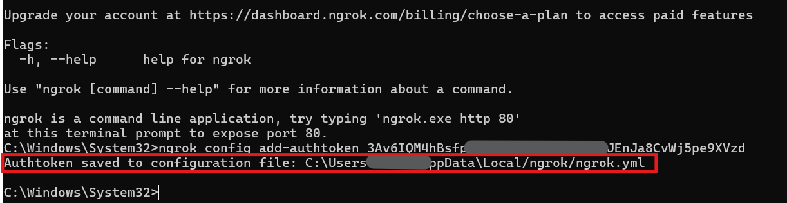
