# Anthropic 簡介

Anthropic 是一家由前 OpenAI 高層創立的 AI 安全與研究公司，致力於開發可靠、可解釋且安全的 AI 系統。其旗艦模型 **Claude** 系列在目前 AI 市場中表現極為出色。

## 為什麼選擇 Anthropic (Claude)？

1. **卓越的程式碼能力**：Claude 3.5 Sonnet 模型在撰寫、除錯與重構程式碼方面的表現被公認為目前界內頂尖，非常適合開發者與學員使用。
2. **強大的邏輯推理**：相較於其他模型，Claude 在處理複雜邏輯、遵循指令及語意理解上更為細膩與準確。
3. **Artifacts 功能**：提供即時的程式碼預覽與文件編輯環境，能大幅提升教學與學習的互動性。

## 付費建議

有免費的替代方案（如 Claude 的免費版或其他平台），但是免費資源往往有嚴格的使用限制（如每小時對話次數），且 AI 回應的穩定性參差不齊，可能會影響老師教學進度與學員學習體驗。

**建議學員可以考慮自費訂閱 Claude Pro**，以獲取最強大的模型效能與更穩定的使用頻寬。

## 快速上手步驟

1. 前往 [Anthropic 官網](https://www.anthropic.com/)。
2. 點擊使用google帳號繼續。
   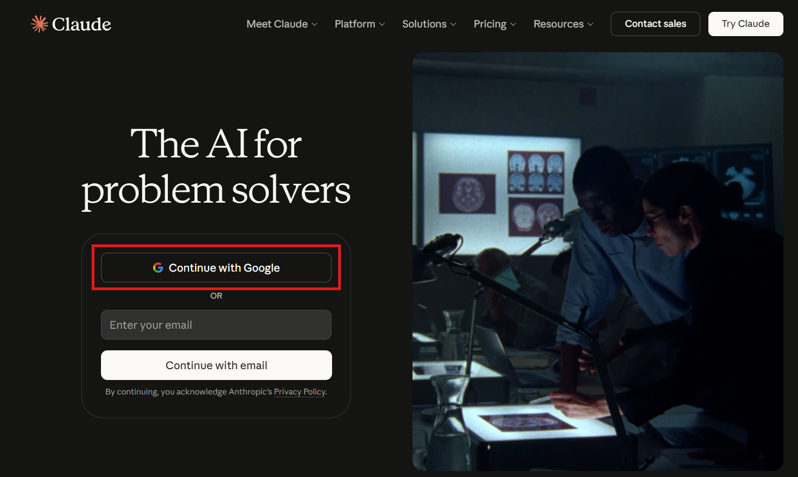

3. 點擊繼續
   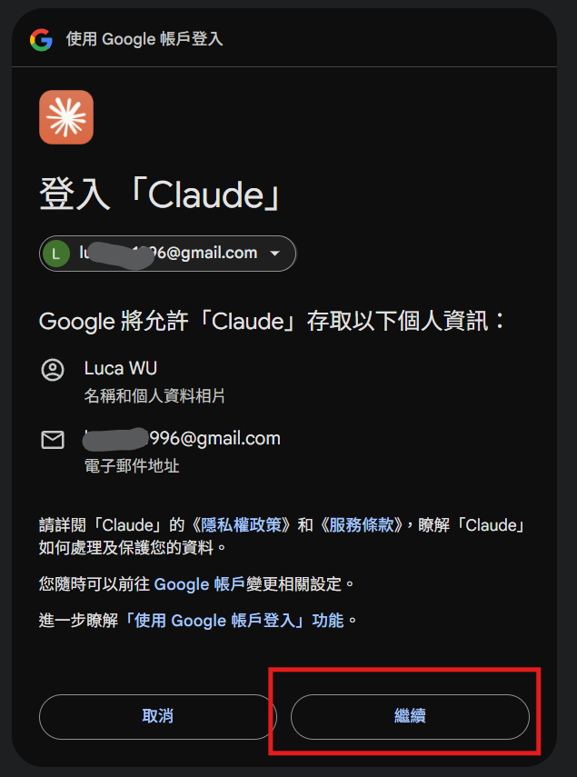

4. 填寫使用者名稱，勾選同意政策，點擊建立帳號
   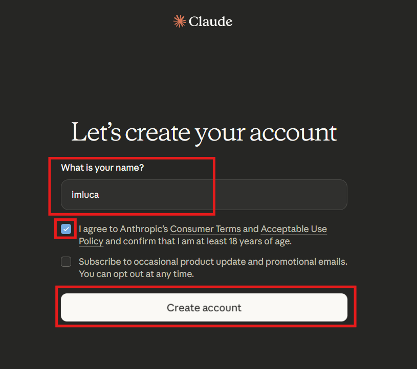

5. 驗證手機號碼，手機從09XX改成+8869XX，點擊驗證
   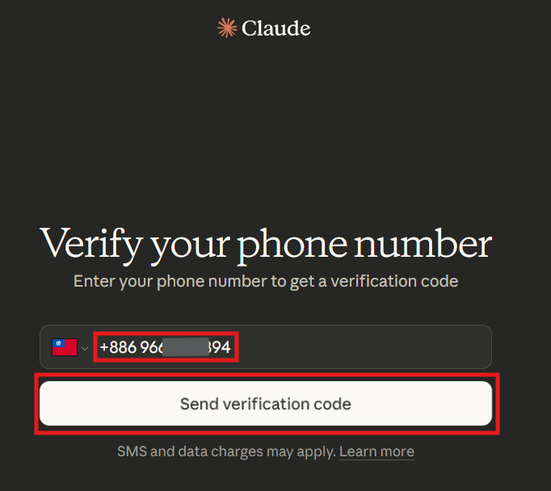

6. 輸入驗證碼，點擊驗證
   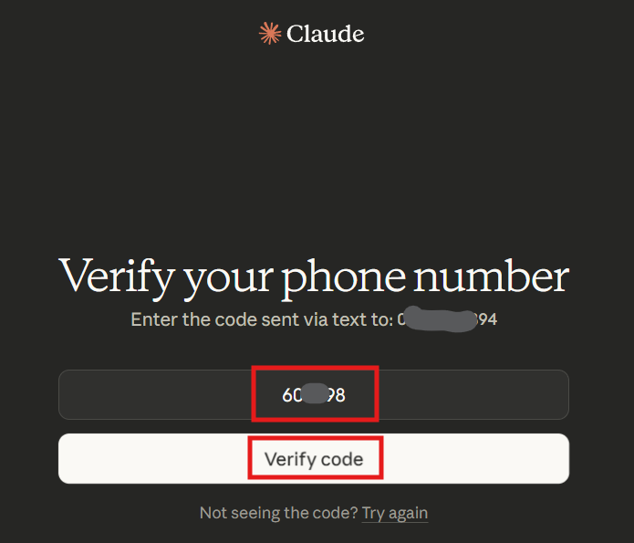

7. 關閉用自己的聊天紀錄訓練claude，點擊I understand
   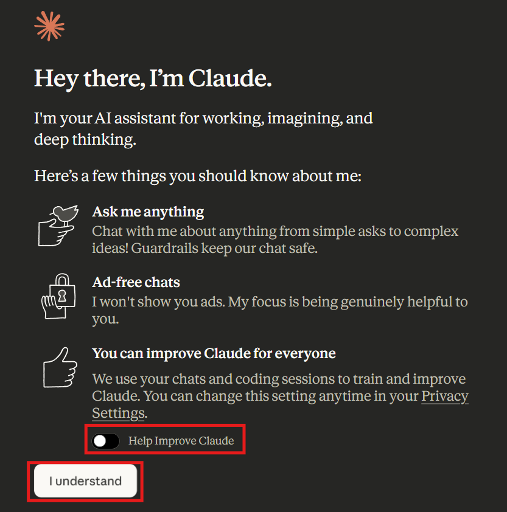

8. 職業隨便填，點擊繼續
   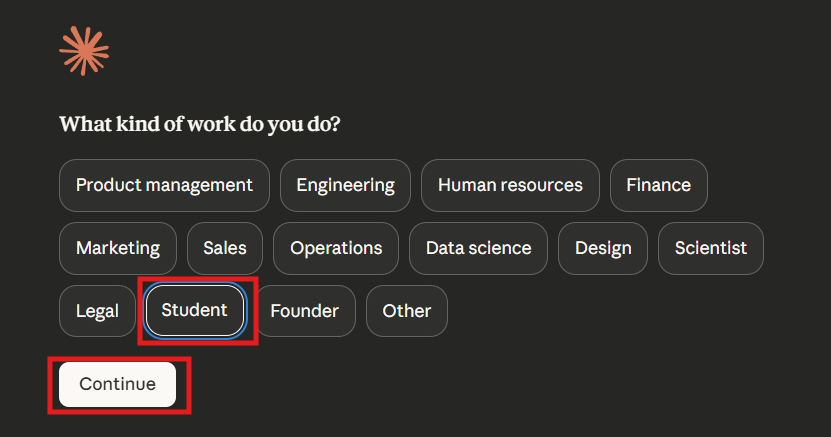

9. 點擊繼續
   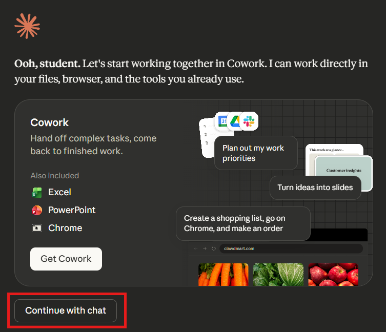

10. 選擇購買一個月的pro方案，點擊Get Pro plan
    *注意：費用是20美金(約650台幣)
    *注意：主要使用claude Code功能
    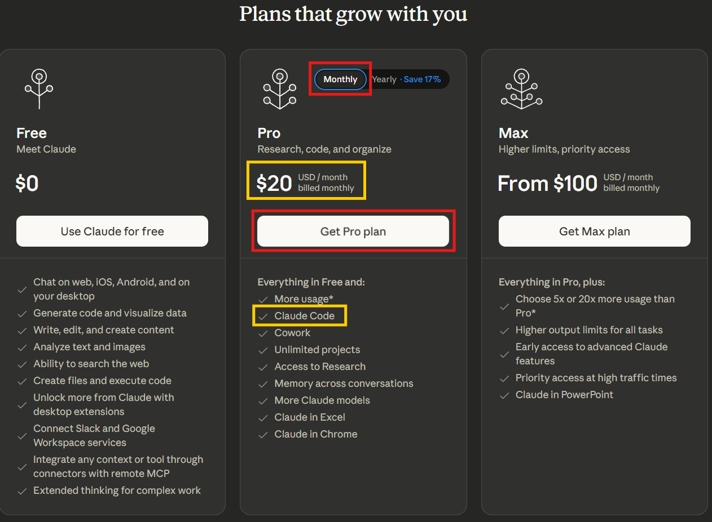

11. 自行填寫信用卡資訊，完成購買
    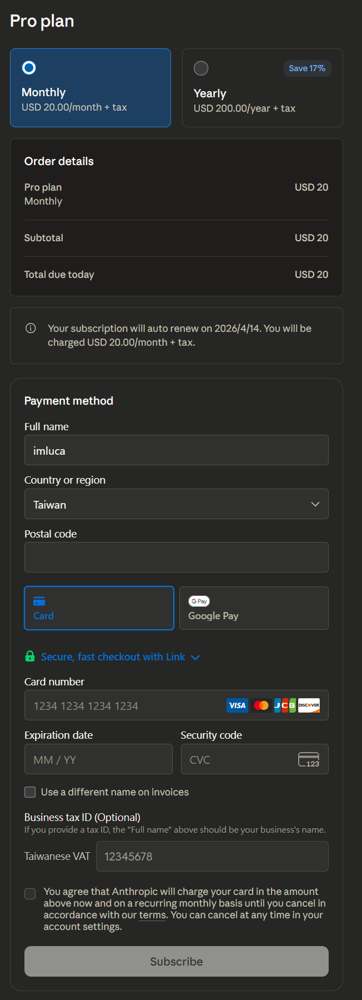

12. 在claude聊天室窗的左下角看到有Pro plan代表購買成功。
    [claude 聊天室窗](https://claude.ai/new)
    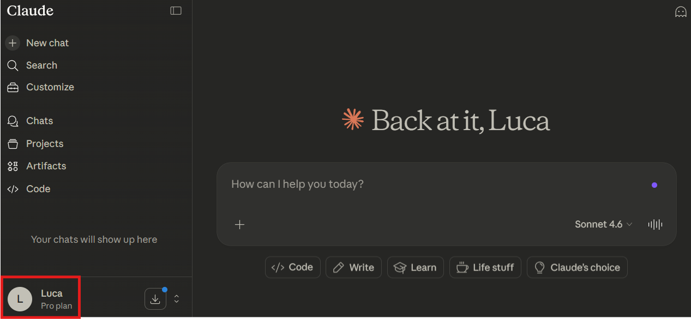

13. 開啟終端機輸入以下指令，下載claude code。
    [安裝指令說明](https://code.claude.com/docs/en/overview)
    1. 使用PowerShell，貼上指令，按enter。

       ```bash
       irm https://claude.ai/install.ps1 | iex
       ```

       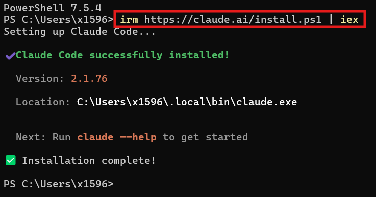

    2. 或使用命令提示字元，貼上指令，按enter。

       ```bash
       curl -fsSL https://claude.ai/install.cmd -o install.cmd && install.cmd && del install.cmd
       ```

       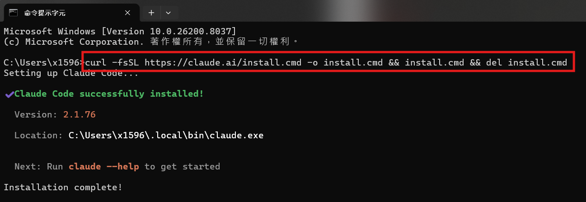

14. 在桌面建立一個資料夾，例如`claude`。
    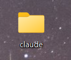

15. 複製資料夾路徑(對路徑列的空白處點一下，再按ctrl+c)。
    

16. 貼上剛剛複製的資料夾路徑，按enter。
    - 注意：路徑和cd之間要有空白
    - cd 指令的意思：移動到指定的資料夾

    ```
    cd 路徑
    ```

    黃色底線的路徑與你剛剛貼上的路徑一樣，代表成功。
    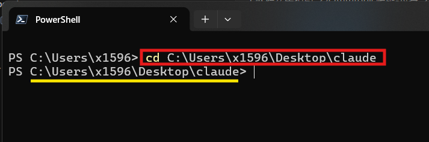

17. 在終端機輸入`claude code`，會出現以下畫面，按enter同意。
    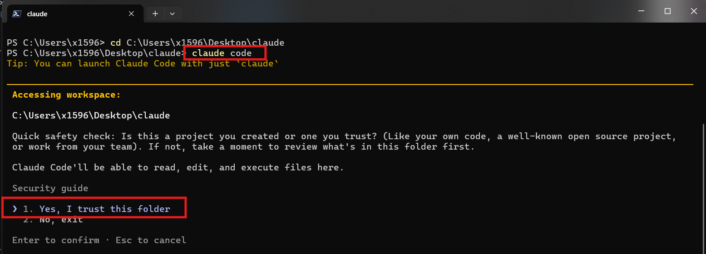

18. 到這個畫面代表安裝成功，完成後可以關閉畫面。
    Sonnet 4.6 ： 目前選中的模型
    Claude Pro ： 目前使用的方案
    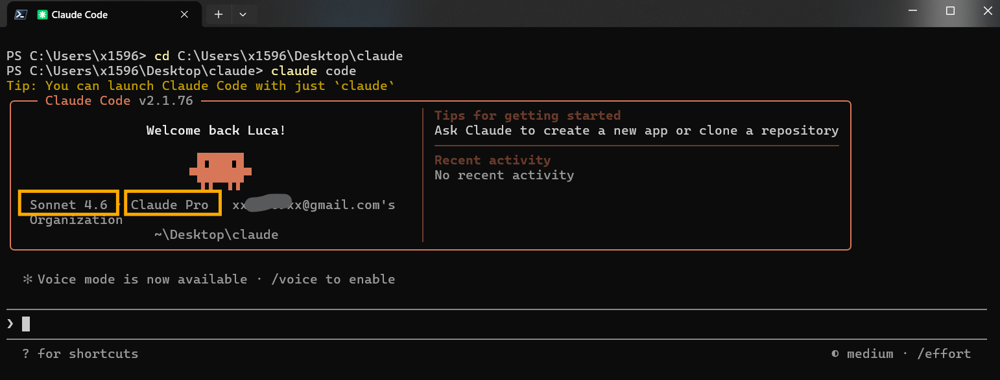
