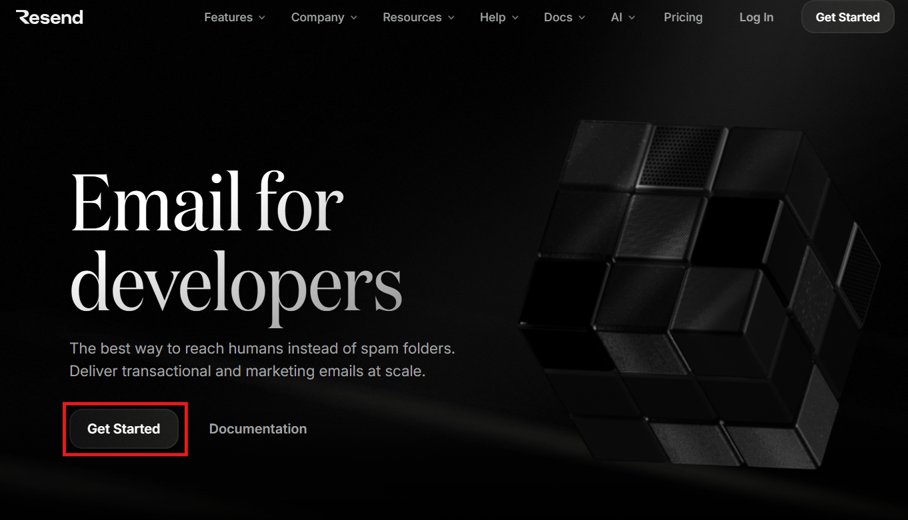
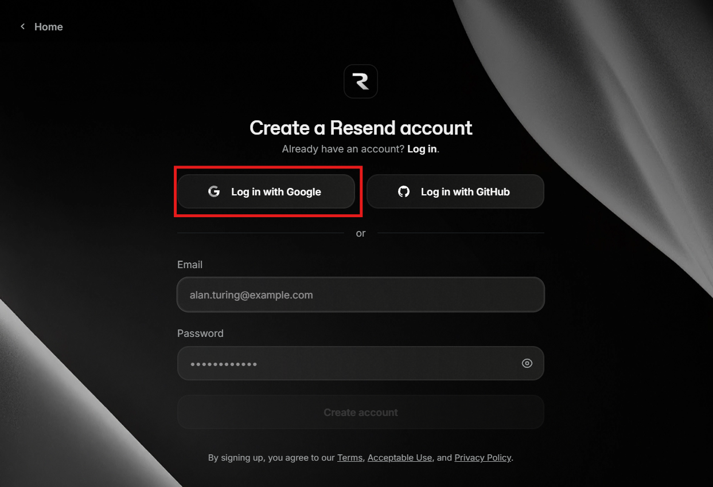
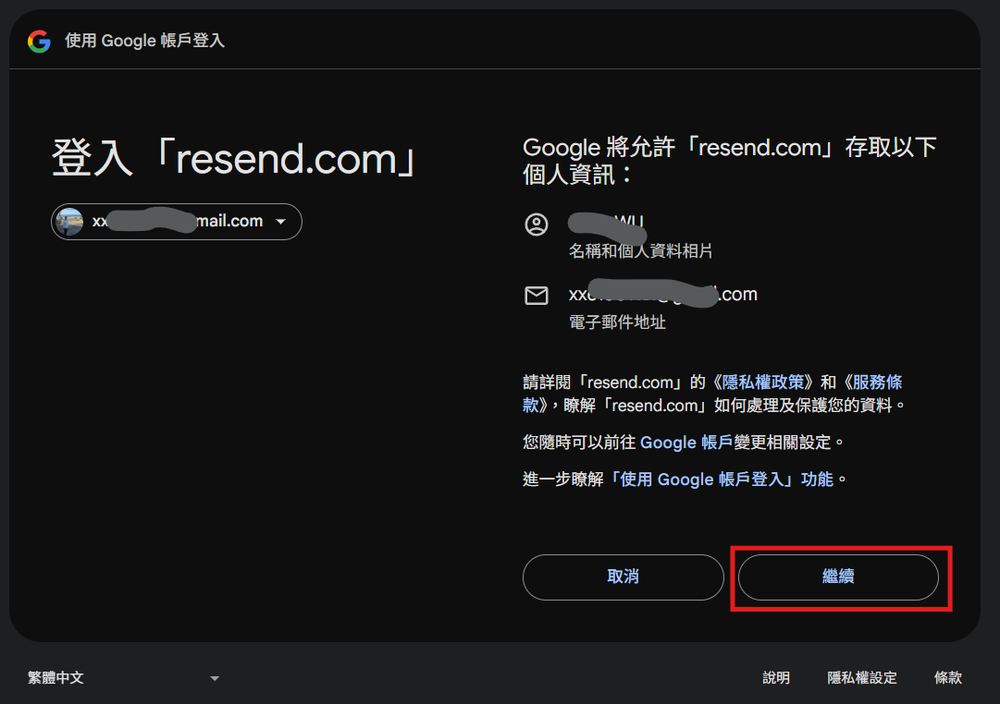
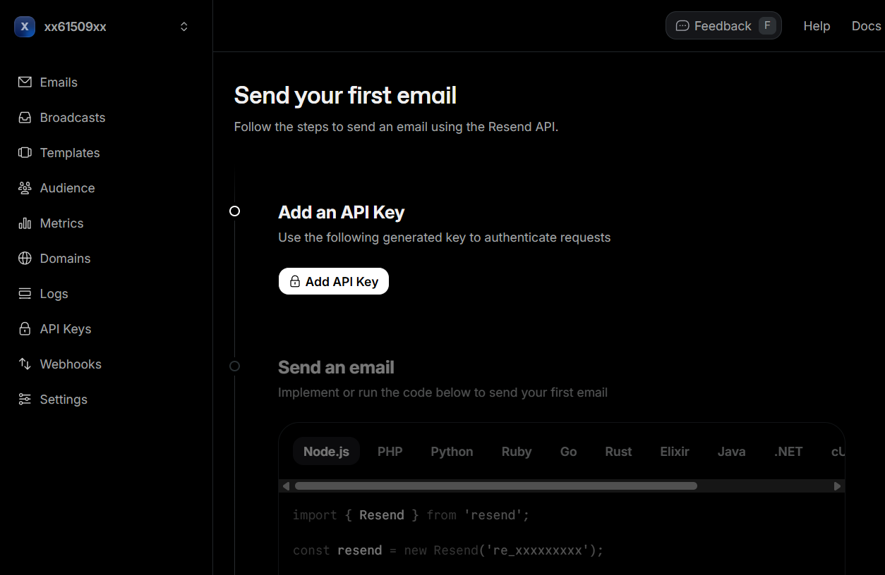

# Resend 簡介

[Resend](https://resend.com/) 是一個專為開發者設計的現代化電子郵件 API 平台，旨在簡化發送、接收和追蹤電子郵件的流程。

### 核心特色

- **開發者體驗優先**：提供直觀的 REST API、SMTP Relay 服務以及多種語言的 SDK（如 Node.js, Python, Go 等）。
- **React Email 整合**：與 `React Email` 深度集成，允許開發者使用 React 組件來構建響應式電子郵件模板，讓信件內容開發像寫 UI 一樣簡單。
- **高傳達率**：透過自動化的 SPF、DKIM 和 DMARC 驗證，確保信件能精準進入收件箱。
- **即時監控**：提供詳細的 Webhooks 和數據分析日誌，即時追蹤信件的投遞、開啟、點擊及彈回狀態。

### 方案與定價 (2026 參考)

Resend 提供非常有競爭力的免費方案，非常適合個人開發者或新創項目：

- **Free 免費方案**：每月可免費發送 **3,000 封** 電子郵件（每日限額 100 封），支援 1 個自定義域名及 1 天的數據保留。
- **Pro 專業方案**：每月 $20 起，支援 50,000 封郵件，無每日限額，支援 10 個自定義域名及更長的數據保留期。

### 為什麼選擇 Resend？

如果您正在尋找一個比傳統服務（如 SendGrid 或 Mailgun）更現代、配置更簡單且對 React 生態系更友好的郵件發送解決方案，Resend 是目前的最佳選擇。

## Resend 註冊流程

1. 前往 [Resend 官方網站](https://resend.com/)，點擊「Get Started」開始註冊。

   

2. 選擇使用 Google 帳號進行登入。

   

3. 確認授權，允許 Resend 存取您的帳號資訊。

   

4. 帳號建立完成，出現以下畫面即表示註冊成功，可以關閉視窗。

   
