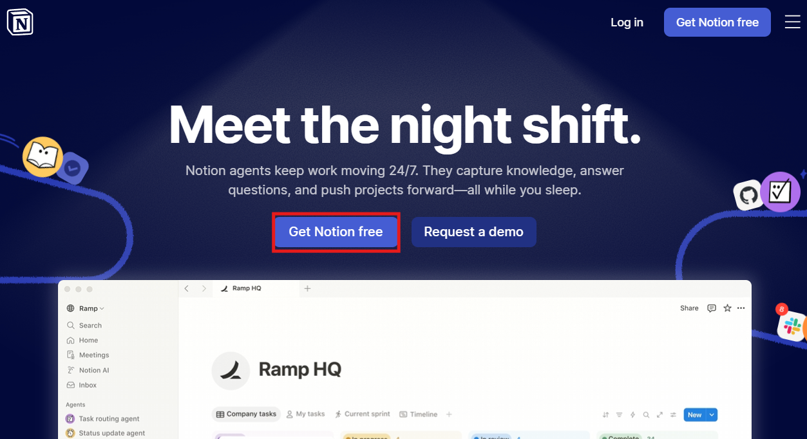
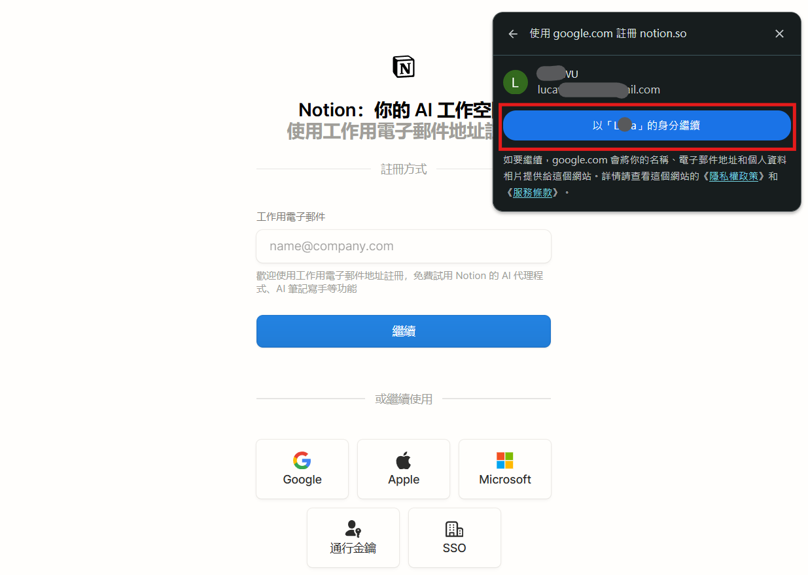
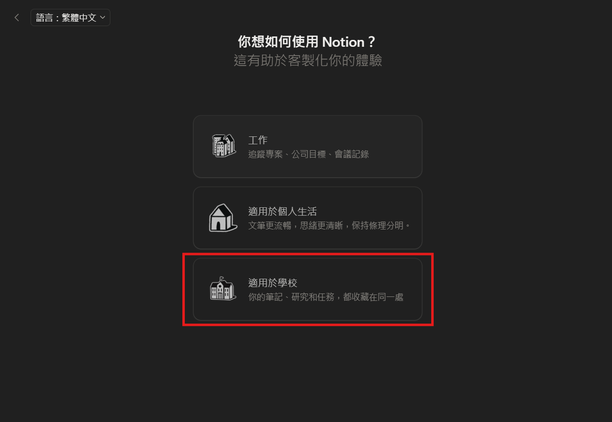
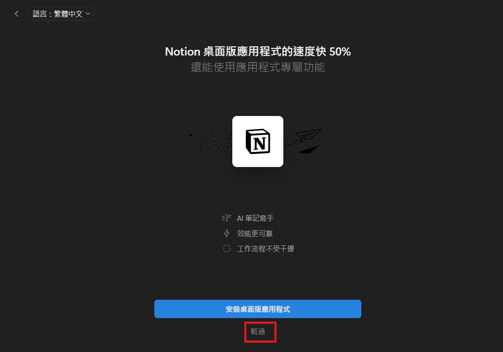
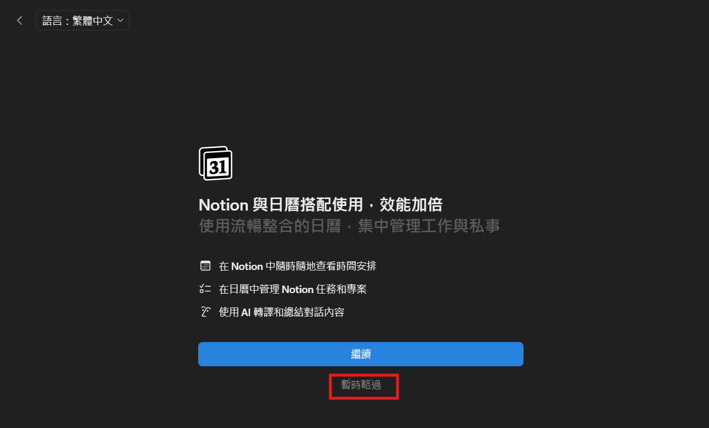
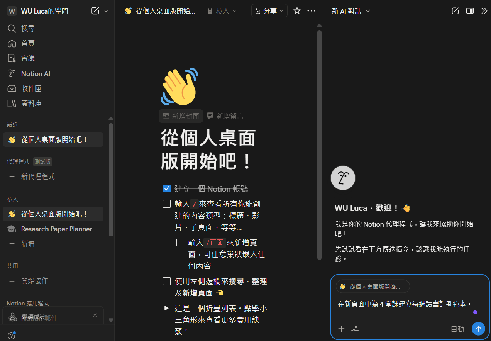

# Notion 簡介

Notion 是一款「全位一體」（All-in-one）的協作工作區軟體，旨在將筆記、文件、任務管理、知識庫及資料庫整合在一個平台上。

### 核心功能：

1. **筆記與文件**：提供強大的富文本編輯功能，支援多種內容塊（Blocks）。
2. **資料庫（Databases）**：支援表格、看板、日曆、清單、畫廊等多種視圖，方便進行資料整理與專案追蹤。
3. **任務與目標管理**：可建立待辦清單，並透過看板（Kanban）或甘特圖（Timeline）管理專案進度。
4. **團隊協作**：支援多人即時編輯、評論及權限控管，非常適合團隊知識共享。
5. **高度自定義**：使用者可以根據需求自由建構頁面結構與工作流程。

### 為什麼使用 Notion？

- **整合性強**：減少在多個 App 之間切換的頻率。
- **跨平台支援**：可在瀏覽器、Windows、macOS、iOS 及 Android 上使用。
- **豐富的模板**：提供大量社群模板，讓新手能快速上手。

---

## Notion 註冊流程

1. 前往 [Notion 官方網站](https://www.notion.so/)，點擊「Get Notion free」開始註冊。

   

2. 選擇使用 Google 帳號進行註冊。

   

3. 確認帳號資訊後，點擊「以你的身分繼續」。

   

4. 用途問卷可依個人狀況填寫，不影響後續使用。

   

5. 邀請成員步驟可點擊「暫時略過」。

   

6. 附加設定可點擊「略過」。

   

7. 進階功能介紹可點擊「暫時略過」。

   

8. 出現以下畫面即表示帳號設定完成，可以關閉視窗。

   
