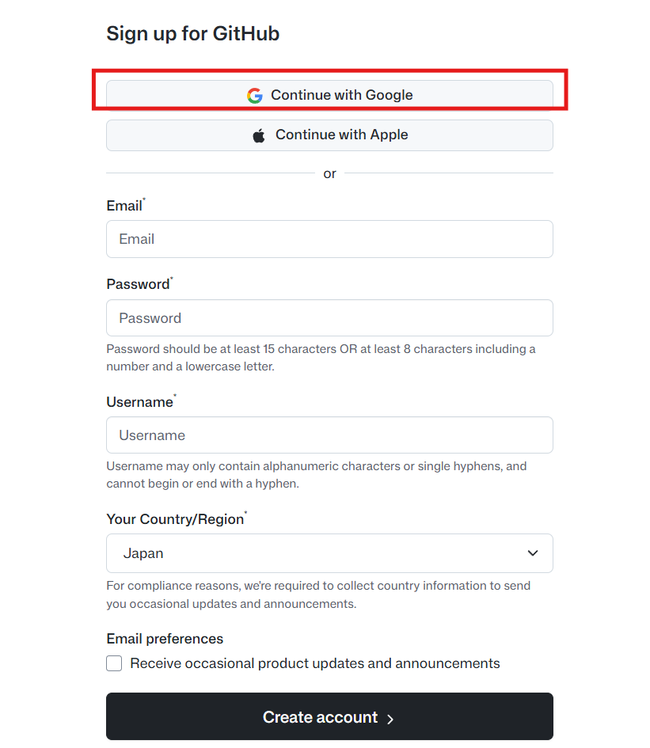

# GitHub 簡介

GitHub 是全球最大的程式碼託管平台，基於 Git 版本控制系統打造。它提供程式碼儲存、版本管理、協作開發與專案管理等功能，是開發者進行開源與私有專案協作的首選平台。透過 GitHub，開發者可以輕鬆追蹤程式碼變更、發起合併請求（Pull Request）、回報問題（Issues），並與全球社群共同協作。

---

## GitHub 註冊流程

1. 前往 [GitHub 官方網站](https://github.com/)，點擊「Sign up」開始註冊。

   

2. 填寫註冊資料，建議使用 Google 帳號的電子郵件進行註冊。

   

3. 填寫使用者名稱並選擇所在地區。

   

4. 出現以下畫面即表示帳號建立成功，可以關閉視窗。

   
