# LINE 官方帳號簡介

LINE 官方帳號是 LINE 平台提供的商業溝通工具，讓企業、組織或個人開發者能透過 LINE 與用戶進行互動。搭配 LINE Messaging API，開發者可以建立自動化聊天機器人（Chatbot），實現訊息自動回覆、推播通知、圖文選單等豐富功能，廣泛應用於客服、行銷與資訊推播等場景。

---

## 建立流程

### 步驟一：進入 LINE Developers 控制台

1. 前往 LINE Developers 網站，點擊右上角 **Console**。

   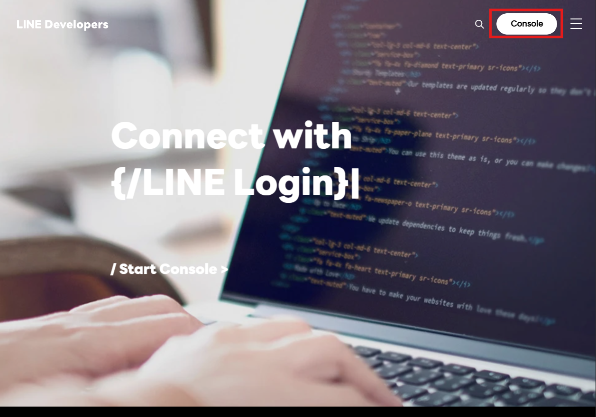

2. 點擊 **建立帳號**。

   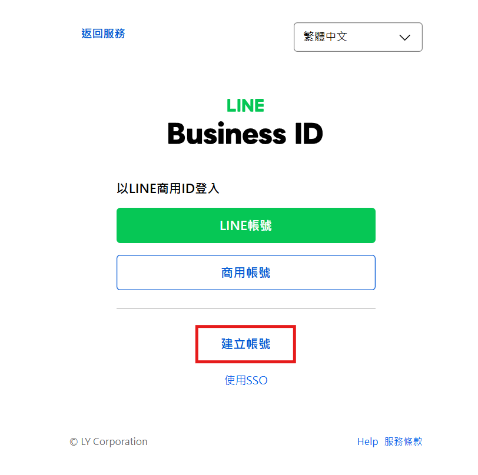

3. 使用 LINE 帳號進行註冊。

   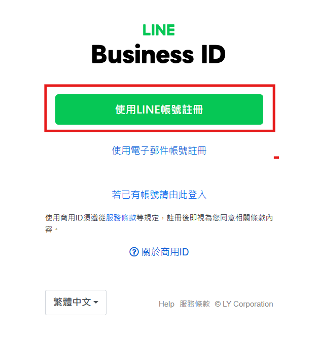

4. 輸入帳號密碼後登入。

   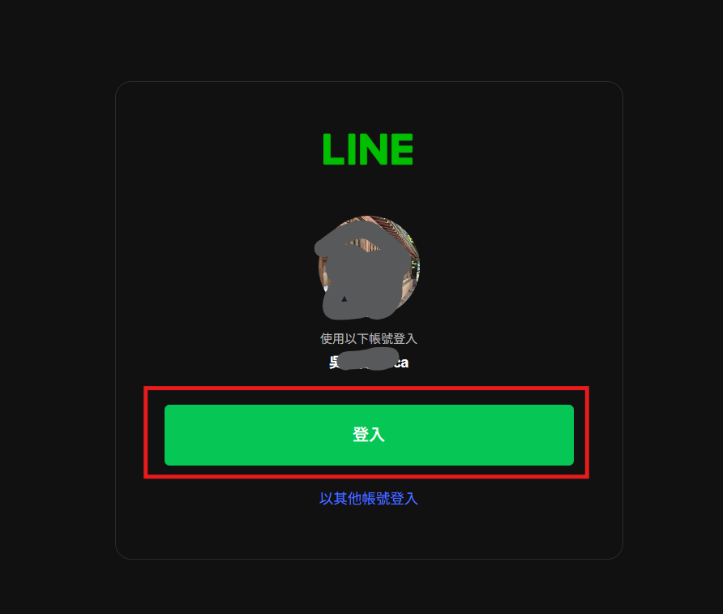

## 步驟二：建立 Provider

> **Provider（服務提供者）** 是指提供服務的個人開發者、公司或組織。

5. 點擊 **Create a new provider**。

   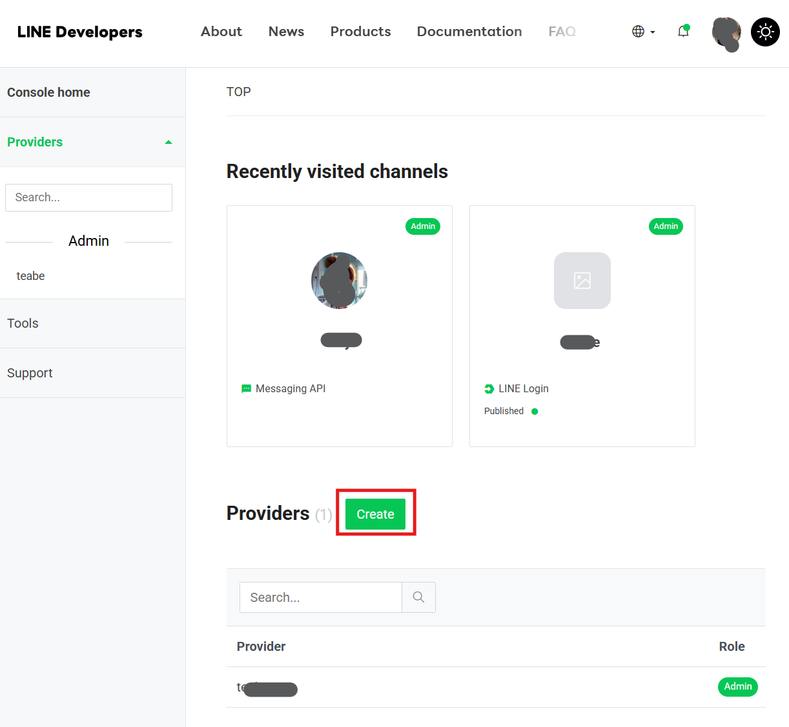

6. 填寫 Provider 名稱（個人使用可自行命名）。

   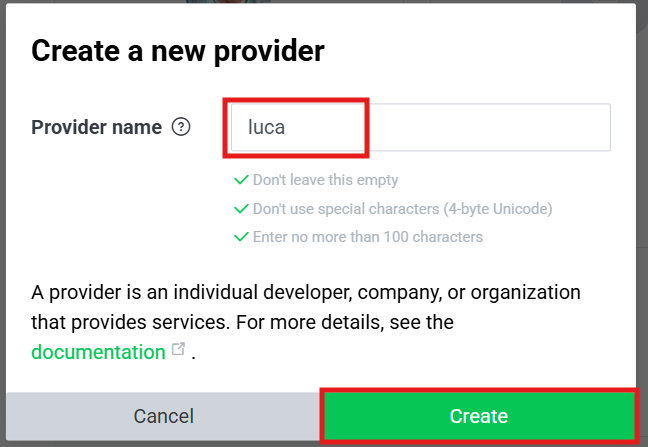

## 步驟三：建立 Messaging API Channel

7. 選擇 **Create a Messaging API channel**。

   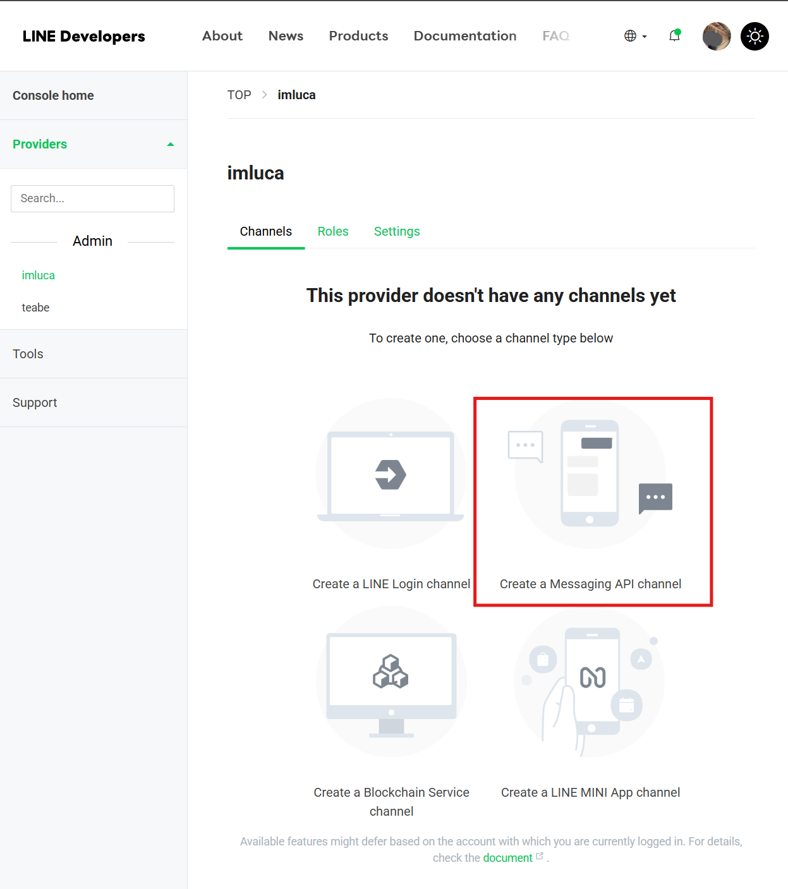

8. 點擊 **建立 LINE 官方帳號**。

   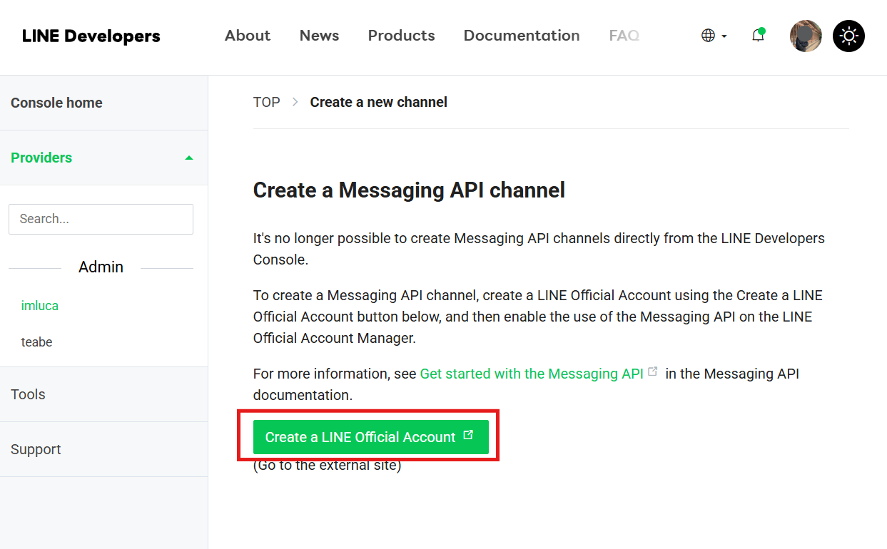

9. 填寫帳號資料（個人使用可自行填寫）。

   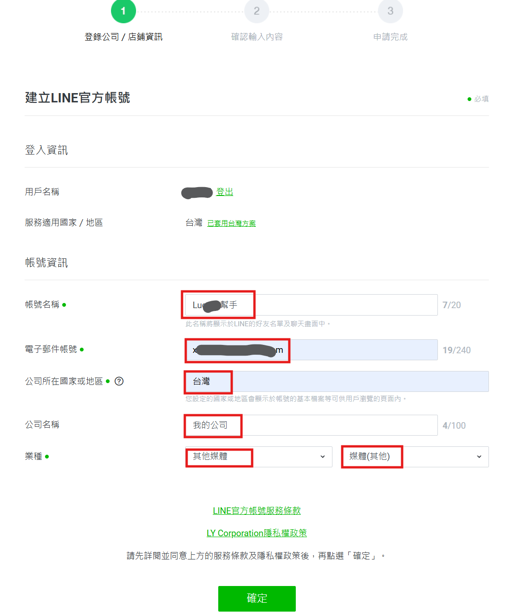

10. 確認資訊無誤後，點擊 **完成**。

    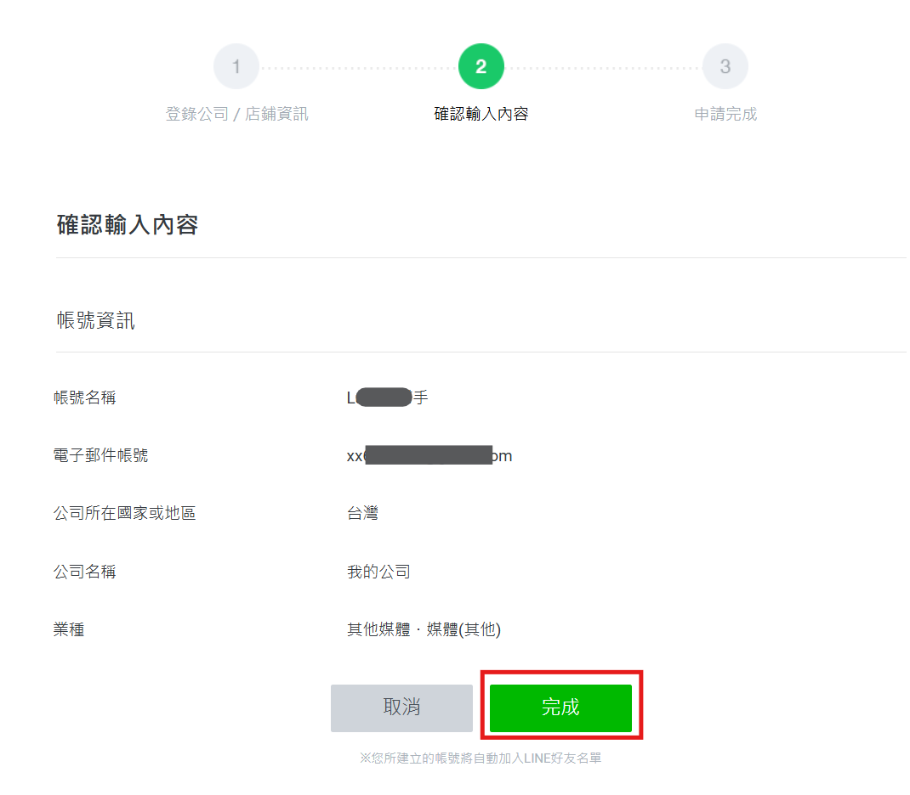

## 步驟四：完成設定

11. 帳號認證步驟選擇 **稍後再認證**（個人使用無需認證）。

    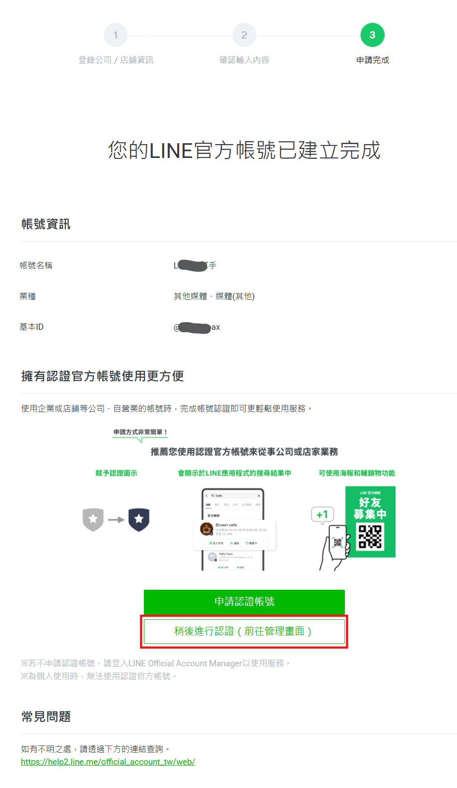

12. 閱讀條款後，點擊 **同意**。

    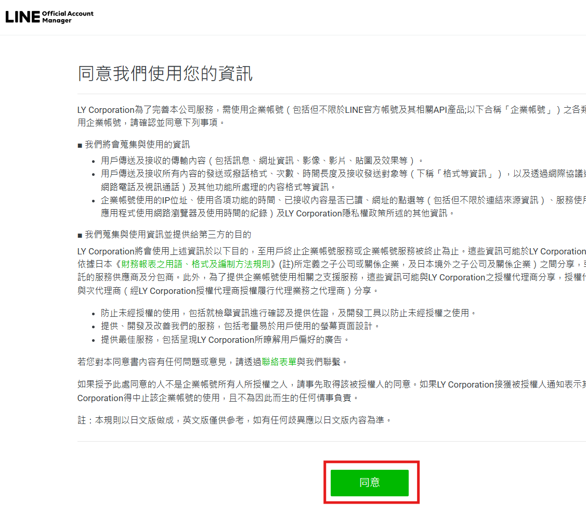

13. 閱讀注意事項後，點擊 **了解並接受**。

    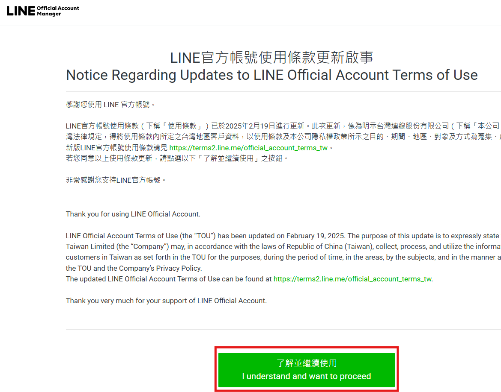

14. LINE 官方帳號建立完成。

    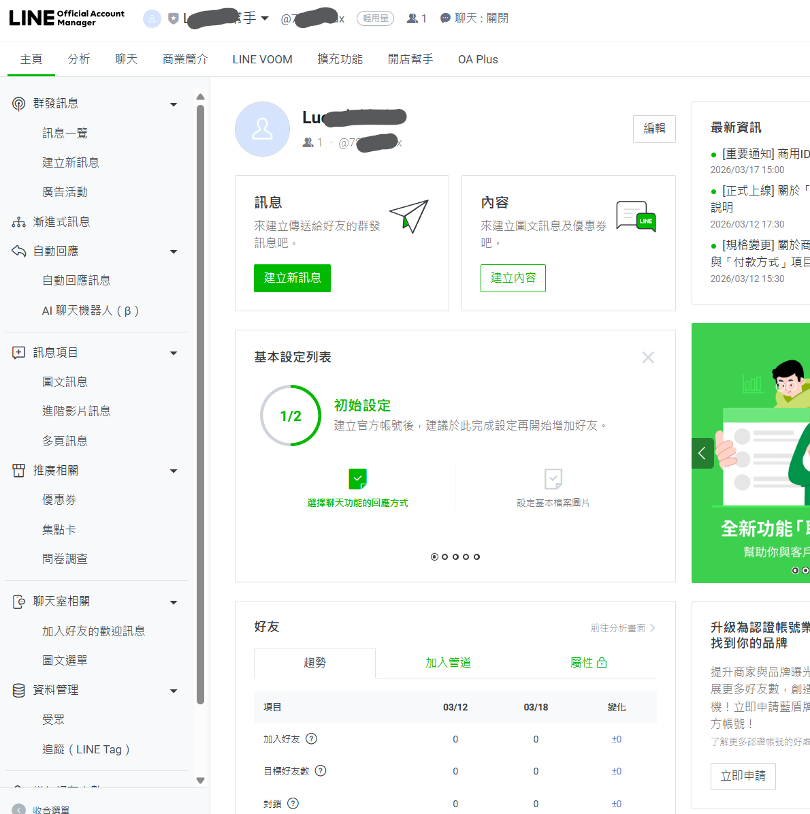
