# LINE Bot 金鑰取得

## 金鑰用途

LINE Bot 需要兩組金鑰來運作：

- **Channel Secret**：用於驗證來自 LINE 平台的 Webhook 請求是否合法，確保訊息來源的安全性。
- **Channel Access Token**：用於呼叫 LINE Messaging API，讓 Bot 能夠發送訊息、回覆用戶、推播通知等。

取得這兩組金鑰後，Bot 才能與 LINE 平台進行安全的雙向通訊。

---

## 啟用 Messaging API

1. 進入 [LINE 官方帳號管理後台](https://manager.line.biz/)。

2. 點擊「聊天」。

   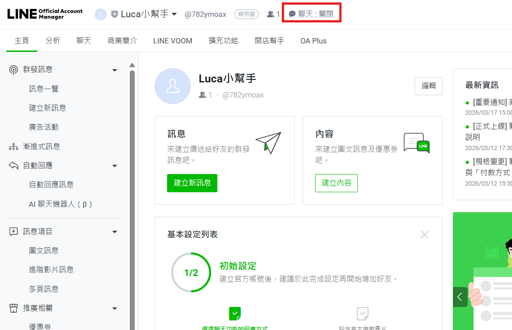

3. 關閉聊天、自動回應訊息與回應時間功能
   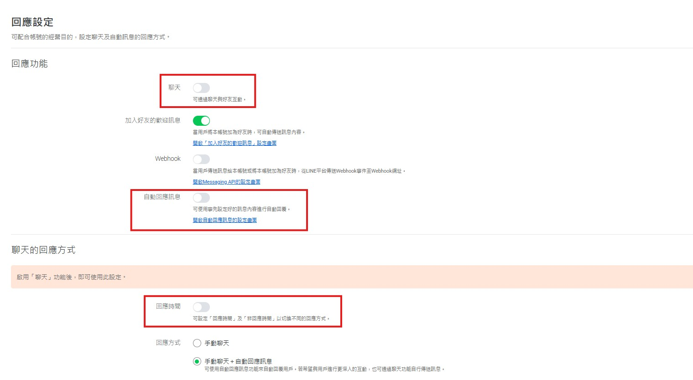
4. 點擊「Message API」選項。

   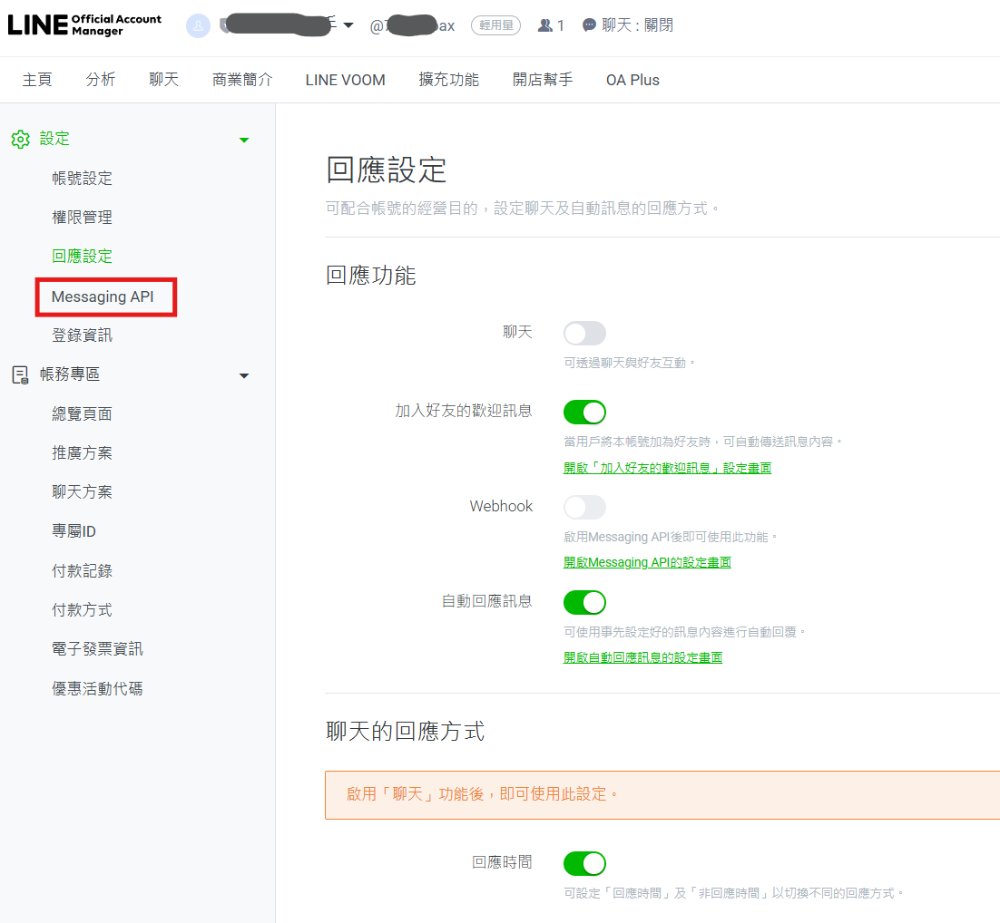

5. 點擊「啟動 Message API」。

   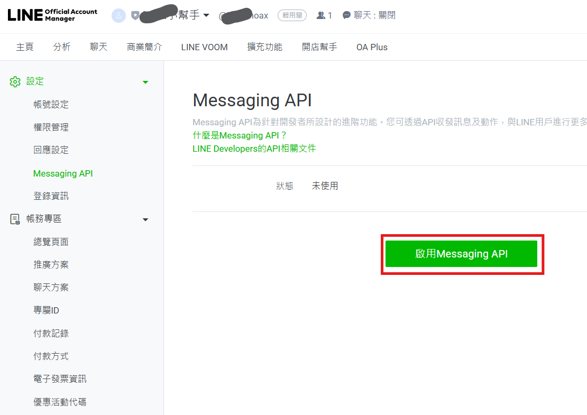

6. 選擇先前建立的官方帳號名稱，並點擊「同意」。

   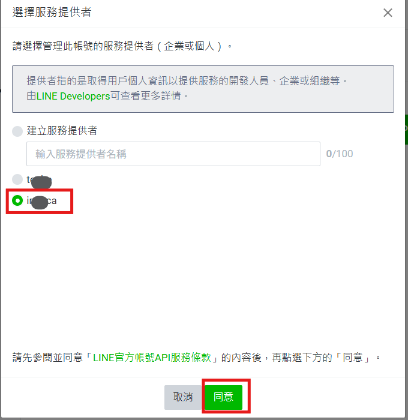

7. 確認啟用資訊，點擊「確定」。

   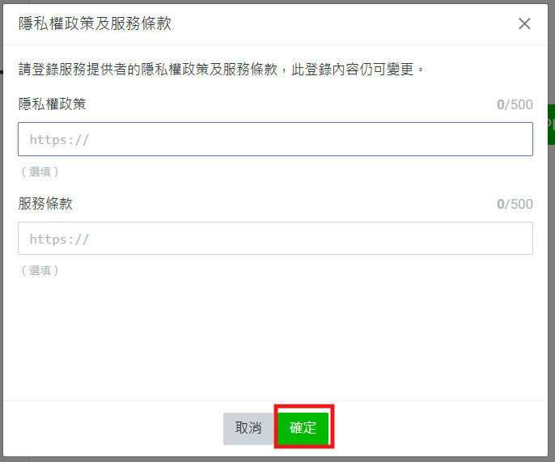

8. 再次點擊「確定」完成啟用。

   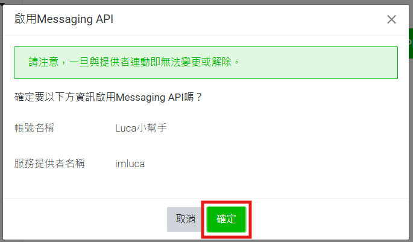

## 取得金鑰

9. 前往 [LINE Developers 控制台](https://developers.line.biz/en/)，點擊右上角「Console」。

   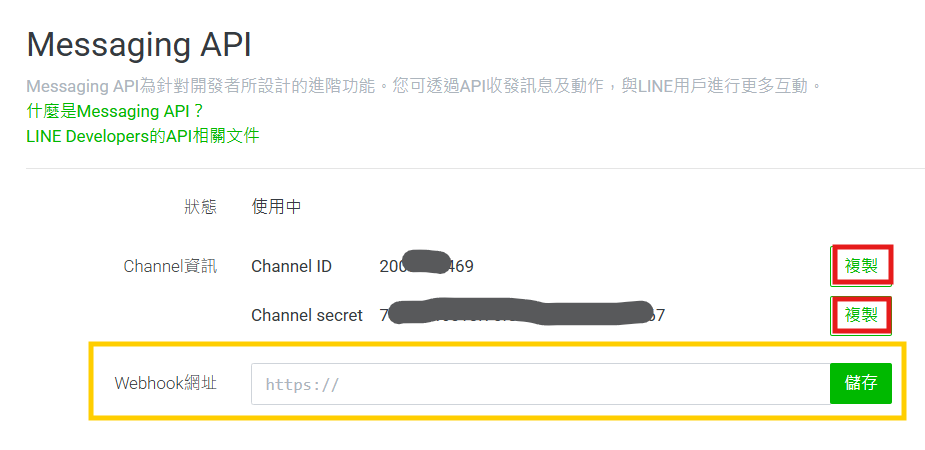

10. 在 Providers 列表中，點擊您的專案名稱。

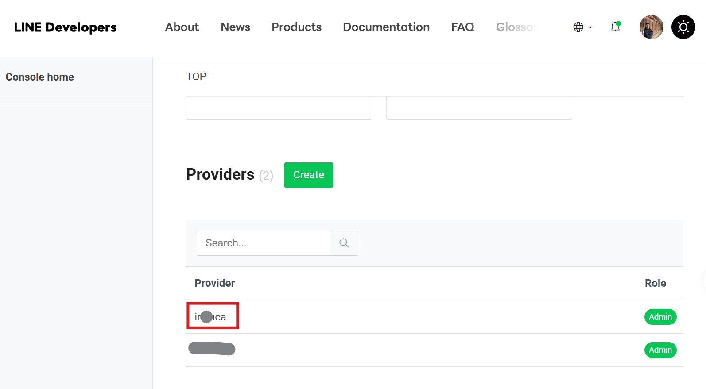

11. 點擊「Messaging API」頻道。

    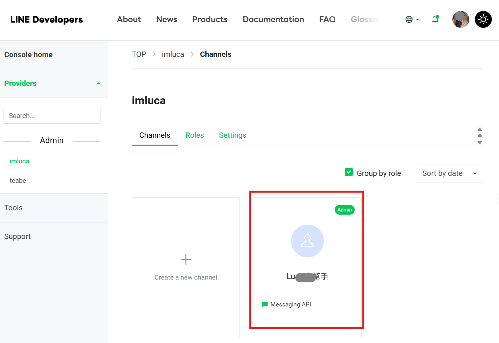

### 取得 Channel Secret

12. 在「Basic settings」頁面中向下捲動，找到 **Channel Secret** 欄位，點擊複製按鈕，並將金鑰貼至筆記本保存。

    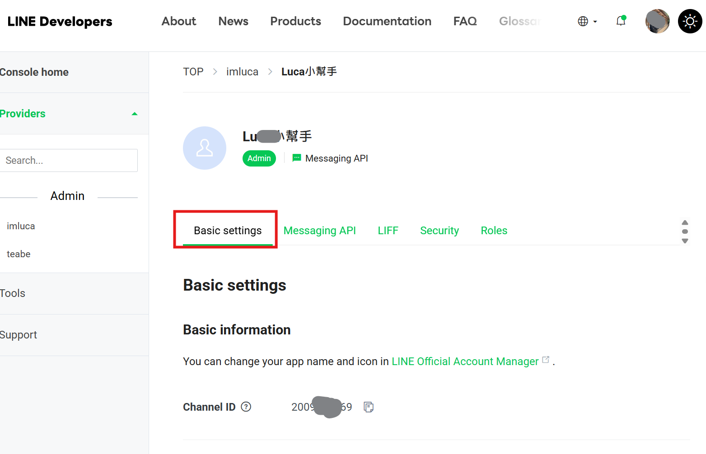

    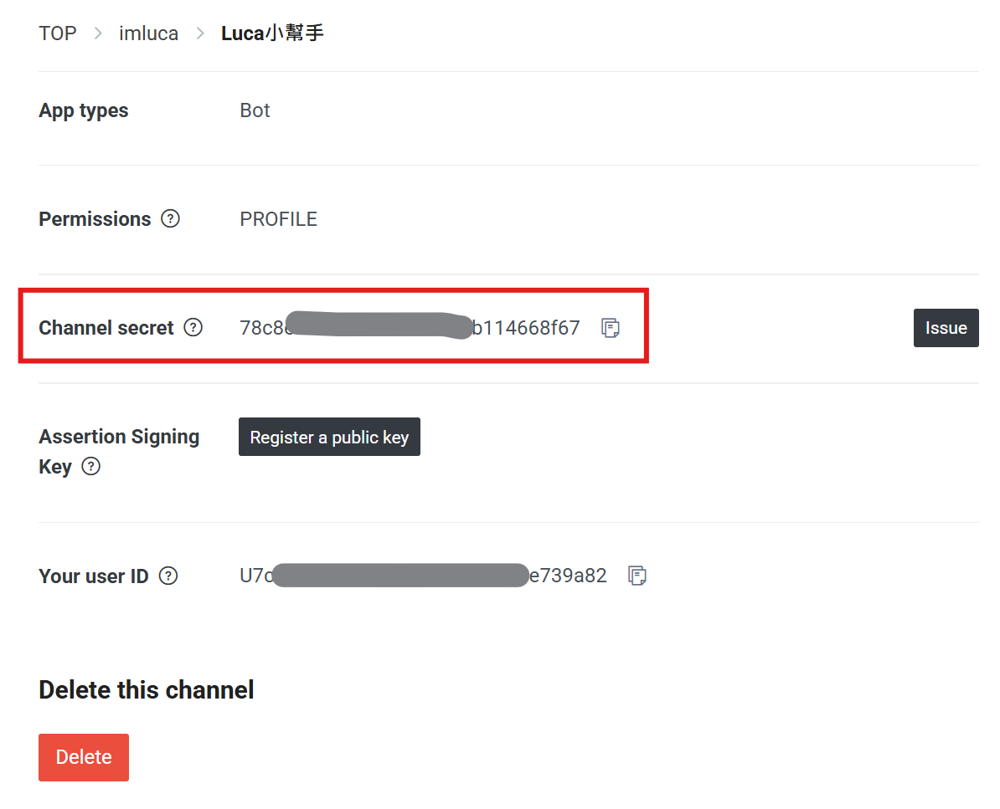

### 取得 Channel Access Token

13. 切換至「Messaging API」頁面並向下捲動，找到 **Channel Access Token** 欄位，點擊「Issue」按鈕產生金鑰，複製後貼至筆記本保存。

    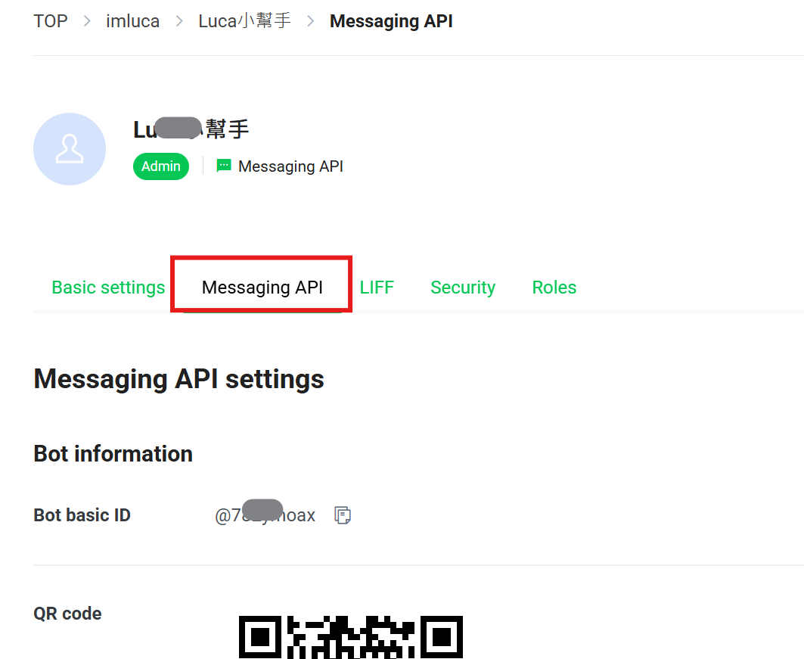

    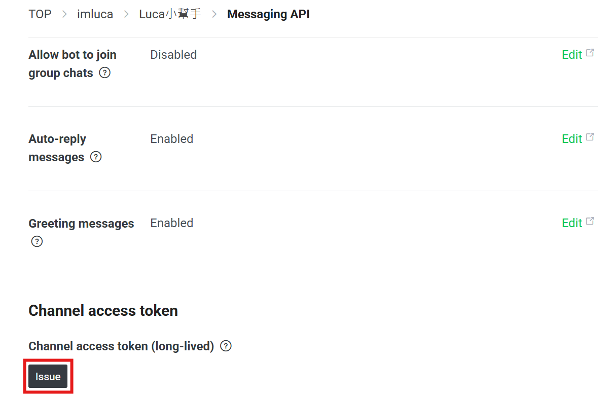

    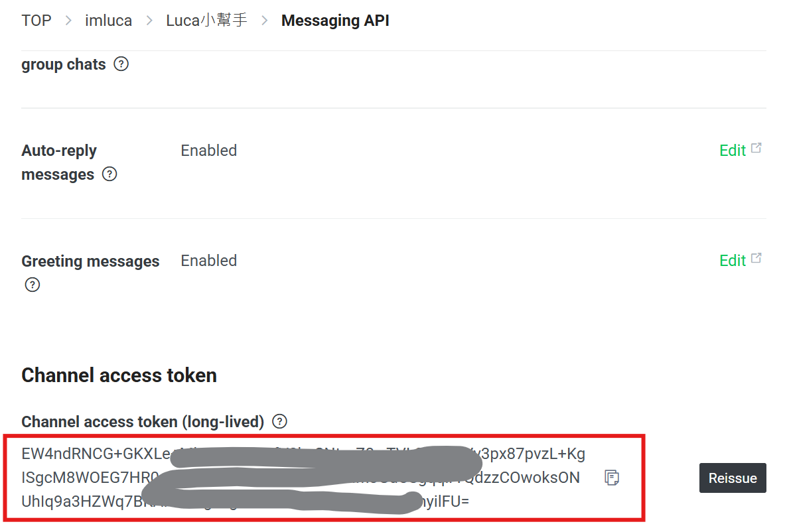

### 記錄 Webhook 設定頁面

14. 記錄此頁面的網址，後續設定 Webhook URL 時將需要返回此處。
    - 黃色標示區塊的 Webhook URL 欄位將於後續步驟進行設定

    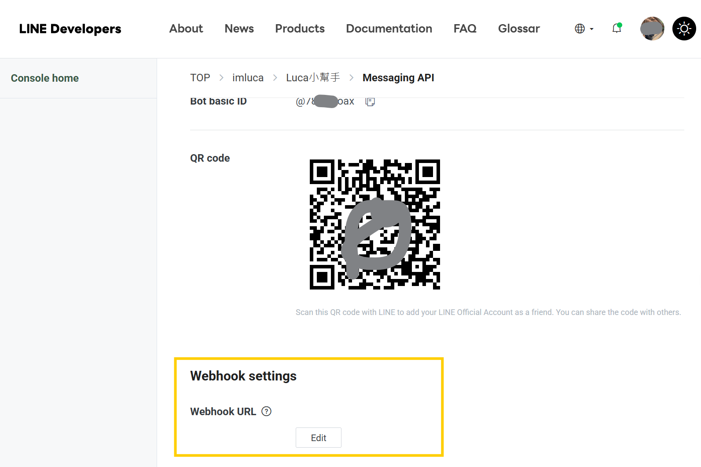

### 輸入完 Webhook 後的設定

15. 驗證權限是否正常，開啟use webhook功能
    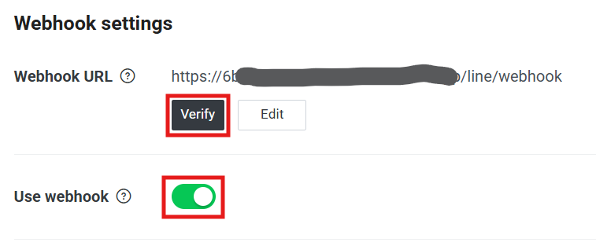
