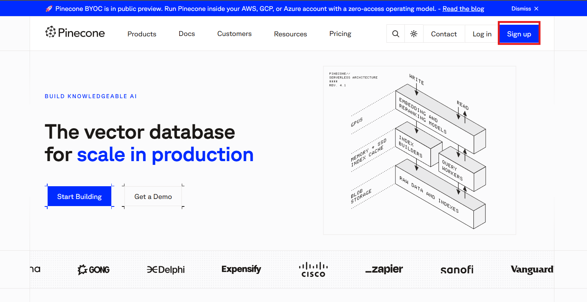
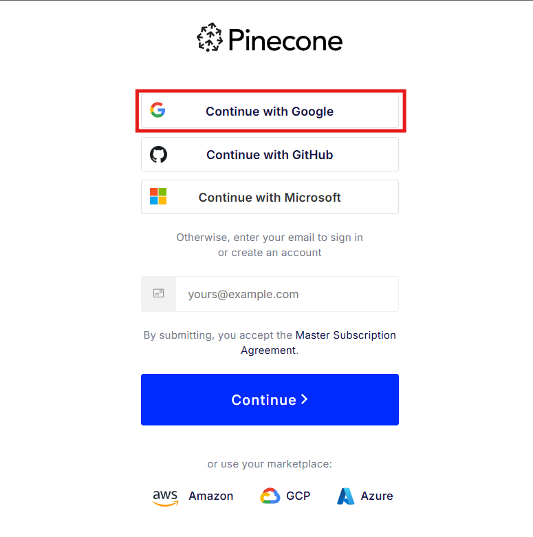
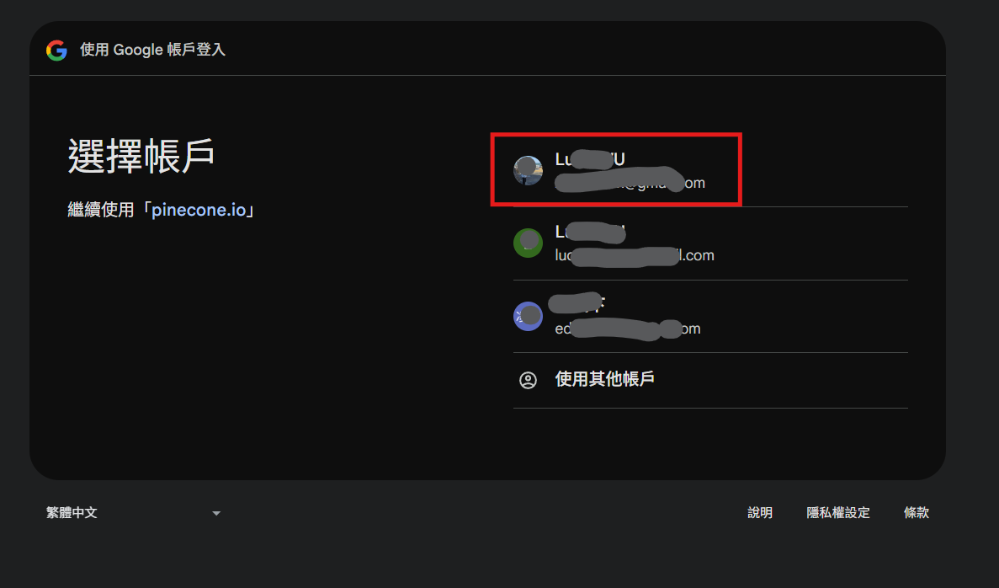
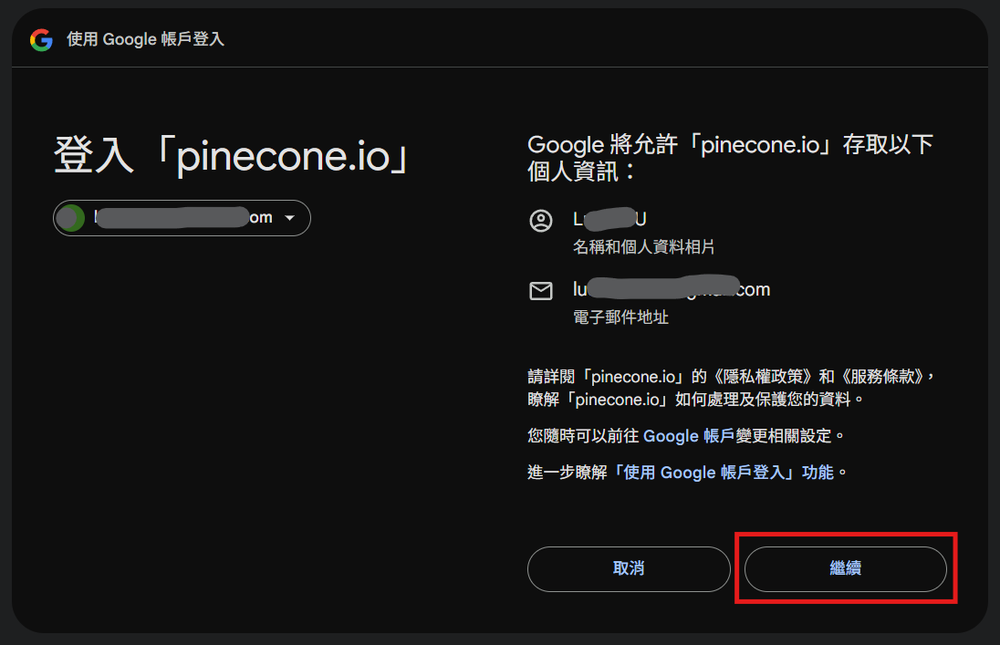
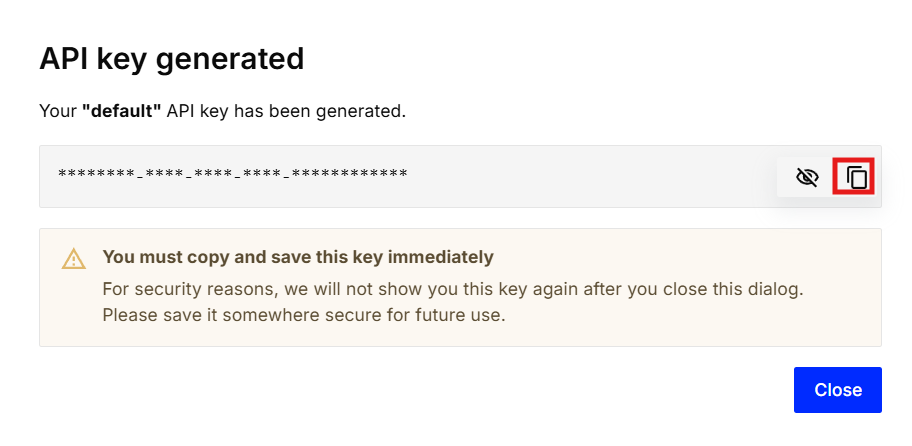
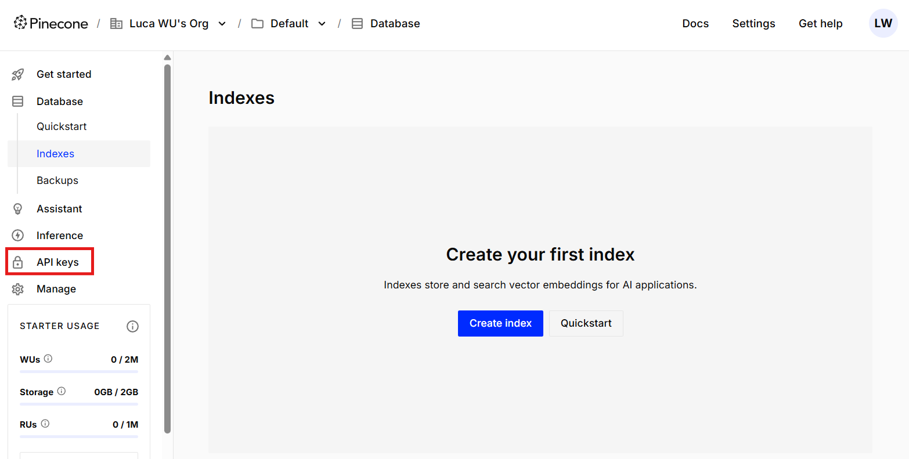
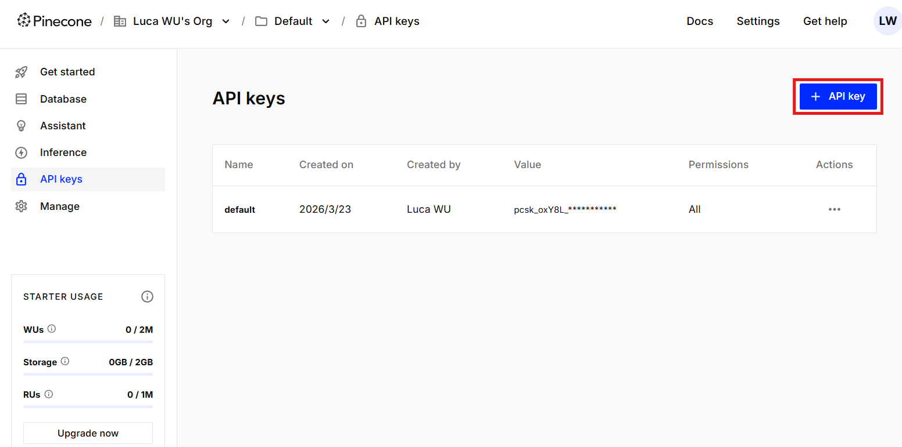
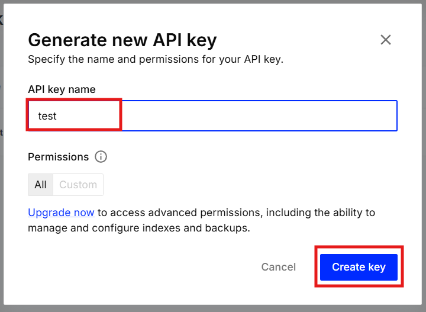

# Pinecone API 金鑰取得

## 金鑰用途

Pinecone API Key 是存取 Pinecone 向量資料庫服務的身份驗證憑證。Pinecone 專為 AI 應用設計，提供高效能的向量儲存與相似度搜尋功能，常用於語意搜尋、推薦系統與 RAG（檢索增強生成）等場景。透過此金鑰，應用程式可以建立索引、寫入向量資料並執行查詢。

---

## 註冊與取得金鑰

1. 進入 [Pinecone 官方網站](https://www.pinecone.io/)，點擊右上角「Sign up」進行註冊。

   

2. 點擊「Continue with Google」，使用 Google 帳號快速註冊。

   

3. 選擇您的 Google 帳號進行授權。

   

4. 確認帳號資訊後，點擊「繼續」完成註冊。

   

5. 註冊完成後，系統會自動產生一組 API Key，複製此金鑰並妥善保存。

   

## 於管理介面查看金鑰

若需重新查看或建立新的 API Key，可透過以下方式操作：

1. 點擊左側導覽列的「API Keys」選項。

   

2. 點擊「Create API Key」建立新金鑰。

   

3. 填寫金鑰名稱（可自行命名），點擊「Create Key」完成建立。

   

4. 複製產生的金鑰並妥善保存。

   
