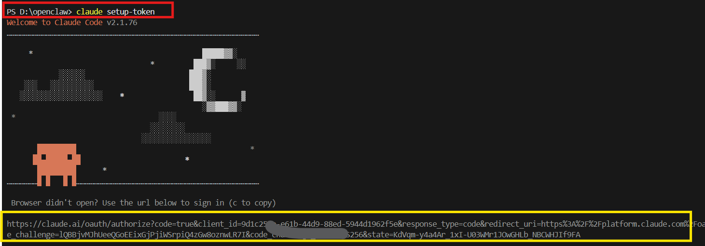
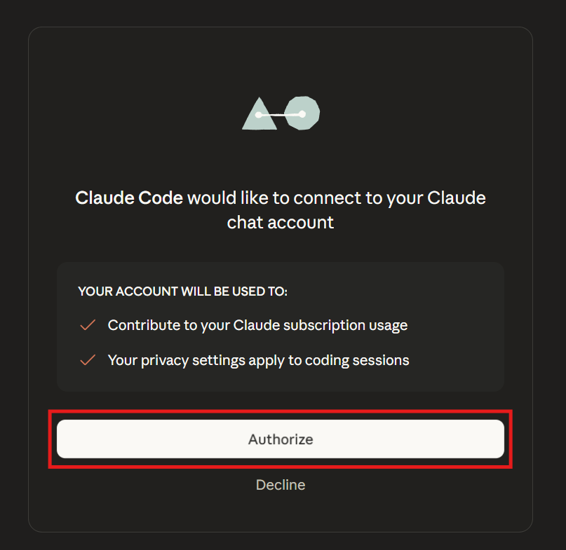
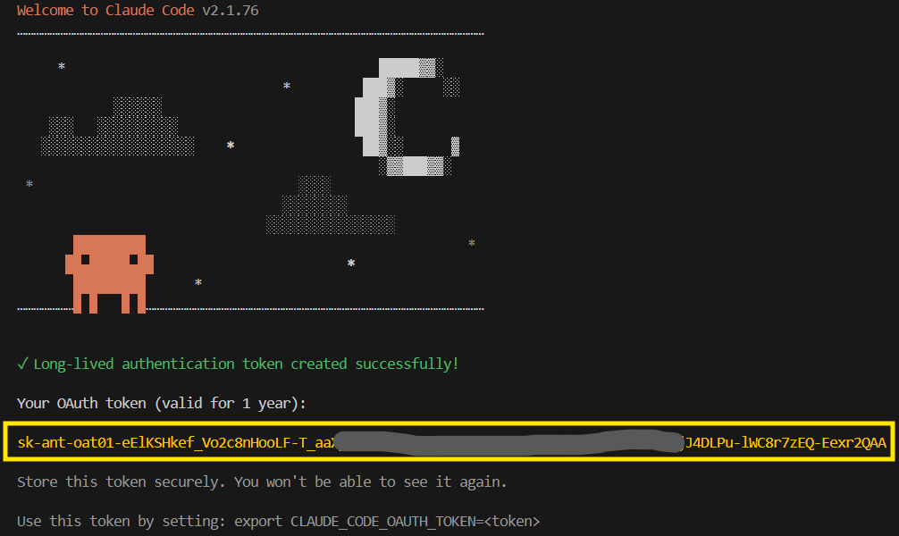

# Anthropic API 金鑰取得

## 金鑰用途

Anthropic API Key 是存取 Claude AI 模型的身份驗證憑證。透過此金鑰，應用程式可以呼叫 Claude API 進行對話生成、文本分析、程式碼輔助等功能。在本專案中，此金鑰用於驅動 Claude Code 與相關 AI 功能。

---

## 取得流程

1. 在桌面建立一個新資料夾，例如命名為 `claude`。

   

2. 複製該資料夾的路徑（在檔案總管的路徑列空白處點擊一下，再按 Ctrl+C 複製）。

   

3. 在終端機中使用 `cd` 指令切換至該資料夾，將複製的路徑貼上後按 Enter。
   - 注意：`cd` 與路徑之間需保留一個空格
   - `cd` 指令用途：切換至指定的資料夾

   ```
   cd 路徑
   ```

   當終端機顯示的路徑與您貼上的路徑一致時，即表示切換成功。

   

4. 在終端機中輸入 `claude setup-token`，系統會自動開啟瀏覽器進行授權。若瀏覽器未自動開啟，可手動複製黃色框框中的網址，貼至瀏覽器開啟。

   

5. 在瀏覽器中點擊「同意授權」。

   

6. 返回終端機，畫面會顯示產生的金鑰。複製黃色框框中的金鑰內容並妥善保存。

   
