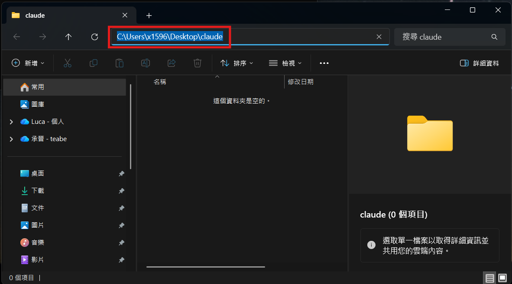

# Anthropic 取得金鑰

1. 在桌面建立一個資料夾，例如`claude`。
   

2. 複製資料夾路徑(對路徑列的空白處點一下，再按ctrl+c)。
   

3. 貼上剛剛複製的資料夾路徑，按enter。
   - 注意：路徑和cd之間要有空白
   - cd 指令的意思：移動到指定的資料夾

   ```
   cd 路徑
   ```

   黃色底線的路徑與你剛剛貼上的路徑一樣，代表成功。
   

4. 在終端機輸入`claude code`，會出現以下畫面，按enter同意。
