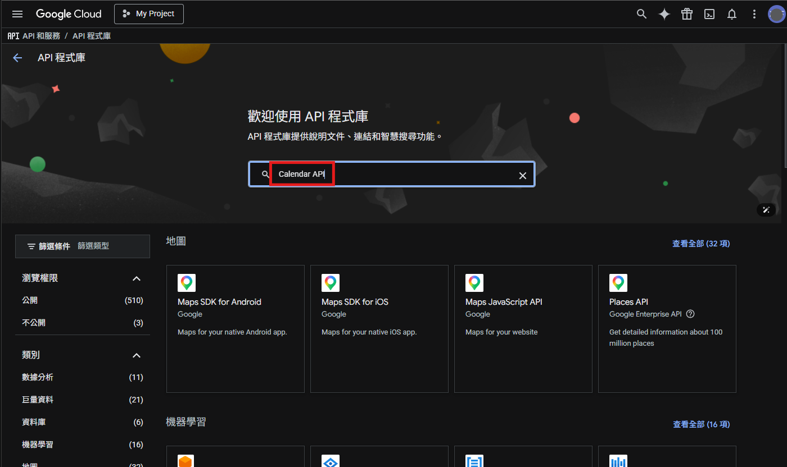
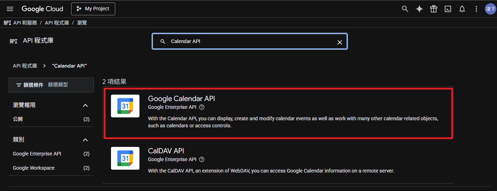
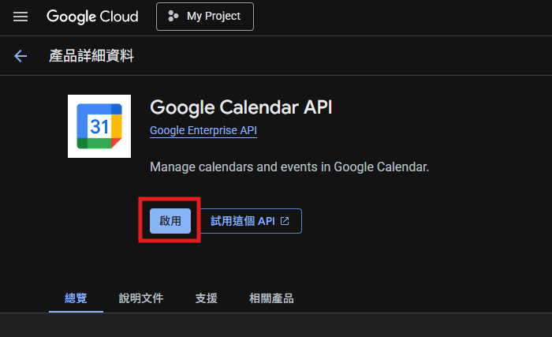

## 第一步：啟用 Google Calendar API

1. 進入[Google Cloud Console](https://console.cloud.google.com/)

2. 點擊左上角三條線選單

3. 選擇「API 和服務」>「程式庫」。

4. 搜尋「Calendar API」，點擊進入。

5. 點擊「Google Calendar API」選項。

6. 點擊啟用。

## 第二步：設定 OAuth 同意畫面

1. 左側點擊「OAuth 同意畫面」。

2. 點擊開始

3. 填寫應用程式名稱(隨意填)與郵件

4. 選擇「外部」

5. 填寫email

6. 勾選同意後建立

## 第三步：建立憑證

1. 點擊左上角三條線選單

2. 選擇「API 和服務」>「憑證」。

3. 點擊「建立憑證」>「OAuth 用戶端 ID」。

4. 選擇「Web 應用程式」，點擊建立。

5. 下載 JSON 檔案

