# Google API 金鑰取得

## 金鑰用途

本專案需要啟用以下三組 Google API，並透過 OAuth 2.0 憑證進行授權存取：

- **Google Calendar API**：用於讀取與管理 Google 日曆事件，實現行程查詢、建立與提醒等功能。
- **Gmail API**：用於存取 Gmail 郵件，實現郵件讀取、發送與管理等功能。
- **Google Drive API**：用於存取 Google 雲端硬碟中的檔案，實現檔案讀取、上傳與管理等功能。

最終產生的 OAuth 用戶端 JSON 憑證檔案，將作為應用程式存取上述 API 的授權依據。

---

## 第一步：啟用 API 服務

1. 進入 [Google Cloud Console](https://console.cloud.google.com/)。

2. 點擊左上角的三條線選單圖示。

   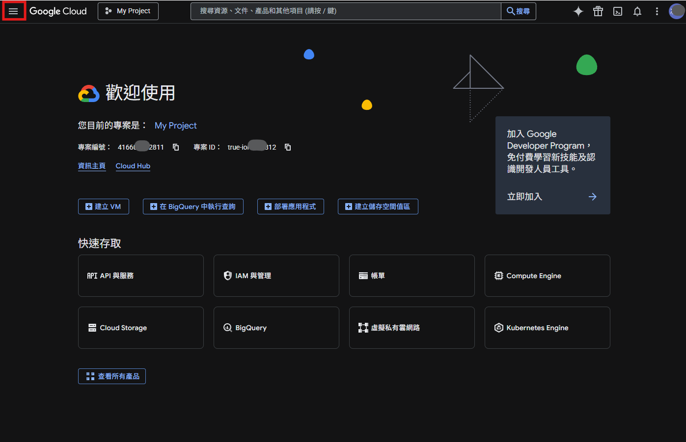

3. 選擇「API 和服務」>「程式庫」。

   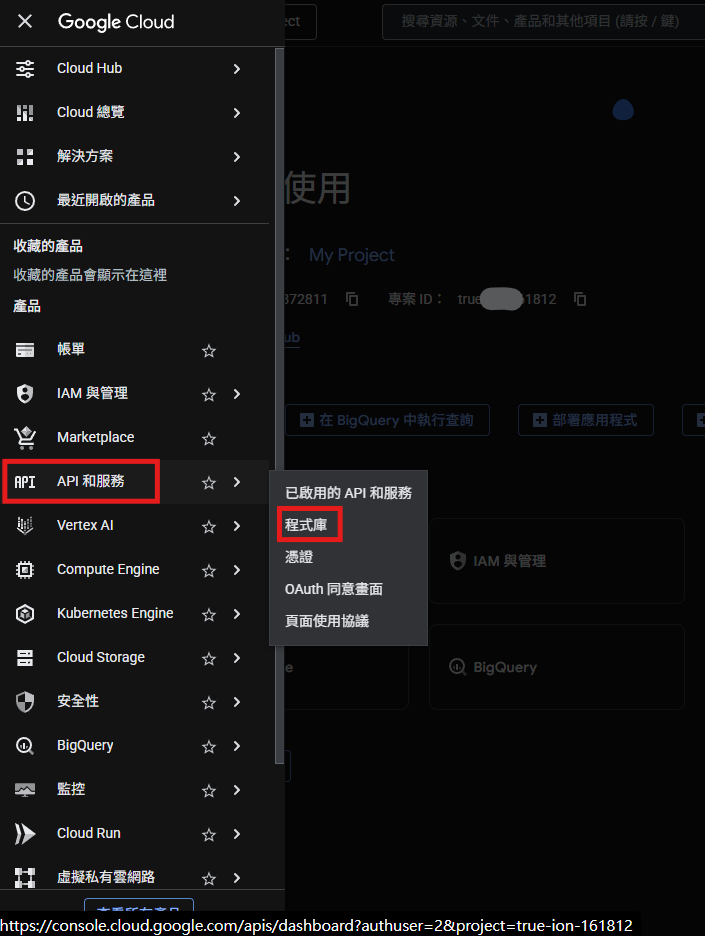

### 啟用 Google Drive API

4. 在搜尋欄中輸入「Google Drive API」，按 Enter 搜尋。

   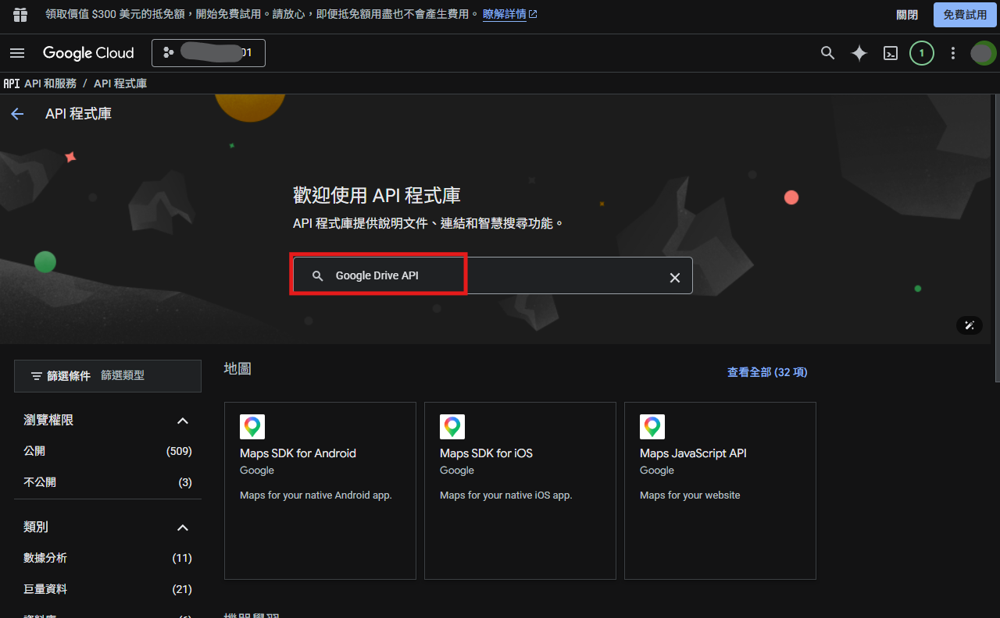

5. 點擊「Google Drive API」選項。

   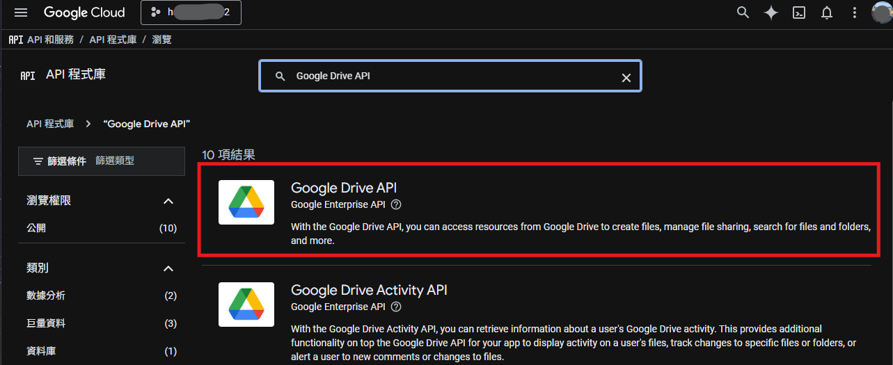

6. 點擊「啟用」按鈕。

   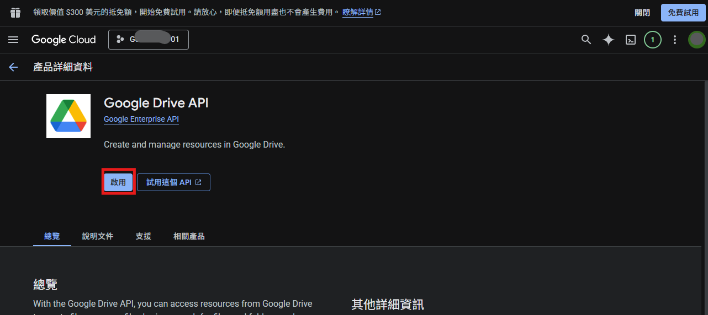

## 第二步：設定 OAuth 同意畫面

1. 在左側導覽列中點擊「OAuth 同意畫面」。

   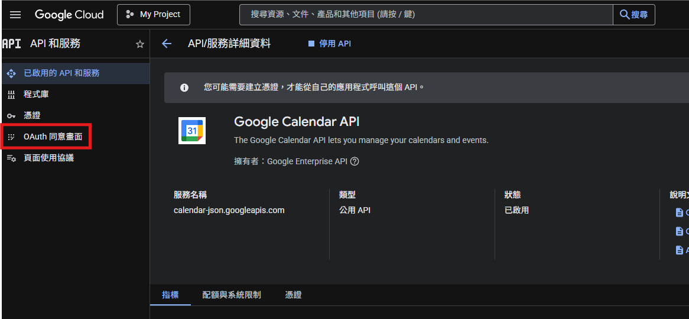

2. 點擊「開始」進入設定流程。

   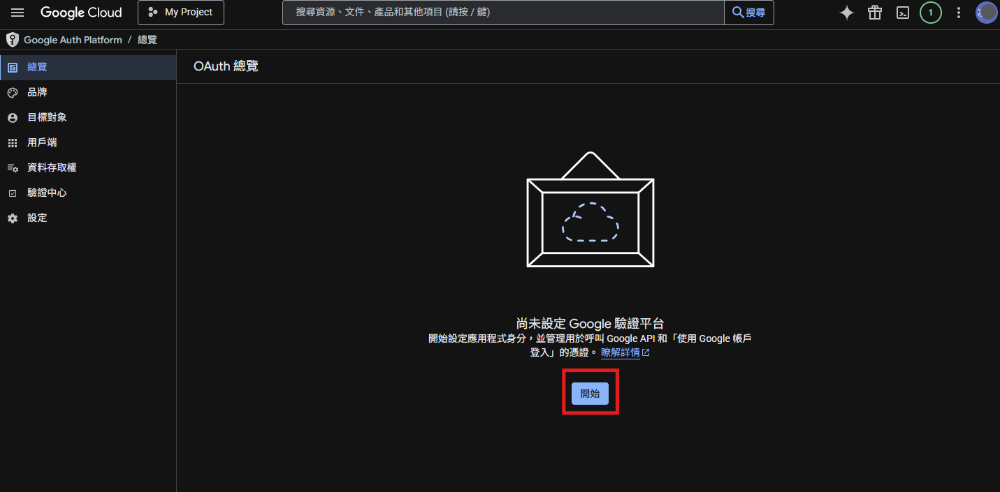

3. 填寫應用程式名稱（可自行命名）與聯絡電子郵件。

   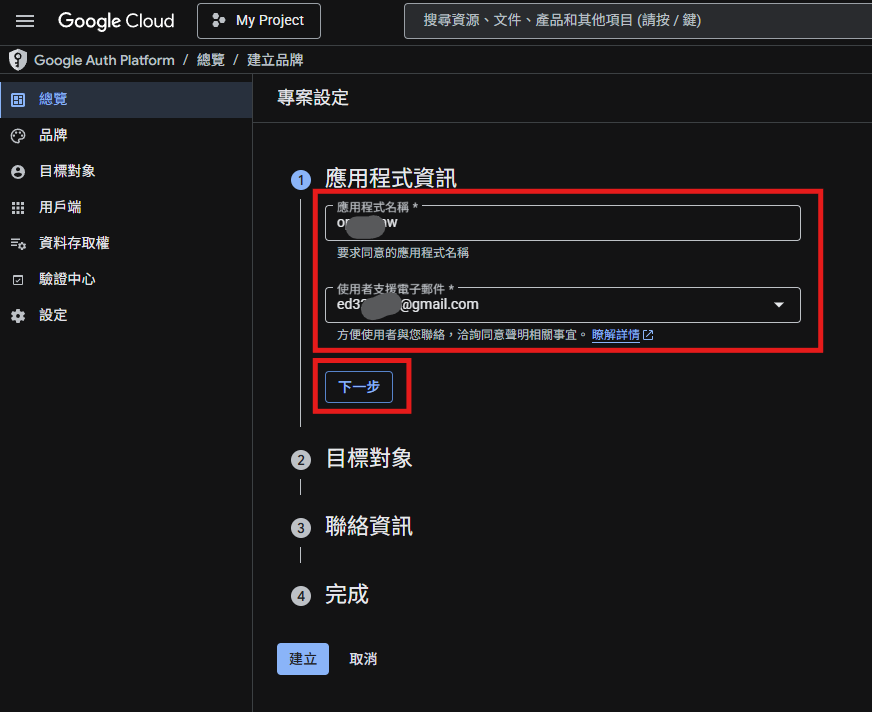

4. 使用者類型選擇「外部」。

   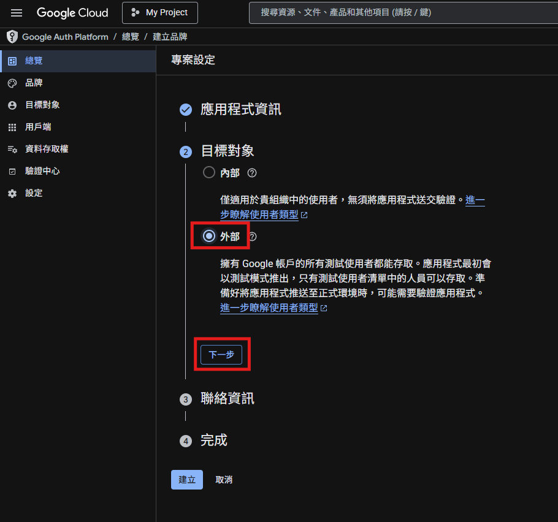

5. 填寫開發者聯絡電子郵件。

   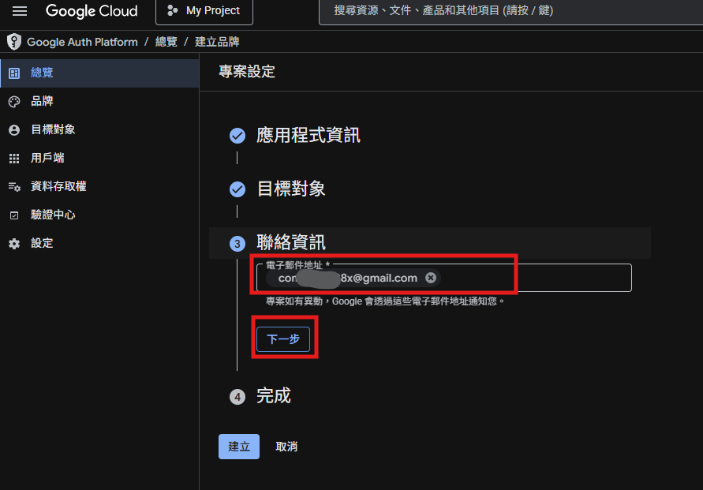

6. 勾選同意條款後，點擊「建立」。

   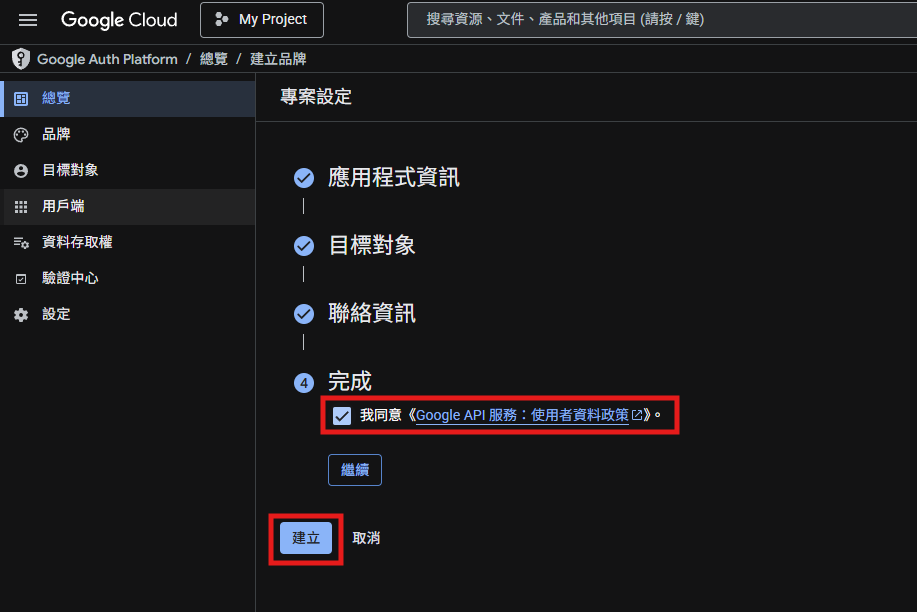

7. 前往「目標對象」區塊，點擊「新增測試使用者」，輸入您自己的電子郵件後點擊「儲存」。

   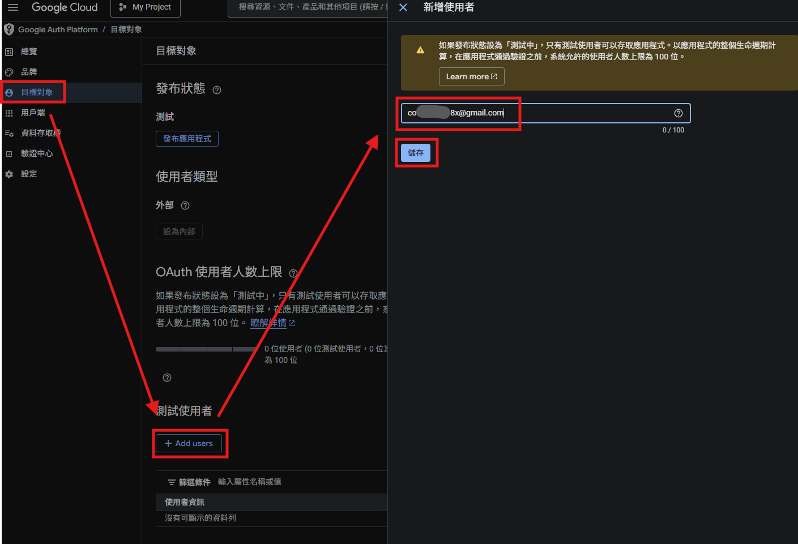

## 第三步：建立 OAuth 憑證

1. 點擊左上角的三條線選單圖示。

   

2. 選擇「API 和服務」>「憑證」。

   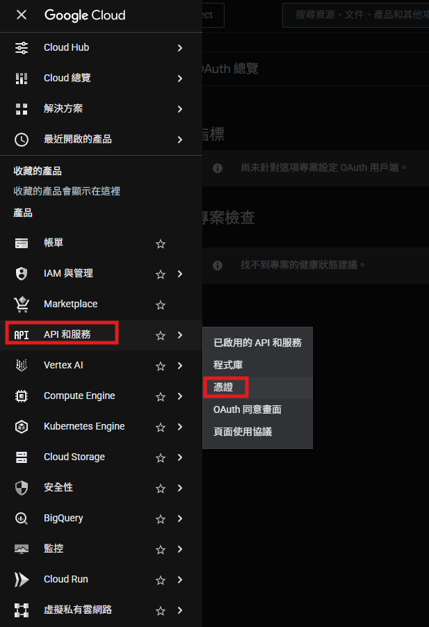

3. 點擊「建立憑證」，選擇「OAuth 用戶端 ID」。

   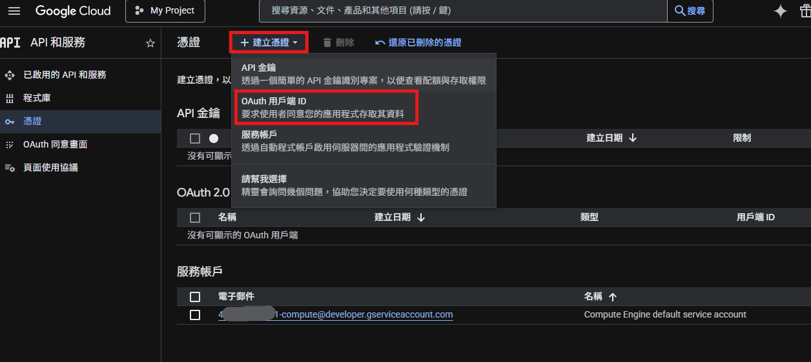

4. 應用程式類型選擇「電腦版應用程式」，點擊「建立」。
   - 需要特別注意，選擇電腦版應用程式，否則會無法使用
     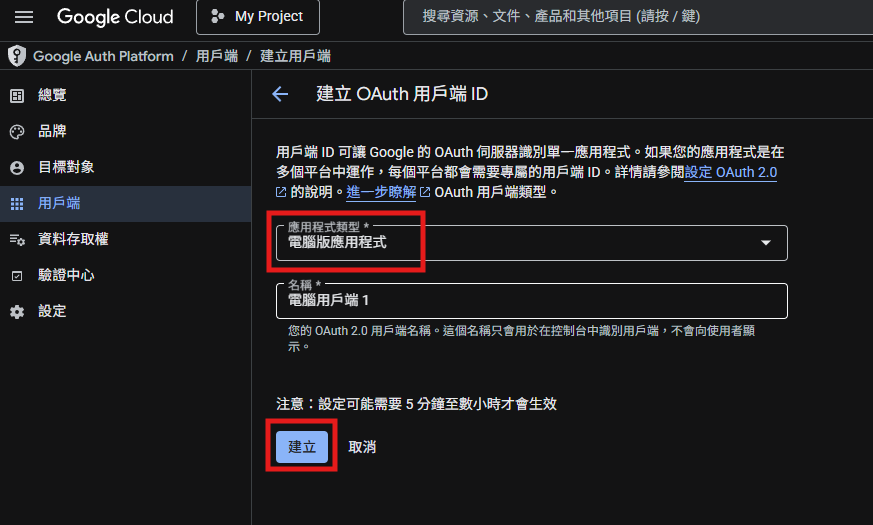

5. 憑證建立完成後，點擊「下載 JSON」按鈕，將憑證檔案下載並妥善保存。

   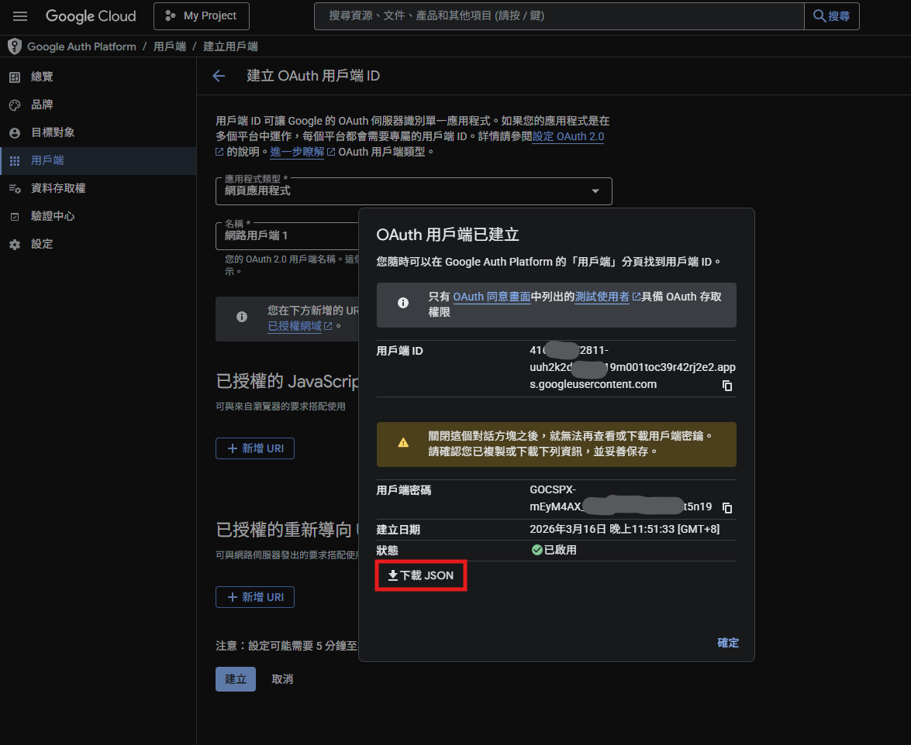
