# Notion API 金鑰取得

## 金鑰用途

Notion Internal Integration Token 是存取 Notion API 的身份驗證憑證。透過此金鑰，應用程式可以讀取、建立與更新 Notion 工作空間中的頁面與資料庫內容，實現自動化的資料同步、內容管理與知識庫整合等功能。

---

## 第一步：建立資料庫頁面

1. 進入 [Notion 工作空間](https://www.notion.so/)。

   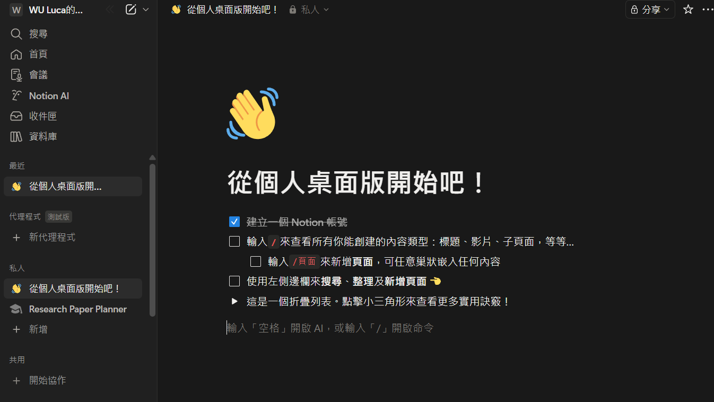

2. 在左側導覽列中新增一個頁面（此頁面將於後續 API 設定時使用）。

   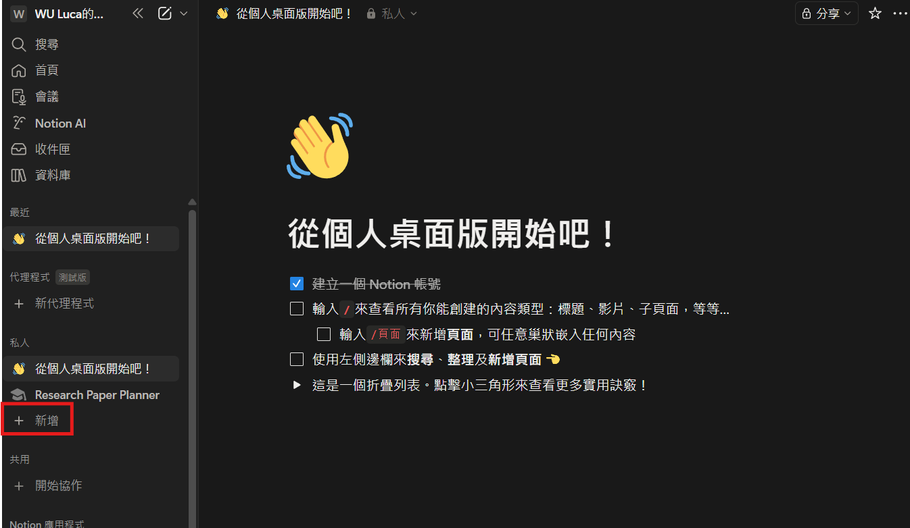

3. 選擇「空白資料庫」作為頁面類型。

   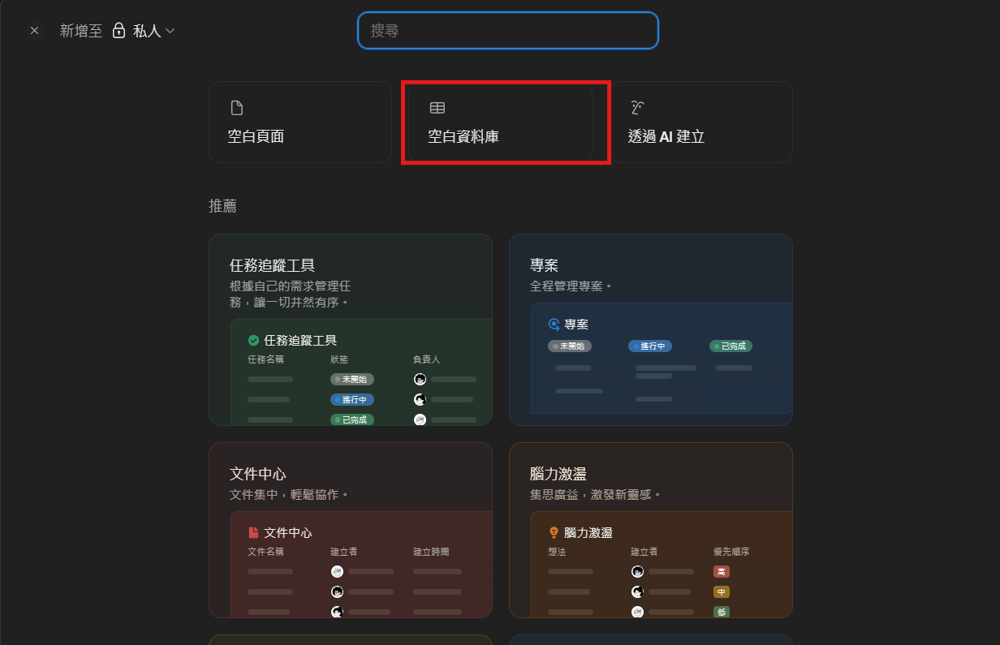

4. 為資料庫命名，方便後續識別與管理。

   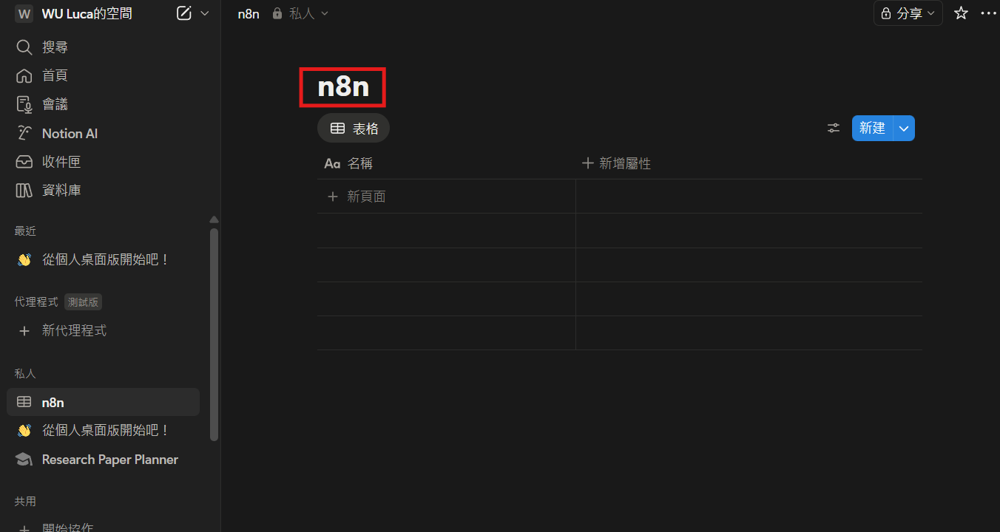

## 第二步：建立 API 整合

1. 點擊左側選單的「Settings & Members」進入設定頁面。

   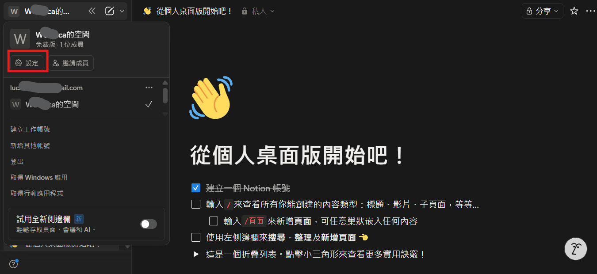

2. 點擊「連接」分頁。

   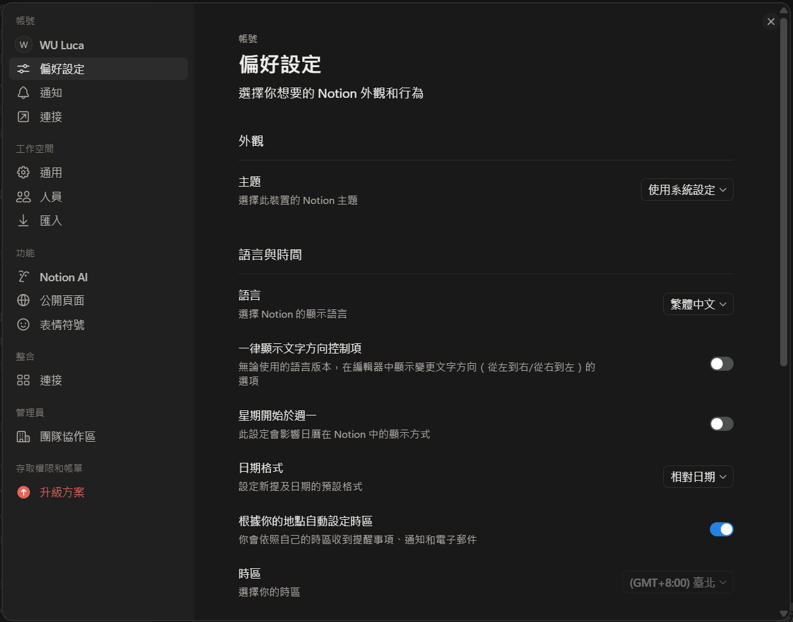

3. 點擊「開發或管理整合」，前往整合管理頁面。

   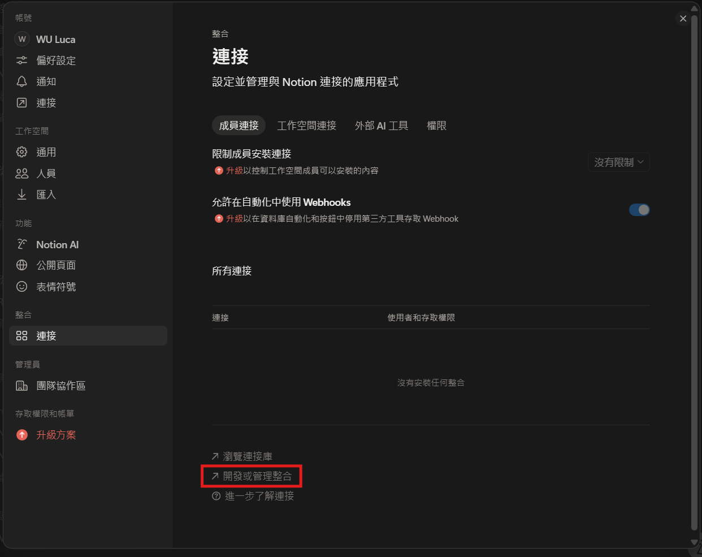

4. 點擊「建立新整合」。

   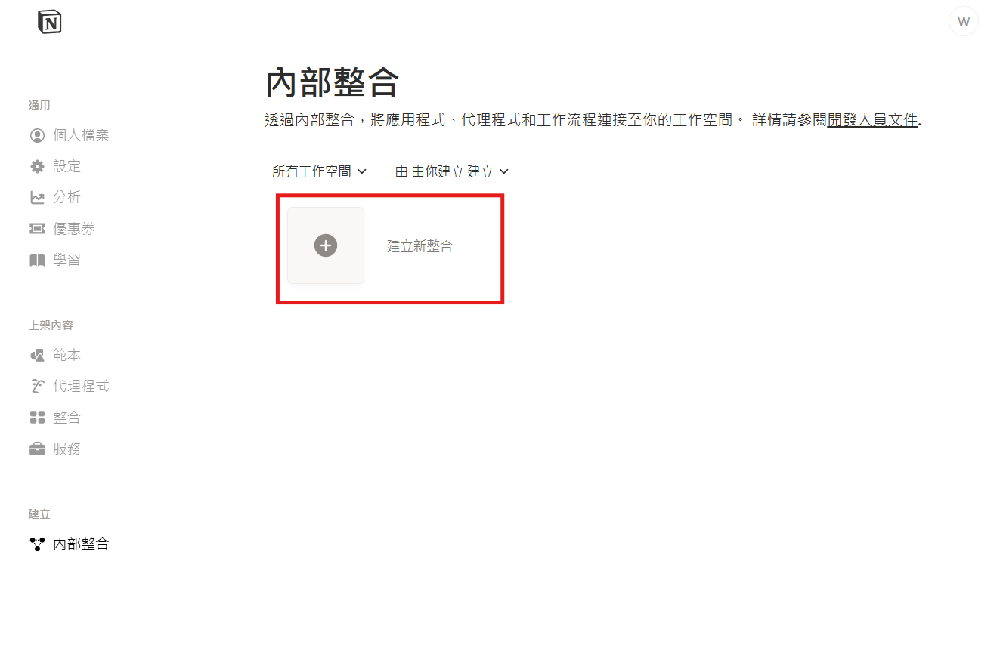

5. 填寫整合名稱（可自行命名），選擇要關聯的工作空間，點擊「建立整合」。

   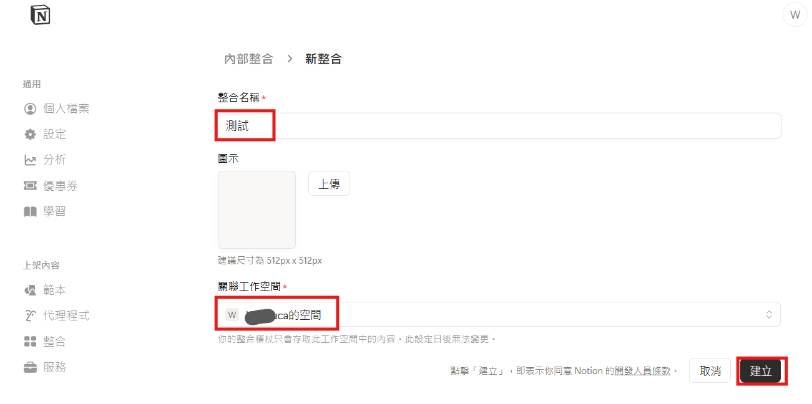

6. 確認整合設定內容。

   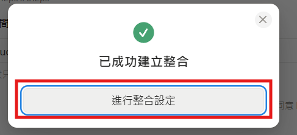

## 第三步：取得金鑰

7. 點擊「顯示」按鈕以顯示 Internal Integration Token，複製金鑰並妥善保存。

   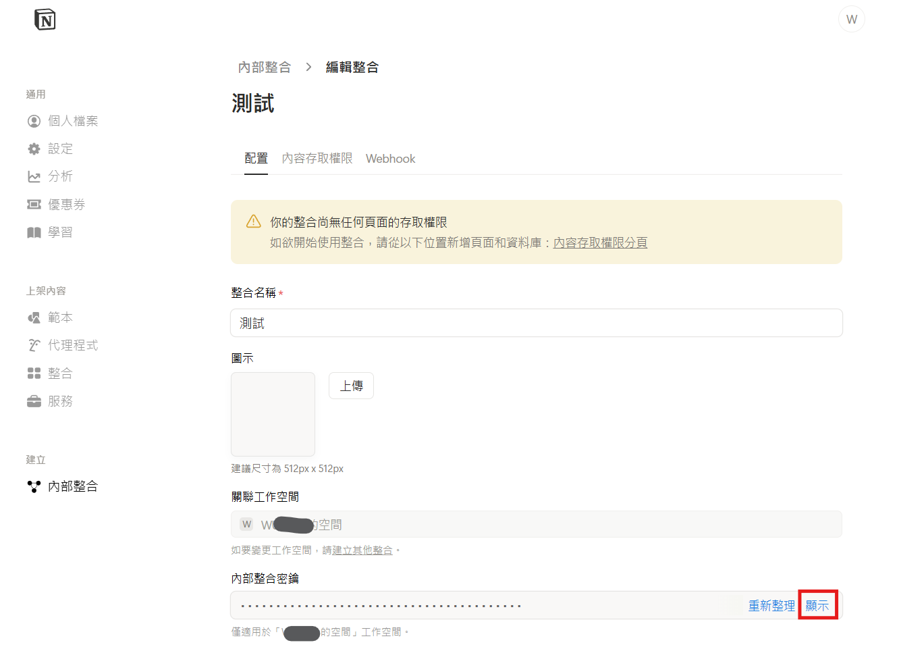
   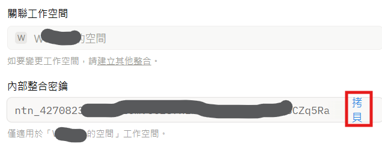

## 第四步：設定資料庫存取權限

8. 點擊「內容存取權限」分頁。

   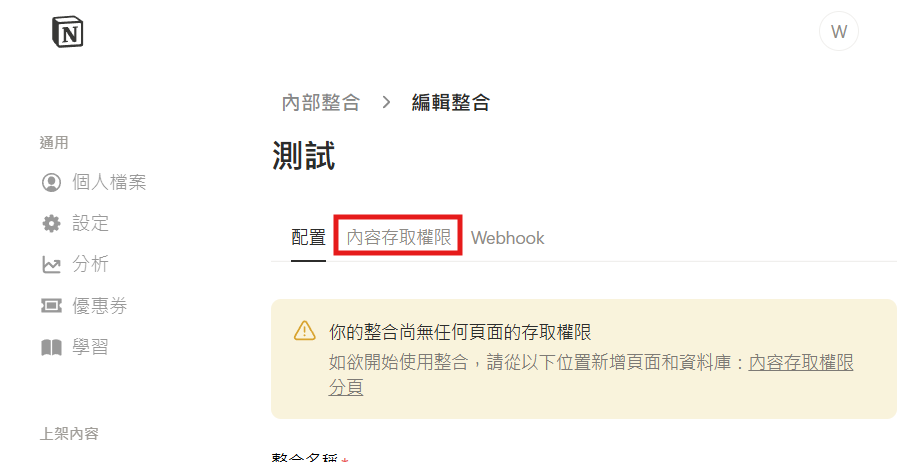

9. 點擊「編輯存取權限」，設定此整合可存取的頁面範圍。

   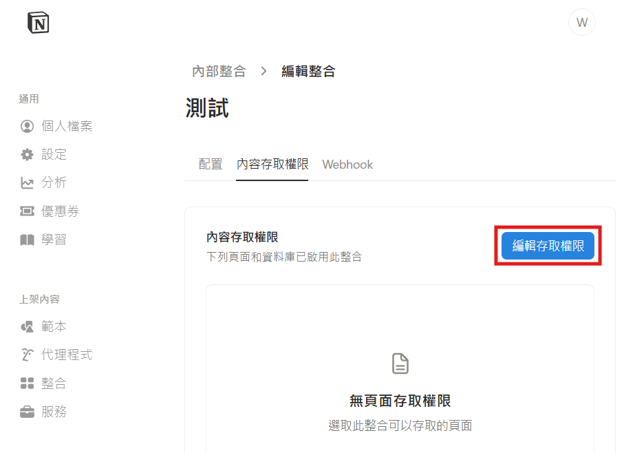

10. 選擇第一步中建立的資料庫頁面，點擊「儲存」完成權限設定。

    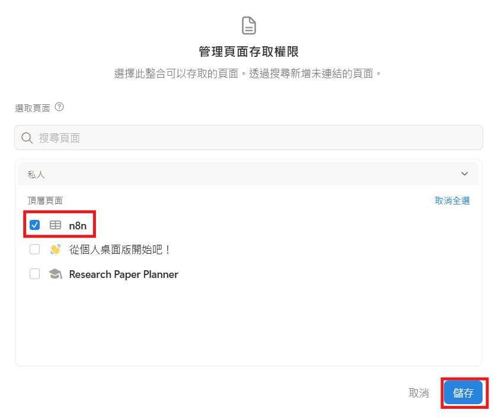
