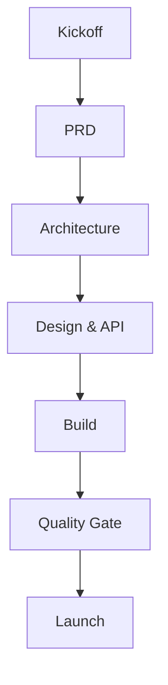

# 產品開發工作流手冊 (Product Development Workflow Manual)

---

**版本:** `v2.0`
**更新日期:** `2026-01-16`
**狀態:** `Active`

---

## 目錄 (Table of Contents)

- [1. 核心原則](#1-core-principles)
- [2. 工作流階段](#2-workflow-stages)
- [3. 檢驗標準 (Gate Criteria)](#3-gate-criteria)
- [4. 檢查清單 (Checklists)](#4-checklists)
- [5. 文件指南 (Documentation Guide)](#5-documentation-guide)

---

## 1. 核心原則 (Core Principles)

- **單一真理來源 (SSOT)**: 文件即合約。
- **迭代交付**: 小步快跑，確保 ADRs 可追蹤。
- **風險優先**: 透過階段檢驗 (Gates) 儘早緩釋風險。
- **內建品質**: 從第一天開始落實 Security 與 Testing。
- **文件存放 (File Location)**: 所有產製之文件 (Generated Documents) 應統一存放在 `docs/` 資料夾中。
  > **AI 關鍵指令**: 在執行寫入前，**必須**檢查並自動建立 `docs/`、`docs/adr/` 與 `docs/bdd/` 資料夾。若目錄不存在，直接建立即可，**無需**尋求使用者批准。
  - **ADR**: `docs/adr/`
  - **BDD Specs**: `docs/bdd/`

**角色 (RACI):** PM, TL, ARCH, DEV, QA, SRE, SEC, OPS, DATA

---

## 2. 工作流階段 (Workflow Stages)

### 階段 1: 啟動與規劃 (Inception & Planning)

**目標**: 達成業務價值、範圍與風險的共識。

- **A0 Kickoff**: 定義業務目標與邊界。(產出: Kickoff Deck)
- **A1 Planning (PRD & WBS)**: 定義問題、範圍、成功指標與任務分解。
  - **產出**: `200_project_brief_prd.md`, `201_wbs_plan.md` (參閱 `100_workflow_manual.md`)
  - **檢驗 (Gate)**: PRD 與 WBS 已核准，KPIs 可衡量。

### 階段 2: 方案設計與架構 (Design & Architecture)

**目標**: 建立穩固且具擴展性的技術基礎。

- **A2 High-Level Architecture**: 定義系統邊界、技術棧 (tech stack) 與 NFRs。
  - **產出**: `202_architecture_design.md` (參閱 `101_project_structure_guide.md`), `203_adr.md` (存放在 `docs/adr/`)
  - **檢驗 (Gate)**: ADRs 完整，NFRs 可驗證。
- **A3 Detailed Design**: 實作規格說明。
  - **產出**:
    - `204_module_spec.md`, `205_class_relationships.md`, `206_file_dependencies.md` (參閱 `101_project_structure_guide.md`)
    - `207_api_spec.md` (參閱 `102_api_design_standards.md`)
    - `208_frontend_specification.md` (參閱 `103_frontend_guidelines.md`)
  - **檢驗 (Gate)**: 介面穩定，測試策略已定義。

### 階段 3: 實作建置 (Construction)

**目標**: 交付可驗證、具生產環境水準的程式碼。

- **A4 Development & Verification**: 使用 TDD/BDD 實作。
  - **產出**: Code (`104_development_cookbook.md`), Tests (`docs/bdd/`, 參閱 `105_bdd_guide.md`), Build Artifacts
  - **檢驗 (Gate)**: Tests 通過，滿足 Coverage 要求。

### 階段 4: 發佈上線 (Release)

**目標**: 安全、可觀測的部署。

- **A5 Security & Launch Review**: 生產環境就緒檢查。
  - **產出**: `107_security_checklist.md` (參閱 `107_security_checklist.md`)
  - **檢驗 (Gate)**: 風險已緩釋。
- **A6 Launch**: 部署與監控。
  - **產出**: Go/No-Go 決策
  - **檢驗 (Gate)**: SLOs/Alerts 已生效，演練通過。

---

## 3. 檢驗標準 (Gate Criteria)

**進入條件 (Entry)**: 輸入完整、角色對齊、風險已紀錄。
**結束條件 (Exit)**: 文件完成度 >90%、審閱通過、指標可驗證。

**衡量指標 (Metrics)**:

- 穩定性 (Stability)、缺陷密度 (Defect Density)、交付節奏 (Delivery Cadence)。
- SLO 達成率、回滾率 (Rollback Rate)、MTTR。

---

## 4. 檢查清單 (Checklists)

- **PRD**: 問題清楚嗎？是否定義 Non-goals？KPIs 是否量化？
- **Architecture**: 權衡紀錄 (ADR) 是否確實？NFRs 是否可測試？
- **Design**: 資料模型、API 合約、錯誤處理是否定義？
- **Security**: 密鑰管理 (Secrets)？AuthZ/AuthN？輸入驗證 (Input validation)？
- **Launch**: 備份、監控、告警 (Alerts)、回滾計畫？

---

## 5. 文件指南 (Documentation Guide)

**前置準備 (Prerequisites)**: 在使用任何模板 (Template) 之前，**必須**先閱讀對應的規範 (Standard/Guideline)。此為強制規定，確保所有產出符合專案標準。

**原則**: Simple, Clear, Precise, Concise. 確保單一真理來源 (SSOT).

### 規範與模板 (Standards & Templates)

所有產出必須符合對應規範。請在 Start 階段前閱讀。

- **`200_Series` (規劃/架構)**: 參閱 `100_workflow_manual.md`, `101_project_structure_guide.md`
- **`207_api_spec.md`**: 參閱 `102_api_design_standards.md`
- **`208_frontend_specification.md`**: 參閱 `103_frontend_guidelines.md`
- **Code/Tests**: 參閱 `104_development_cookbook.md`, `105_bdd_guide.md`
- **Review/Ops**: 參閱 `106_code_review_guide.md`, `108_ops_guide.md`

- **存放位置**: `docs/` (架構決策存於 `docs/adr/`, BDD 規格存於 `docs/bdd/`)
- **撰寫標準**: 使用 Markdown (`.md`) 與 Mermaid 圖表. 採主動語態, 標題清晰.
- **維護策略**: 隨程式碼變更即時更新 (DoD), 並於 Changelog 記錄變更. 每月定期審閱.
- **文件類型**:
  - **API**: OpenAPI 規格, Endpoints 說明.
  - **架構**: C4 Model, ADRs.
  - **開發**: 環境建置, 貢獻指南, 風格指南.
  - **使用**: 使用手冊, FAQs.
- **核心範本**:
  - **README**: 專案概述, 安裝/使用說明, API 連結, License.
  - **Changelog**: 追蹤 Unreleased, Added, Changed, Fixed.
