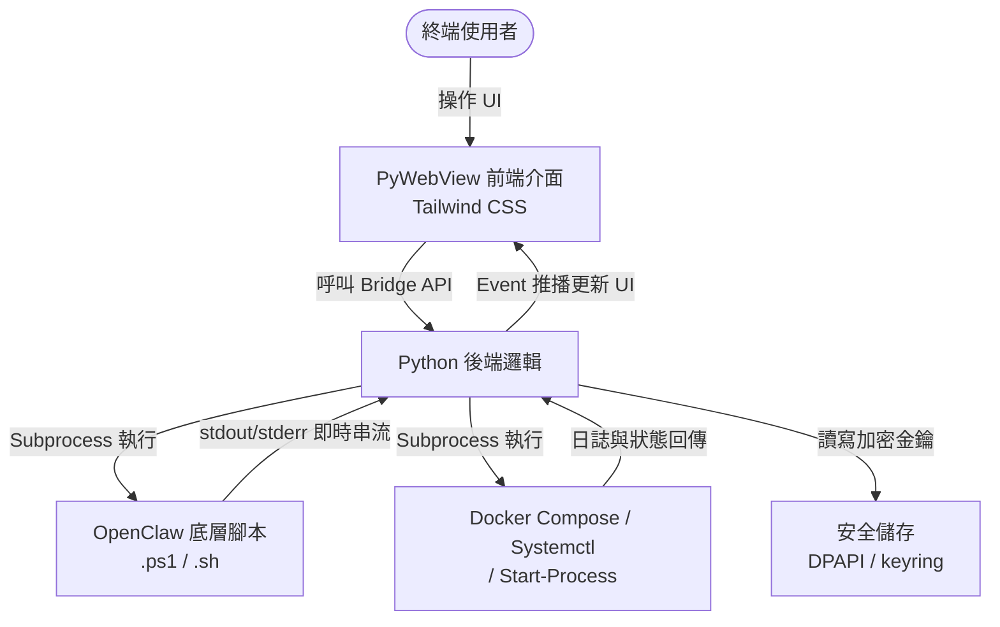

# 架構設計 (Architecture Design) - OpenClaw GUI 應用程式

---

**版本:** `v1.1`
**狀態:** `草案`

---

## 1. 概觀 (Overview)

OpenClaw GUI 應用程式旨在提供一個友善的圖形化介面，取代原有的命令列腳本（如 `openclaw-docker.ps1`, `openclaw-docker.sh`, `openclaw.sh`）。
應用程式透過 PyWebView 建立桌面視窗，前端使用 HTML/JS 與 Tailwind CSS 提供現代化的操作介面，後端使用 Python 處理業務邏輯並透過 `subprocess` 呼叫底層腳本，最後透過 PyInstaller 打包為單一可執行檔。

### C4 模型 (C4 Model)

- **L1 Context (脈絡圖)**:
  - User 透過 GUI 應用程式輸入設定檔、管理服務狀態。
  - GUI 應用程式透過呼叫系統 Shell (PowerShell/Bash) 與 Docker 或 Systemd 進行互動。
- **L2 Container (容器圖)**:
  - **Frontend UI**: 基於 HTML/JS 與 Tailwind CSS 的網頁介面。
  - **Python Backend**: 基於 PyWebView 的宿主程式，負責提供 API (Bridge) 給前端呼叫，並執行系統指令。
  - **Shell Scripts**: 既有的 OpenClaw 操作腳本 (`scripts/` 目錄下的 `.ps1` 與 `.sh` 檔案)。
- **L3 Component (組件圖)**:
  - **UI Components**: 表單組件 (金鑰輸入)、終端機日誌顯示組件、狀態控制按鈕。
  - **Bridge API**: 負責接收前端請求並轉換為腳本執行的 Python 類別與函數通訊層。
  - **Process Manager**: 負責非同步執行 `subprocess`、擷取 stdout/stderr 日誌並即時回傳給前端的通訊模組。
  - **Config Manager**: 負責金鑰與設定值的讀寫、加密儲存及環境變數管理。

### 設計策略 (Strategy)

- **Bridge 模式通訊**: 前端 UI 完全無狀態，所有的系統操作與腳本互動均透過 PyWebView 提供的 Python API (Bridge) 進行非同步呼叫。
- **非侵入式介面**: 應用程式本身不修改既有腳本邏輯，僅做為介面層 (Presentation Layer) 收集使用者輸入，並將參數傳遞給腳本。
- **跨平台兼容**: Python 後端需偵測作業系統與環境，在 Windows 呼叫 `.ps1` 腳本，在 Linux 呼叫 `.sh` 腳本。服務啟停則依據環境分支處理：
  - **Docker 環境** (Windows/Linux): 使用 `docker-compose up -d` / `docker-compose down`。
  - **Linux 原生環境**: 使用 `systemctl start/stop openclaw`。
  - **Windows 原生環境**: 使用背景程序管理 (`Start-Process` / `Stop-Process`)。

## 2. 非功能性需求 (NFRs)

- **效能 (Performance)**: 介面操作反應時間 < 200ms；終端機日誌即時串流顯示延遲 < 500ms，且不能阻塞 UI 執行緒 (Non-blocking I/O)。
- **可用性 (Usability)**: 打包後必須為不需要預先安裝複雜 Python 環境的單一可執行檔 (Zero-dependency deployment for users)。
- **相容性 (Compatibility)**: 完整支援 Windows 10/11 與主流 Linux 發行版 (例如 Ubuntu)。
- **安全性 (Security)**:
  - 金鑰與敏感設定值（如 LINE/Discord tokens）不得以明文儲存於設定檔中，須採用作業系統原生的安全儲存機制（Windows: DPAPI/Credential Manager; Linux: libsecret/keyring）或應用層級加密。
  - 前端與 Bridge API 之間的資料傳輸限於本機 loopback，不得暴露至外部網路。
  - subprocess 呼叫時須對使用者輸入參數進行適當的轉義 (escaping)，防止命令注入 (Command Injection)。

## 3. 高階設計 (High-Level Design)



## 4. 技術棧 (Tech Stack)

| 技術項目 | 選擇 | 選擇原因 |
| :--- | :--- | :--- |
| **前端框架 (Frontend)** | HTML/JS/CSS + Tailwind CSS | 輕量化，不需複雜的編譯流程，符合專案要求且能快速打造現代 UI。 |
| **桌面框架 (Desktop)** | PyWebView | 輕量級 GUI 方案，能將 Web 技術與 Python 結合，資源佔用低於 Electron。 |
| **後端邏輯 (Backend)** | Python 3 | 生態系主流語言，能方便處理跨平台 subprocess 呼叫與非同步 I/O 操作。 |
| **打包工具 (Builder)** | PyInstaller | 將 Python 應用程式連同網頁靜態資源編譯為獨立執行檔，降低使用者部署門檻。 |
| **金鑰儲存 (Secrets)** | keyring (Python 套件) | 跨平台安全儲存，自動整合 Windows Credential Manager 與 Linux Secret Service。 |

## 5. 資料流 (Data Flow)

- **功能調用資料流 (如 Init/Check Env)**:
  - Frontend 提供視覺化表單與按鈕 -> User 點擊執行並傳送參數 -> Frontend 呼叫 Python Bridge -> Backend 根據作業系統執行對應的腳本 (例如 `openclaw-docker.ps1 init`) -> Backend 持續將子程序輸出的日誌即時回報給 Frontend。
- **技能部署與外掛安裝資料流 (Deploy Skills / Install Plugins)**:
  - User 點擊「部署技能」或「安裝外掛」按鈕 -> Frontend 呼叫 Python Bridge -> Backend 根據作業系統執行對應的腳本 (例如 `deploy-skills` 或 `install-plugins`) -> Backend 持續將子程序輸出的日誌即時回報給 Frontend，並於完成後顯示結果摘要。
- **服務啟停資料流 (Start/Stop)**:
  - User 點擊啟動按鈕 -> Frontend 呼叫 Python Bridge -> Backend 偵測當前環境並直接控制後台服務 (Docker 環境: `docker-compose up -d`; Linux 原生: `systemctl start openclaw`; Windows 原生: `Start-Process`) -> Backend 取得服務狀態與即時日誌並更新 Frontend 顯示狀態。
- **金鑰儲存資料流**:
  - User 於表單填入金鑰 -> Frontend 呼叫 Python Bridge -> Backend 透過 `keyring` 套件將金鑰寫入系統安全儲存 -> 後續腳本執行時由 Backend 從安全儲存讀取金鑰並注入為環境變數或寫入臨時設定檔（執行結束後清除）。

## 6. 錯誤處理策略 (Error Handling Strategy)

| 情境 | 處理方式 |
| :--- | :--- |
| **腳本執行失敗 (Non-zero exit code)** | 在 UI 日誌區以醒目樣式 (紅色) 顯示 stderr 輸出與錯誤碼，並提供「重試」按鈕。 |
| **Subprocess 逾時 (Timeout)** | 設定可配置的逾時門檻（預設 300 秒），超時後自動終止子程序並在 UI 顯示逾時提示，提供「強制終止」與「重試」選項。 |
| **使用者中途關閉應用程式** | 應用程式關閉前檢查是否有執行中的子程序，若有則彈出確認對話框，確認後優雅終止 (graceful shutdown) 所有子程序再退出。 |
| **權限不足** | 於執行操作前預先檢查必要權限（如 Docker socket 存取、systemctl 權限），不足時在 UI 顯示友善提示（如「請以系統管理員身分執行」）。 |
| **環境偵測失敗** | 當無法判斷目前為 Docker 或原生環境時，在 UI 提供手動選擇環境類型的下拉選單，並記住使用者的選擇。 |

## 7. 專案目錄結構 (Project Structure)

```text
openclaw/
├── src/                          # GUI 應用程式原始碼
│   ├── main.py                   # PyWebView 入口點
│   ├── bridge.py                 # Python Bridge API 類別
│   ├── process_manager.py        # Subprocess 管理模組
│   ├── config_manager.py         # 設定與金鑰管理模組
│   ├── platform_utils.py         # 跨平台偵測與工具函式
│   └── frontend/                 # 前端靜態資源
│       ├── index.html            # 主頁面
│       ├── css/
│       │   └── styles.css        # Tailwind CSS 編譯產出
│       └── js/
│           └── app.js            # 前端互動邏輯
├── scripts/                      # 既有的 OpenClaw 操作腳本 (不修改)
│   ├── openclaw-docker.ps1
│   ├── openclaw-docker.sh
│   └── openclaw.sh
├── build.py                      # PyInstaller 打包腳本
├── requirements.txt              # Python 依賴清單
└── docs/                         # 專案文件
    ├── 200_project_brief_prd.md
    ├── 201_wbs_plan.md
    └── 202_architecture_design.md
```
