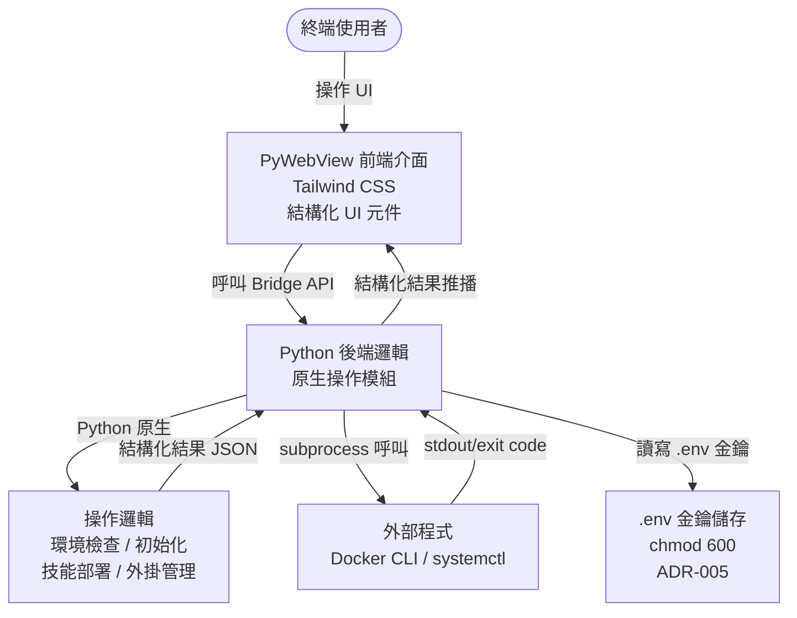

# 架構設計 (Architecture Design) - OpenClaw GUI 應用程式

---

**版本:** `v2.1`
**狀態:** `草案`
**變更依據:** `ADR-003` — 廢棄 Shell 腳本，改以原生 Python 實作所有操作邏輯; `ADR-004` — SSH 遠端管理 Transport Layer; `ADR-007` — 前端多國語言支援（繁體中文與英文）

---

## 1. 概觀 (Overview)

OpenClaw GUI 應用程式旨在提供一個友善的圖形化介面，取代原有的命令列腳本（如 `openclaw-docker.ps1`, `openclaw-docker.sh`, `openclaw.sh`）。
應用程式透過 PyWebView 建立桌面視窗，前端使用 HTML/JS 與 Tailwind CSS 提供現代化的操作介面，後端使用 Python 原生實作所有操作邏輯（環境檢查、初始化、技能部署、服務控制等），僅在呼叫外部程式（docker, systemctl）時使用 subprocess，最後透過 PyInstaller 打包為單一可執行檔。

### C4 模型 (C4 Model)

- **L1 Context (脈絡圖)**:
  - User 透過 GUI 應用程式輸入設定、管理服務狀態。
  - GUI 應用程式以 Python 原生邏輯處理所有操作，僅在需要時直接呼叫外部程式（Docker CLI / systemctl）。
- **L2 Container (容器圖)**:
  - **Frontend UI**: 基於 HTML/JS 與 Tailwind CSS 的網頁介面，以結構化 UI 元件（狀態卡片、表單、勾選清單、進度指示）呈現操作結果。
  - **Python Backend**: 基於 PyWebView 的宿主程式，負責提供 Bridge API 給前端呼叫，並以 Python 原生邏輯執行所有操作。
- **L3 Component (組件圖)**:
  - **UI Components**: 狀態卡片（環境檢查結果）、表單組件（金鑰輸入、模型勾選清單）、勾選清單（技能/外掛選擇）、進度步驟元件（初始化精靈）、服務狀態開關按鈕、Origin 白名單編輯、裝置配對管理列表 (ADR-006)、語言切換元件 (ADR-007)。
  - **i18n Module**: 全域翻譯函式 `t(key, params)` + JSON 語系檔（`locales/zh-TW.json`, `locales/en.json`）。語系檔以 `<script>` 標籤載入為全域變數，避開 `file://` CORS 限制。語言偵測優先順序：`gui-settings.json` → `navigator.language` → `zh-TW` fallback。切換語言時重新渲染當前頁面 (ADR-007)。
  - **Bridge API**: 接收前端請求，轉發至對應的 Python 操作模組，回傳結構化 JSON 結果。
  - **Env Checker**: 以 `shutil.which()` 與 `subprocess.run()` 偵測軟體與版本，回傳結構化檢查結果。
  - **Initializer**: 以 `pathlib` 建立目錄結構、`json` 讀寫設定檔、`subprocess` 呼叫 `docker compose`。
  - **Skill Manager**: 掃描 `module_pack/`（自訂業務模組）與 `openclaw/skills/`（52 社群技能）目錄、解析 SKILL.md YAML frontmatter（name, description, homepage, metadata.openclaw.emoji/requires）、`shutil.copytree/rmtree` 部署至 `~/.openclaw/workspace/skills/` 或移除。
  - **Plugin Manager**: 讀取 `openclaw/extensions/` 目錄中的 `openclaw.plugin.json`（含 id, channels[], providers[], providerAuthEnvVars, providerAuthChoices, configSchema）、安裝操作透過修改 `openclaw.json` 的 `plugins.load.paths[]` 與 `plugins.installs` 區段實現（config-driven，非檔案複製）、外掛修復與診斷邏輯。
  - **Service Controller**: Docker Compose / systemctl 服務啟停與狀態查詢。
  - **Config Manager**: 管理 `openclaw.json` 結構化 JSON（完整檔案含 30+ sections；GUI 操作涉及: meta, wizard, auth, agents, tools, commands, channels, gateway, plugins）與 `.env` 檔案（環境變數 + API 金鑰 upsert）。API 金鑰統一儲存於 `.env`，檔案權限 `600` (ADR-005)。Gateway token 產生與讀取邏輯（讀 openclaw.json > 讀 .env > `secrets.token_hex(32)` 產生）。模型目錄管理：`registries.py` 維護 `MODEL_REGISTRY` 靜態字典，記錄各供應商的可用模型 ID 與顯示名稱（資料來源：`openclaw/extensions/` TypeScript 原始碼中的 `provider-catalog.ts` / `model-definitions.ts`）。初始化 Step 2 儲存金鑰時，同時將使用者選取的模型寫入 `openclaw.json` 的 `agents.defaults.models`（allowlist）與 `agents.defaults.model.primary`（主模型）。**注意**: `gateway` 區段實際含 `tls`, `http`, `nodes`, `tools`, `tailscale`, `remote` 等 GUI 不操作的欄位，讀寫時必須以 deep merge 保留這些欄位，不可覆蓋。`plugins` 區段實際含 `entries`, `allow`, `deny`, `slots` 等欄位，GUI v1.0 僅操作 `entries`, `installs`, `load.paths`。GUI 設定（`gui-settings.json`）另管理語言偏好 `locale`（`zh-TW` / `en`），供 i18n 模組讀寫 (ADR-007)。
  - **Platform Utils**: 偵測 OS 與環境類型 (Docker/Native)。
  - **Process Manager**: 非同步執行外部程式（docker, systemctl），僅用於無法以 Python 直接完成的操作。
  - **Executor Protocol**: 定義統一的操作介面（`run_command`, `read_file`, `write_file`, `mkdir`, `copy_tree`, `remove_tree`, `file_exists`, `list_dir`, `which`），上層模組透過此介面操作，不直接呼叫底層 I/O (ADR-004)。
  - **LocalExecutor**: 封裝 `subprocess`, `pathlib`, `shutil`，用於本機模式（Docker / Native Linux）。
  - **RemoteExecutor**: 封裝 `paramiko.SSHClient` + `SFTPClient`，用於 SSH 遠端模式。
  - **SSH Connection Manager**: SSH 連線生命週期管理（建立/斷線/重連/心跳/狀態），支援 key 與 password 認證。SSH Host Key 採 TOFU（Trust on First Use）策略：首次連線接受 fingerprint 並持久化至 `~/.ssh/known_hosts`，後續連線比對已知 key，不匹配時拒絕並提示使用者。
  - **Transfer Service**: 跨本機/遠端檔案傳輸（技能部署：本機 `module_pack/` → 遠端 `~/.openclaw/workspace/skills/`）。

### 設計策略 (Strategy)

- **Bridge 模式通訊**: 前端 UI 完全無狀態，所有系統操作透過 PyWebView 提供的 Python Bridge API 進行非同步呼叫。
- **Python 原生操作**: 所有操作邏輯（環境檢查、目錄建立、設定讀寫、技能部署等）以 Python 原生實作，不依賴 Shell 腳本 (ADR-003)。僅在呼叫外部程式（docker CLI, systemctl）時使用 subprocess。
- **結構化 UI 回饋**: 前端不使用 terminal 元件顯示原始日誌，改以結構化 UI（狀態卡片、進度條、結果清單）呈現操作結果與錯誤訊息。
- **多國語言 (i18n)**: 所有 UI 字串透過全域 `t(key)` 翻譯函式取得，語系資料以 JSON 檔存放於 `frontend/locales/`。v1.0 支援繁體中文（`zh-TW`，預設）與英文（`en`）。語言偏好持久化於 `gui-settings.json`，切換語言即時重新渲染，無需重啟 (ADR-007)。
- **跨平台兼容**: Python 標準庫（`pathlib`, `shutil`, `platform`, `json`）天然跨平台，無需為不同 OS 維護不同腳本。服務啟停依據環境分支處理：
  - **Docker 環境** (Windows/Linux): 使用 `docker compose up -d` / `docker compose down`。
  - **Linux 原生環境**: 使用 `systemctl start/stop openclaw`。
  - **SSH 遠端模式** (Remote Server): 使用者從本機 GUI 透過 SSH 管理雲端 VM 上的 OpenClaw 實例。所有操作透過 `RemoteExecutor`（paramiko）在遠端執行，金鑰統一儲存於目標機器 `.env`（chmod 600），SSH 模式透過 `RemoteExecutor.write_file()` 寫入 (ADR-004, ADR-005)。

## 2. 非功能性需求 (NFRs)

- **效能 (Performance)**: 介面操作反應時間 < 200ms；操作進度回饋延遲 < 500ms，且不能阻塞 UI 執行緒 (Non-blocking I/O)。
- **可用性 (Usability)**: 打包後必須為不需要預先安裝複雜 Python 環境的單一可執行檔 (Zero-dependency deployment for users)。前端以結構化 UI 呈現操作結果，降低使用者理解門檻。支援繁體中文與英文介面切換，依 OS 語系自動偵測預設語言 (ADR-007)。
- **相容性 (Compatibility)**: 完整支援 Windows 10/11 與主流 Linux 發行版 (例如 Ubuntu)。
- **安全性 (Security)**:
  - API 金鑰與敏感設定值（如 LINE/Discord tokens）統一儲存於目標機器的 `.env` 檔案，檔案權限設為 `600`（僅 owner 可讀寫）(ADR-005)。
  - 前端與 Bridge API 之間的資料傳輸限於本機 loopback，不得暴露至外部網路。
  - subprocess 使用 `list` 形式傳遞引數，禁止 `shell=True`，防止命令注入 (Command Injection)。
  - SSH Host Key 驗證採 TOFU（Trust on First Use）策略：首次連線時接受遠端主機 fingerprint 並持久化，後續連線比對已知 key。禁止使用 `AutoAddPolicy`（靜默接受所有 key），防止 MITM 攻擊。

## 3. 高階設計 (High-Level Design)



## 4. 技術棧 (Tech Stack)

| 技術項目 | 選擇 | 選擇原因 |
| :--- | :--- | :--- |
| **前端框架 (Frontend)** | HTML/JS/CSS + Tailwind CSS | 輕量化，不需複雜的編譯流程，符合專案要求且能快速打造現代 UI。 |
| **多國語言 (i18n)** | 自建 `t()` 函式 + JSON 語系檔 | 零外部依賴，與 Vanilla JS 全域作用域架構相容，支援繁中/英雙語 (ADR-007)。 |
| **桌面框架 (Desktop)** | PyWebView | 輕量級 GUI 方案，能將 Web 技術與 Python 結合，資源佔用低於 Electron。 |
| **後端邏輯 (Backend)** | Python 3 | 原生跨平台標準庫（`pathlib`, `shutil`, `json`, `platform`），處理操作邏輯與非同步 I/O。 |
| **打包工具 (Builder)** | PyInstaller | 將 Python 應用程式連同網頁靜態資源編譯為獨立執行檔，降低使用者部署門檻。 |
| **金鑰儲存 (Secrets)** | `.env` 檔案 + 檔案權限 (`chmod 600`) | API 金鑰統一儲存於目標機器的 `.env`，與 Docker/systemd 環境變數注入機制一致 (ADR-005)。 |
| **SSH 連線 (Remote)** | paramiko (Python 套件) | 成熟的純 Python SSH2 實作，提供 SSHClient + SFTPClient，與 PyInstaller 相容。用於 RemoteExecutor 的遠端命令執行與檔案傳輸 (ADR-004)。 |

## 5. 資料流 (Data Flow)

- **環境檢查資料流 (Check Env)**:
  - User 點擊「檢查環境」按鈕 → Frontend 呼叫 Bridge API `check_env()` → Backend `env_checker.py` 以 `shutil.which()` 偵測各軟體是否安裝、以 `subprocess.run()` 取得版本號 → 回傳結構化結果 `[{name, installed, version, message}]` → Frontend 渲染為狀態卡片列表（綠色通過/紅色缺失）。
- **初始化資料流 (Init)**:
  - User 於步驟精靈填寫金鑰與設定 → Frontend 呼叫 Bridge API `initialize()` → Backend `initializer.py` 依序執行 10 步流程（對齊 `openclaw/scripts/docker/setup.sh` 實際行為）：
    > **前端顯示**：Docker 模式前端顯示 **10 個步驟**，Native 模式顯示 **8 個步驟**（詳見 208 §4.4）。
    > **設計決策**：原始腳本的初始化流程不使用 `openclaw onboard`（互動式 CLI wizard，需 TTY 確認安全警告），而是由腳本直接建立目錄、寫入設定檔。GUI 沿用此模式，以 Python 原生步驟完成初始化，不依賴 `onboard` 指令。Gateway 設定（`openclaw.json`）在啟動 Gateway 之前寫入，確保容器啟動時已有完整設定，避免因缺少 `gateway.mode` 設定導致容器崩潰進入 restart 迴圈。
    1. 驗證 Docker + Docker Compose 可用性
    2. 驗證/設定環境變數（`OPENCLAW_CONFIG_DIR`, `OPENCLAW_WORKSPACE_DIR`, `OPENCLAW_GATEWAY_PORT`, `OPENCLAW_GATEWAY_BIND` 等）
    3. `pathlib` 建立目錄結構（`~/.openclaw/identity/`, `agents/main/agent/`, `agents/main/sessions/`, `workspace/`）
    4. 解析/產生 Gateway Token（讀 openclaw.json → 讀 .env → `secrets.token_hex(32)` 產生新 token）
    5. 寫入 `.env` 檔案（16+ 環境變數 upsert）
    6. Build 或 Pull Docker Image（最耗時步驟）
    7. 修正資料目錄權限（`docker-linux` / `remote-ssh` 模式執行 chown 1000:1000；`docker-windows` 模式跳過 — Windows Docker Desktop 的 NTFS bind mount 不支援 chown 且不需要）
    8. 同步 Gateway 設定（`gateway.mode=local`, `gateway.bind`, `gateway.controlUi.allowedOrigins`）— 必須在啟動 Gateway 之前完成
    9. 啟動 Gateway（`docker compose up -d openclaw-gateway`）
    10. Health Check（`http://127.0.0.1:{port}/healthz`）
  - 每步回傳結構化結果 → Frontend 逐步更新精靈步驟狀態。
- **技能部署資料流 (Deploy Skills)**:
  - User 點擊「部署技能」→ Frontend 呼叫 Bridge API `list_skills()` → Backend `skill_manager.py` 掃描兩個來源：`module_pack/`（自訂業務模組）與 `openclaw/skills/`（社群技能），解析 SKILL.md YAML frontmatter（name, description, metadata.openclaw.emoji）→ 回傳可選技能清單 `[{name, emoji, description, installed, source}]` → Frontend 渲染分類勾選清單 → User 勾選後送出 → Backend 執行 `shutil.copytree` 部署至 `~/.openclaw/workspace/skills/` 或 `shutil.rmtree` 移除 → 回傳部署結果摘要。
- **外掛安裝資料流 (Install Plugins)**:
  - User 點擊「安裝外掛」→ Frontend 呼叫 Bridge API `list_plugins()` → Backend `plugin_manager.py` 掃描 `openclaw/extensions/` 目錄並讀取每個 `openclaw.plugin.json`（取得 id, channels[], providers[], providerAuthEnvVars 分類資訊）→ 回傳可選外掛清單（按 Model Providers / Channels / Tools / Infrastructure 分類）→ Frontend 渲染分類勾選清單 → User 勾選後送出 → Backend 修改 `openclaw.json` 的 `plugins.entries[id]`（啟用狀態）、`plugins.installs[id]`（安裝紀錄）與 `plugins.load.paths[]`（載入路徑）區段 → 回傳安裝結果摘要。
- **Channel 初始化資料流 (Channel Init Wizard)**:
  - **觸發**：Channel 類型外掛安裝完成後，Progress Overlay 顯示「Configure」CTA 按鈕；或於外掛列表中已安裝 Channel 行的「Configure」按鈕觸發。
  - **載入既有設定**：Frontend 呼叫 `get_channel_config(channel_name)` → Backend 讀取 `openclaw.json` 的 `channels.<name>` 區段 + `.env` 中對應金鑰的存在狀態（僅回傳 `has_value` + 末 4 碼 preview，不回傳完整值）→ Frontend 回填表單。
  - **取得 Webhook URL**：Frontend 呼叫 `get_webhook_url(channel_name)` → Backend 依據 `openclaw.json` gateway 設定（port, tls, bind）組合本機 URL + 公開 URL 範本 → 回傳 `{local_url, template, path, note}`。
  - **儲存設定**：User 於精靈中輸入金鑰與選擇 DM Policy → Frontend 呼叫 `save_channel_config(channel_name, credentials, config)` → Backend 將金鑰寫入 `.env`（chmod 600，本機模式透過 `ConfigManager.write_env()`，SSH 模式透過 `RemoteExecutor.write_file()`）+ 將 channel config（`enabled: true`, `dmPolicy` 等）以 deep merge 寫入 `openclaw.json` 的 `channels.<name>` 區段 → 回傳 `{success, message}`。
  - **LINE 具體流程**（3 步驟）：
    1. **Credentials**：輸入 `LINE_CHANNEL_ACCESS_TOKEN`（寫入 `.env`）+ `LINE_CHANNEL_SECRET`（寫入 `.env`）。
    2. **Webhook Setup**：顯示計算後的 Webhook URL（`https://<domain>/line/webhook`）+ LINE Developers Console 設定指引（啟用 Messaging API、貼入 Webhook URL、開啟 Use webhook、關閉自動回應）。
    3. **DM Policy**：選擇 `dmPolicy`（`pairing` | `allowlist` | `open` | `disabled`，預設 `pairing`）→ 寫入 `openclaw.json` `channels.line.dmPolicy`。
  - **設計決策**：Channel 金鑰統一儲存於 `.env`（與 Configuration Step 2 一致，ADR-005），Channel 特定設定（`enabled`, `dmPolicy`）儲存於 `openclaw.json` `channels` 區段。精靈以 Modal Overlay 呈現，不離開 Install Plugins 頁面。每個 Channel 的步驟定義由前端 `CHANNEL_INIT_REGISTRY` 資料結構驅動，新增 Channel 只需增加 registry 條目。
- **服務啟停資料流 (Start/Stop)**:
  - User 點擊啟動/停止按鈕 → Frontend 呼叫 Bridge API `start_service()` / `stop_service()` → Backend `service_controller.py` 透過 Executor 介面執行服務控制指令 — 本機模式由 `LocalExecutor` 呼叫 `subprocess`，遠端模式由 `RemoteExecutor` 透過 SSH 執行 → 回傳結構化結果 `{success, message}` → Frontend 更新服務狀態指示燈。
- **金鑰儲存資料流** (ADR-005):
  - User 於表單填入金鑰 → Frontend 呼叫 Bridge API `save_keys()` → Backend `config_manager.py` 將金鑰寫入目標機器的 `{config_dir}/.env`（本機模式透過 `pathlib`，SSH 模式透過 `RemoteExecutor.write_file()`）→ 寫入後設定檔案權限 `600` → Docker Compose (`env_file`) 或 systemd (`EnvironmentFile`) 直接讀取 `.env` 注入環境變數。
  - 重新進入 Configuration Step 2 時，`load_env_keys()` 從目標機器的 `.env` 讀取既有金鑰回填表單。SSH 模式下透過 `RemoteExecutor.read_file()` 讀取遠端 `.env`。
- **模型選擇資料流 (Model Selection)**:
  - Frontend 進入 Configuration Step 2 時呼叫 Bridge API `get_provider_models()` → Backend `registries.py` 回傳 `MODEL_REGISTRY`（`{provider_name: [{id, name}]}`）→ Frontend 於各供應商金鑰欄位下方渲染模型勾選清單（預設全選）。
  - User 調整勾選並指定 Primary Model → 點擊 "Next" → Frontend 呼叫 `save_keys()` 傳入 `model_selection: {primary, models}` → Backend `config_manager.py` 以 deep merge 寫入 `openclaw.json`：`agents.defaults.model.primary`（主模型，如 `"anthropic/claude-sonnet-4-6"`）與 `agents.defaults.models`（allowlist，如 `{"anthropic/claude-opus-4-6": {}, "openai/gpt-5.4": {}}`）。
  - 重新進入 Step 2 時，`load_env_keys()` 額外讀取 `openclaw.json` 的 `agents.defaults` 區段，回傳已選模型列表與 Primary Model，Frontend 自動回填勾選狀態。
- **SSH 連線資料流 (SSH Connection)** (ADR-004):
  - User 於 Configuration Step 1 選擇「Remote Server (SSH)」模式並填入連線資訊 → Frontend 呼叫 Bridge API `test_connection({host, port, username, key_path})` → Backend `ssh_connection.py` 建立 `paramiko.SSHClient` 連線 + host key 驗證（TOFU 策略：首次連線接受 fingerprint 並持久化，後續連線比對已知 key）→ 回傳 `{success, server_info}` → Frontend 顯示連線成功/失敗狀態。
  - 連線成功後呼叫 `connect_remote()` 持久化連線 → Backend 建立 `RemoteExecutor` 實例 → Bridge 將所有後續 API 的 executor 切換為 `RemoteExecutor` → Sidebar 連線狀態指示燈更新為「Connected」。
- **遠端操作資料流 (Remote Operation)** (ADR-004):
  - 所有操作 API（`check_env()`, `initialize()`, `deploy_skills()` 等）透過 `Executor` Protocol 介面執行 → 遠端模式下自動路由至 `RemoteExecutor` → paramiko SSH 在遠端執行命令 / SFTP 讀寫檔案 → 結構化結果回傳 → Frontend 渲染（與本機模式 UI 無差異）。
  - 技能部署特殊流程：本機 `module_pack/` 掃描結果 + 遠端 `openclaw/skills/` 掃描結果合併 → User 勾選 → `transfer_service.upload_tree()` 將本機模組上傳至遠端 `~/.openclaw/workspace/skills/`。
- **Gateway 控制資料流 (Gateway Control)** (ADR-006):
  - **Origin 存取控制**: User 進入 Gateway 頁面 → Frontend 呼叫 `get_allowed_origins()` → Backend 讀取 `openclaw.json` 的 `gateway.controlUi.allowedOrigins` → Frontend 渲染 Toggle（全域 `*` / 白名單）+ origin 列表。User 切換模式或增刪 origin → `save_allowed_origins()` → Backend 寫入 `openclaw.json`。
  - **裝置配對管理**: Frontend 呼叫 `list_devices()` → Backend 執行 `openclaw devices list --json` → 回傳 `{pending: [...], paired: [...]}` → Frontend 渲染 Pending（Approve/Reject 按鈕）與 Paired（備註欄 + Remove 按鈕）裝置列表。裝置備註存於 GUI 本地 `gui-settings.json` 的 `device_notes` 映射。

- **語言切換資料流 (i18n)** (ADR-007):
  - 啟動時 `initApp()` 呼叫 `get_locale()` → Backend 讀取 `gui-settings.json` 的 `locale` → 回傳 `locale`（可能為 `null`）→ Frontend 依優先順序選擇語系（`gui-settings` > `navigator.language` > `zh-TW`）→ 載入對應語系 JSON → 呼叫 `setLocale()` 設定全域翻譯資料 → 渲染頁面時所有字串透過 `t(key)` 取得。
  - User 切換語言 → Frontend 呼叫 `save_locale({locale})` → Backend 寫入 `gui-settings.json` → Frontend 載入新語系 JSON → `setLocale()` 更新翻譯資料 → 觸發當前頁面的 `render()` 重新渲染（利用 `registerPage` 生命週期鉤子）。

## 6. 錯誤處理策略 (Error Handling Strategy)

| 情境 | 處理方式 |
| :--- | :--- |
| **操作執行失敗** | Python exception 映射為結構化錯誤類型，在 UI 以醒目樣式顯示友善錯誤訊息（非原始 stderr），並提供「重試」按鈕。 |
| **外部程式逾時 (Timeout)** | 設定可配置的逾時門檻（預設 300 秒），超時後自動終止子程序並在 UI 顯示逾時提示，提供「強制終止」與「重試」選項。 |
| **使用者中途關閉應用程式** | 應用程式關閉前檢查是否有執行中的子程序，若有則彈出確認對話框，確認後優雅終止 (graceful shutdown) 所有子程序再退出。 |
| **權限不足** | 於執行操作前預先檢查必要權限（如 Docker socket 存取、systemctl 權限），不足時在 UI 顯示友善提示（如「請以系統管理員身分執行」）。 |
| **環境偵測失敗** | 當無法判斷目前為 Docker 或原生環境時，在 UI 提供手動選擇環境類型的下拉選單，並記住使用者的選擇。 |
| **SSH 連線中斷** (ADR-004) | `ssh_connection.py` 偵測心跳失敗 → 自動重連（最多 3 次，指數退避 2/4/8 秒）→ 重連成功則恢復操作 → 重連失敗則在 UI 顯示「連線中斷」狀態，Sidebar 指示燈變紅，提供「重新連線」按鈕。進行中的操作回傳 `CONNECTION_LOST` 錯誤類型。 |
| **SSH 認證失敗** (ADR-004) | 連線時 paramiko 拋出 `AuthenticationException` → 映射為 `AUTH_FAILED` 錯誤類型 → UI 顯示「認證失敗：請檢查使用者名稱、密碼或 SSH 金鑰」提示，導引使用者回到 SSH 連線表單修正設定。 |
| **SFTP 傳輸逾時** (ADR-004) | 檔案上傳/下載超過可配置門檻（預設 60 秒/檔案）→ 中止傳輸 → UI 顯示逾時提示，提供「重試」與「跳過此檔案」選項。 |

## 7. 專案目錄結構 (Project Structure)

```text
openclaw/                            # 專案根目錄
├── src/                             # GUI 應用程式原始碼
│   ├── main.py                      # PyWebView 入口點
│   ├── bridge.py                    # Python Bridge API 類別
│   ├── process_manager.py           # Subprocess 管理模組 (僅用於呼叫 docker/systemctl)
│   ├── config_manager.py            # 設定與金鑰管理模組 (.env + openclaw.json)
│   ├── platform_utils.py            # 跨平台偵測與工具函式
│   ├── env_checker.py               # 環境檢查邏輯 (Python 原生實作)
│   ├── initializer.py               # 初始化邏輯 (目錄建立、config 產生、docker compose)
│   ├── skill_manager.py             # 技能部署邏輯 (目錄掃描、SKILL.md 解析、複製/移除)
│   ├── plugin_manager.py            # 外掛管理邏輯
│   ├── service_controller.py        # 服務啟停控制 (docker compose / systemctl)
│   ├── executor.py                  # Executor Protocol 定義 + CommandResult (ADR-004)
│   ├── local_executor.py            # 本機操作實作 (subprocess/pathlib/shutil)
│   ├── remote_executor.py           # 遠端操作實作 (paramiko SSH/SFTP)
│   ├── ssh_connection.py            # SSH 連線管理 (連線/重連/心跳/狀態)
│   ├── transfer_service.py          # 跨本機/遠端檔案傳輸 (技能部署用)
│   └── frontend/                    # 前端靜態資源
│       ├── index.html               # 主頁面
│       ├── css/
│       │   └── styles.css           # Tailwind CSS 編譯產出
│       ├── locales/                  # i18n 語系檔 (ADR-007)
│       │   ├── zh-TW.json           # 繁體中文（預設語言）
│       │   └── en.json              # 英文
│       └── js/
│           ├── core.js              # 工具函式、共用全域狀態
│           ├── router.js            # SPA 路由、頁面生命週期、側邊欄
│           ├── components.js        # 共用 UI 元件（按鈕、輸入框、卡片等）
│           ├── item-list.js         # 勾選清單頁面工廠（Skills / Plugins 共用）
│           ├── channel-init.js      # Channel 初始化 Modal 精靈
│           ├── page-fix.js          # Fix Plugins 頁面
│           ├── page-dashboard.js    # Dashboard 頁面
│           ├── page-environment.js  # Environment 檢查頁面
│           ├── page-config.js       # Configuration 設定精靈（3 步驟）
│           ├── page-gateway.js      # Gateway 管理頁面
│           └── bootstrap.js         # Bridge 整合與應用程式啟動（必須最後載入）
├── scripts/                         # [DEPRECATED] 舊版 Shell 腳本 (僅供參考，不再使用)
├── build.py                         # PyInstaller 打包腳本
├── pyproject.toml                   # Python 專案設定與依賴宣告 (PEP 621)
├── uv.lock                          # uv 依賴鎖定檔 (確定性建置)
└── docs/                            # 專案文件
    ├── 200_project_brief_prd.md     # 專案簡介與需求
    ├── 201_wbs_plan.md              # WBS 開發計劃
    ├── 202_architecture_design.md   # 架構設計
    └── 203_adr.md                   # 架構決策紀錄索引
```

### 執行時資料目錄 (Runtime Data Directory)

GUI 操作的主要目標目錄，由初始化流程建立：

```text
~/.openclaw/                            # 執行時資料目錄（預設路徑，可透過 OPENCLAW_CONFIG_DIR 覆寫）
├── openclaw.json                       # 主設定檔 (JSON, sections: meta, agents, channels, gateway, plugins)
├── .env                                # 環境變數（Docker 模式使用）
├── identity/                           # 節點身份識別
├── agents/
│   └── main/
│       ├── agent/                      # Agent 中繼資料
│       └── sessions/                   # Session 狀態
├── credentials/                        # 管道認證資料
│   ├── whatsapp/<accountId>/creds.json # WhatsApp 認證
│   ├── <channel>-allowFrom.json        # 管道白名單
│   └── <channel>-pairing.json          # 配對資訊
├── workspace/                          # 工作空間（可透過 OPENCLAW_WORKSPACE_DIR 覆寫）
│   ├── skills/                         # 已部署技能
│   ├── prompts/                        # 自訂提示
│   └── memories/                       # Agent 記憶
└── secrets.json                        # 選用：額外密鑰儲存
```

## 8. 環境變數 (Environment Variables)

Docker 設定流程管理的環境變數，GUI 初始化步驟需讀寫這些值：

| 變數名稱 | 預設值 | 說明 |
| :--- | :--- | :--- |
| `OPENCLAW_CONFIG_DIR` | `~/.openclaw` | 設定目錄路徑 |
| `OPENCLAW_WORKSPACE_DIR` | `~/.openclaw/workspace` | 工作空間路徑 |
| `OPENCLAW_GATEWAY_PORT` | `18789` | Gateway HTTP port |
| `OPENCLAW_BRIDGE_PORT` | `18790` | Bridge port |
| `OPENCLAW_GATEWAY_BIND` | `lan` | 綁定模式（實際支援 5 種：`loopback` / `lan` / `auto` / `custom` / `tailnet`；v1.0 GUI 僅操作 `loopback` / `lan`） |
| `OPENCLAW_GATEWAY_TOKEN` | *(自動產生)* | Gateway 認證 token |
| `OPENCLAW_IMAGE` | `openclaw:local` | Docker image 名稱 |
| `OPENCLAW_TZ` | *(空)* | 時區 (IANA 格式，如 `Asia/Taipei`) |
| `OPENCLAW_SANDBOX` | *(空)* | 設為 `1` 啟用 sandbox 模式 |
| `OPENCLAW_DOCKER_SOCKET` | `/var/run/docker.sock` | Docker socket 路徑 |
| `OPENCLAW_EXTRA_MOUNTS` | *(空)* | 額外 Docker bind mount 規格（逗號分隔） |
| `OPENCLAW_HOME_VOLUME` | *(空)* | Docker named volume 或 bind mount（container /home/node） |
| `OPENCLAW_DOCKER_APT_PACKAGES` | *(空)* | Docker build 時額外安裝的 APT 套件 |
| `OPENCLAW_EXTENSIONS` | *(空)* | Docker build 時額外安裝的擴充套件 |
| `OPENCLAW_INSTALL_DOCKER_CLI` | *(空)* | 設為 `1` 在容器內安裝 Docker CLI（sandbox 模式自動啟用） |
| `OPENCLAW_ALLOW_INSECURE_PRIVATE_WS` | *(空)* | 允許不安全的私有工作空間存取 |
| `DOCKER_GID` | *(自動偵測)* | Docker socket 的 group ID（sandbox 模式需要） |

> **SSH 遠端模式備註 (ADR-004)**: SSH 連線設定（`ssh_host`, `ssh_port`, `ssh_username`, `ssh_key_path`）儲存於本機 `{app_data}/openclaw-gui/gui-settings.json`（如 `%APPDATA%/openclaw-gui/` 或 `~/.config/openclaw-gui/`，與部署模式設定並列），不儲存於環境變數。SSH 私鑰密碼（passphrase）若需要，透過本機 `keyring` 安全儲存。遠端伺服器的環境變數透過 `RemoteExecutor.write_file()` 寫入遠端 `.env`。v1.0 遠端僅支援 Native Linux 模式。
