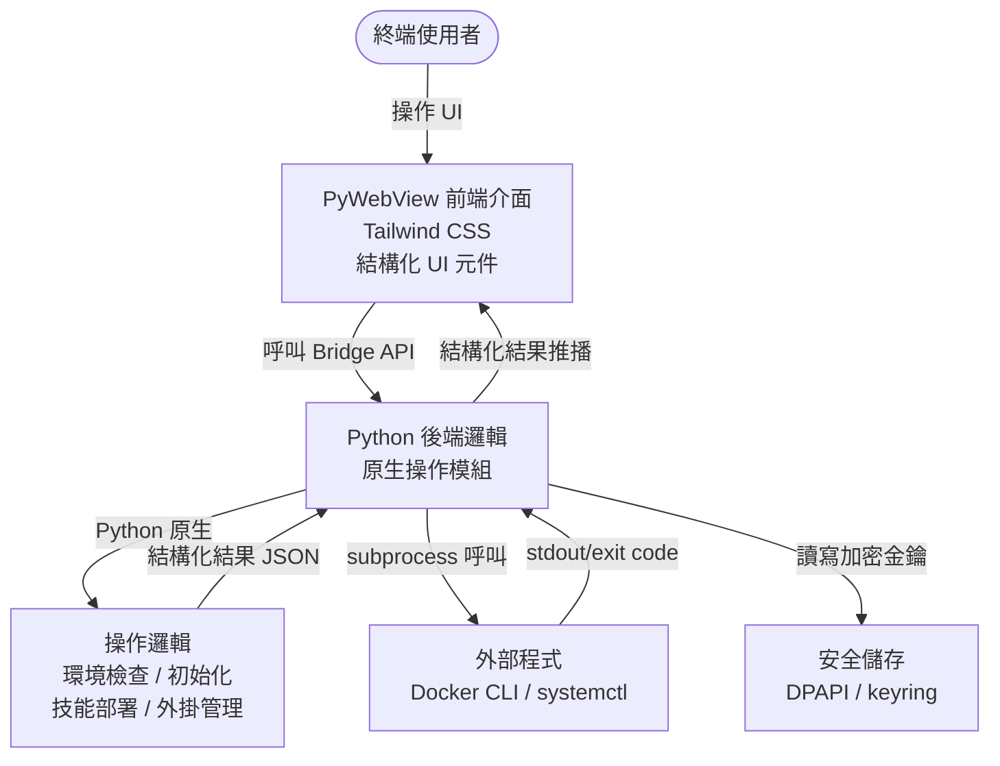

# 架構設計 (Architecture Design) - OpenClaw GUI 應用程式

---

**版本:** `v2.0`
**狀態:** `草案`
**變更依據:** `ADR-003` — 廢棄 Shell 腳本，改以原生 Python 實作所有操作邏輯

---

## 1. 概觀 (Overview)

OpenClaw GUI 應用程式旨在提供一個友善的圖形化介面，取代原有的命令列腳本（如 `openclaw-docker.ps1`, `openclaw-docker.sh`, `openclaw.sh`）。
應用程式透過 PyWebView 建立桌面視窗，前端使用 HTML/JS 與 Tailwind CSS 提供現代化的操作介面，後端使用 Python 原生實作所有操作邏輯（環境檢查、初始化、技能部署、服務控制等），僅在呼叫外部程式（docker, systemctl）時使用 subprocess，最後透過 PyInstaller 打包為單一可執行檔。

### C4 模型 (C4 Model)

- **L1 Context (脈絡圖)**:
  - User 透過 GUI 應用程式輸入設定、管理服務狀態。
  - GUI 應用程式以 Python 原生邏輯處理所有操作，僅在需要時直接呼叫外部程式（Docker CLI / systemctl）。
- **L2 Container (容器圖)**:
  - **Frontend UI**: 基於 HTML/JS 與 Tailwind CSS 的網頁介面，以結構化 UI 元件（狀態卡片、表單、勾選清單、進度指示）呈現操作結果。
  - **Python Backend**: 基於 PyWebView 的宿主程式，負責提供 Bridge API 給前端呼叫，並以 Python 原生邏輯執行所有操作。
- **L3 Component (組件圖)**:
  - **UI Components**: 狀態卡片（環境檢查結果）、表單組件（金鑰輸入）、勾選清單（技能/外掛選擇）、進度步驟元件（初始化精靈）、服務狀態開關按鈕。
  - **Bridge API**: 接收前端請求，轉發至對應的 Python 操作模組，回傳結構化 JSON 結果。
  - **Env Checker**: 以 `shutil.which()` 與 `subprocess.run()` 偵測軟體與版本，回傳結構化檢查結果。
  - **Initializer**: 以 `pathlib` 建立目錄結構、`json` 讀寫設定檔、`subprocess` 呼叫 `docker compose`。
  - **Skill Manager**: 掃描 `module_pack/` 目錄、解析 SKILL.md frontmatter、`shutil.copytree/rmtree` 部署或移除技能。
  - **Plugin Manager**: 外掛安裝與修復邏輯。
  - **Service Controller**: Docker Compose / systemctl 服務啟停與狀態查詢。
  - **Config Manager**: 金鑰與設定值的讀寫、整合 `keyring` 安全儲存。
  - **Platform Utils**: 偵測 OS 與環境類型 (Docker/Native)。
  - **Process Manager**: 非同步執行外部程式（docker, systemctl），僅用於無法以 Python 直接完成的操作。

### 設計策略 (Strategy)

- **Bridge 模式通訊**: 前端 UI 完全無狀態，所有系統操作透過 PyWebView 提供的 Python Bridge API 進行非同步呼叫。
- **Python 原生操作**: 所有操作邏輯（環境檢查、目錄建立、設定讀寫、技能部署等）以 Python 原生實作，不依賴 Shell 腳本 (ADR-003)。僅在呼叫外部程式（docker CLI, systemctl）時使用 subprocess。
- **結構化 UI 回饋**: 前端不使用 terminal 元件顯示原始日誌，改以結構化 UI（狀態卡片、進度條、結果清單）呈現操作結果與錯誤訊息。
- **跨平台兼容**: Python 標準庫（`pathlib`, `shutil`, `platform`, `json`）天然跨平台，無需為不同 OS 維護不同腳本。服務啟停依據環境分支處理：
  - **Docker 環境** (Windows/Linux): 使用 `docker compose up -d` / `docker compose down`。
  - **Linux 原生環境**: 使用 `systemctl start/stop openclaw`。

## 2. 非功能性需求 (NFRs)

- **效能 (Performance)**: 介面操作反應時間 < 200ms；操作進度回饋延遲 < 500ms，且不能阻塞 UI 執行緒 (Non-blocking I/O)。
- **可用性 (Usability)**: 打包後必須為不需要預先安裝複雜 Python 環境的單一可執行檔 (Zero-dependency deployment for users)。前端以結構化 UI 呈現操作結果，降低使用者理解門檻。
- **相容性 (Compatibility)**: 完整支援 Windows 10/11 與主流 Linux 發行版 (例如 Ubuntu)。
- **安全性 (Security)**:
  - 金鑰與敏感設定值（如 LINE/Discord tokens）不得以明文儲存於設定檔中，須採用作業系統原生的安全儲存機制（Windows: DPAPI/Credential Manager; Linux: libsecret/keyring）或應用層級加密。
  - 前端與 Bridge API 之間的資料傳輸限於本機 loopback，不得暴露至外部網路。
  - subprocess 使用 `list` 形式傳遞引數，禁止 `shell=True`，防止命令注入 (Command Injection)。

## 3. 高階設計 (High-Level Design)



## 4. 技術棧 (Tech Stack)

| 技術項目 | 選擇 | 選擇原因 |
| :--- | :--- | :--- |
| **前端框架 (Frontend)** | HTML/JS/CSS + Tailwind CSS | 輕量化，不需複雜的編譯流程，符合專案要求且能快速打造現代 UI。 |
| **桌面框架 (Desktop)** | PyWebView | 輕量級 GUI 方案，能將 Web 技術與 Python 結合，資源佔用低於 Electron。 |
| **後端邏輯 (Backend)** | Python 3 | 原生跨平台標準庫（`pathlib`, `shutil`, `json`, `platform`），處理操作邏輯與非同步 I/O。 |
| **打包工具 (Builder)** | PyInstaller | 將 Python 應用程式連同網頁靜態資源編譯為獨立執行檔，降低使用者部署門檻。 |
| **金鑰儲存 (Secrets)** | keyring (Python 套件) | 跨平台安全儲存，自動整合 Windows Credential Manager 與 Linux Secret Service。 |

## 5. 資料流 (Data Flow)

- **環境檢查資料流 (Check Env)**:
  - User 點擊「檢查環境」按鈕 → Frontend 呼叫 Bridge API `check_env()` → Backend `env_checker.py` 以 `shutil.which()` 偵測各軟體是否安裝、以 `subprocess.run()` 取得版本號 → 回傳結構化結果 `[{name, installed, version, message}]` → Frontend 渲染為狀態卡片列表（綠色通過/紅色缺失）。
- **初始化資料流 (Init)**:
  - User 於步驟精靈填寫金鑰與設定 → Frontend 呼叫 Bridge API `initialize()` → Backend `initializer.py` 依序執行：`pathlib` 建立 `.openclaw/` 目錄結構 → `json` 產生 `openclaw.json` → `keyring` 儲存金鑰 → `subprocess` 呼叫 `docker compose up -d` → 回傳各步驟結構化結果 → Frontend 逐步更新精靈步驟狀態。
- **技能部署與外掛安裝資料流 (Deploy Skills / Install Plugins)**:
  - User 點擊「部署技能」或「安裝外掛」→ Frontend 呼叫 Bridge API → Backend `skill_manager.py` / `plugin_manager.py` 掃描 `module_pack/` 目錄、解析 SKILL.md → 回傳可選技能清單 `[{name, emoji, description, installed}]` → Frontend 渲染勾選清單 → User 勾選後送出 → Backend 執行 `shutil.copytree/rmtree` → 回傳部署結果摘要。
- **服務啟停資料流 (Start/Stop)**:
  - User 點擊啟動/停止按鈕 → Frontend 呼叫 Bridge API `start_service()` / `stop_service()` → Backend `service_controller.py` 偵測環境並呼叫 `subprocess.run(["docker", "compose", "up", "-d"])` 或 `subprocess.run(["systemctl", "start", "openclaw"])` → 回傳結構化結果 `{success, message}` → Frontend 更新服務狀態指示燈。
- **金鑰儲存資料流**:
  - User 於表單填入金鑰 → Frontend 呼叫 Bridge API → Backend `config_manager.py` 透過 `keyring` 將金鑰寫入系統安全儲存 → 後續操作由 Backend 從安全儲存讀取金鑰並注入為環境變數或寫入臨時設定檔（操作結束後清除）。

## 6. 錯誤處理策略 (Error Handling Strategy)

| 情境 | 處理方式 |
| :--- | :--- |
| **操作執行失敗** | Python exception 映射為結構化錯誤類型，在 UI 以醒目樣式顯示友善錯誤訊息（非原始 stderr），並提供「重試」按鈕。 |
| **外部程式逾時 (Timeout)** | 設定可配置的逾時門檻（預設 300 秒），超時後自動終止子程序並在 UI 顯示逾時提示，提供「強制終止」與「重試」選項。 |
| **使用者中途關閉應用程式** | 應用程式關閉前檢查是否有執行中的子程序，若有則彈出確認對話框，確認後優雅終止 (graceful shutdown) 所有子程序再退出。 |
| **權限不足** | 於執行操作前預先檢查必要權限（如 Docker socket 存取、systemctl 權限），不足時在 UI 顯示友善提示（如「請以系統管理員身分執行」）。 |
| **環境偵測失敗** | 當無法判斷目前為 Docker 或原生環境時，在 UI 提供手動選擇環境類型的下拉選單，並記住使用者的選擇。 |

## 7. 專案目錄結構 (Project Structure)

```text
openclaw/                            # 專案根目錄
├── src/                             # GUI 應用程式原始碼
│   ├── main.py                      # PyWebView 入口點
│   ├── bridge.py                    # Python Bridge API 類別
│   ├── process_manager.py           # Subprocess 管理模組 (僅用於呼叫 docker/systemctl)
│   ├── config_manager.py            # 設定與金鑰管理模組 (keyring 整合)
│   ├── platform_utils.py            # 跨平台偵測與工具函式
│   ├── env_checker.py               # 環境檢查邏輯 (Python 原生實作)
│   ├── initializer.py               # 初始化邏輯 (目錄建立、config 產生、docker compose)
│   ├── skill_manager.py             # 技能部署邏輯 (目錄掃描、SKILL.md 解析、複製/移除)
│   ├── plugin_manager.py            # 外掛管理邏輯
│   ├── service_controller.py        # 服務啟停控制 (docker compose / systemctl)
│   └── frontend/                    # 前端靜態資源
│       ├── index.html               # 主頁面
│       ├── css/
│       │   └── styles.css           # Tailwind CSS 編譯產出
│       └── js/
│           └── app.js               # 前端互動邏輯 (結構化 UI，無 terminal)
├── scripts/                         # [DEPRECATED] 舊版 Shell 腳本 (僅供參考，不再使用)
├── build.py                         # PyInstaller 打包腳本
├── pyproject.toml                   # Python 專案設定與依賴宣告 (PEP 621)
├── uv.lock                          # uv 依賴鎖定檔 (確定性建置)
└── docs/                            # 專案文件
    ├── 200_project_brief_prd.md     # 專案簡介與需求
    ├── 201_wbs_plan.md              # WBS 開發計劃
    ├── 202_architecture_design.md   # 架構設計
    └── 203_adr.md                   # 架構決策紀錄索引
```
